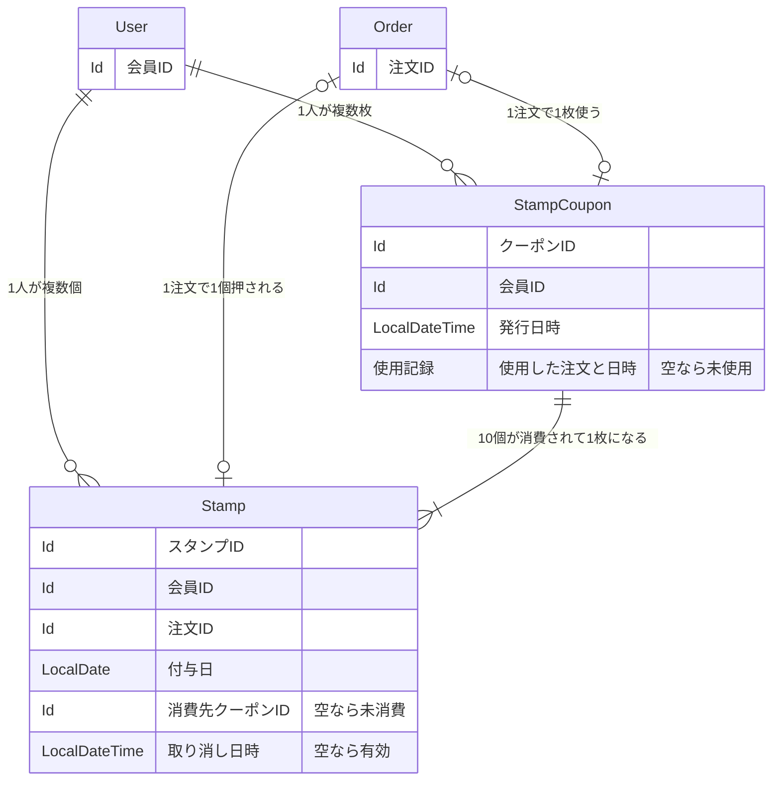

# 問題1：スタンプカード（ポイント） — 詳細要件定義

---

# 本体：確定したエンティティ要件

## 用語 — 全体の用語集に追加する呼称

追加を申請する呼称

| 呼称（これで統一する） | 何を指すか | 言い換えない |
|---|---|---|
| スタンプ | 注文 1 回につき 1 個押される、貯める単位の 1 個分 | 「ポイント」「来店記録」「判子」 |
| 付与日 | そのスタンプが押された日付。**保存する唯一の事実**で、失効判定の根拠になる | 「取得日」「獲得日」「押印日」 |
| 有効期限 | スタンプが有効な期限。**保存しない。** 付与日から 1 年後として都度計算する | 「失効日」「期限日」「有効期間」 |
| 失効 | 付与日から 1 年を過ぎ、保有数に数えられなくなること | 「期限切れ」「消滅」「無効化」 |
| 消費 | スタンプ 10 個がクーポンに引き換えられること | 「使用」「消化」「変換」 |
| クーポン | スタンプ 10 個と引き換えに発行される、ハンバーガー 1 つ無料の権利 | 「無料券」「特典」「チケット」 |
| 使用 | 発行済みクーポンを注文で使い、無料になること | 「利用」「消費」「引き換え」 |
| 取り消し | 注文キャンセルにより、押したスタンプが無効になること | 「削除」「取消」「返却」 |

**「言い換えない」列が、この表の本体です。** 何と呼ぶかを決めるだけでは足りません。何と呼ばないかを決めないと、次の会議で言い換えが起きます。

> ⚠️ **「消費」と「使用」を必ず区別してください。** どちらも「使う」と言いたくなりますが、指すものが違います。
>
> | 業務で起きること | 呼称 | 何が変わるか |
> |---|---|---|
> | スタンプ 10 個 → クーポン 1 枚になる | **消費** | スタンプ側にクーポンへの紐付けが入る |
> | クーポン 1 枚 → 注文が無料になる | **使用** | クーポン側に使用した注文が入る |
>
> 両方を「使用」と呼ぶと、会議で「使ったスタンプ」が何を指すのか誰も確信を持てなくなります。

> ⚠️ **「失効」と「消費」も別物です。** どちらも「スタンプが保有数から消える」ですが、原因が違います。消費は 10 個貯まった結果、失効は 1 年経過した結果です。**消費済みのスタンプは失効しません。**

> ⚠️ **呼称の数と、区分値の数は一致しません。** 上の 8 語のうち、区分値（`enum`）になるものは **1 つもありません**。理由は[区分値の考え方](#区分値の考え方--なぜ区分値が-0-個で足りるか)に書きます。

## ER 図

まず、データの繋がりだけを確認します。**何が必須か、使用済みをどう表すかは、この図では決めません。**



> **この図で確認するのは「どこに何があって、いくつ繋がるか」だけです。** スタンプの有効期限をどう表すか、必須か任意かは、このあとの [EntityModel](#entitymodel) で定義します。

図で読み取ってほしいのは 3 点です。

- **有効期限の項目がありません。** あるのは `付与日` だけ（→ [論点1](#論点1有効期限を保存するか)）
- **`User` にスタンプ数の項目がありません。** 行を数えれば求まります（→ [論点1](#論点1有効期限を保存するか)）
- **`Order` から線が 2 本出ています。** 1 つの注文が「スタンプを押させる」と「クーポンを使う」の 2 役を同時に果たすことがあるため

## EntityModel

属性の表を作るより、`EntityModel` をそのまま書いたほうが早く、正確です。型がそのまま「必須か任意か」を語ります。

> **ここに書くのは、モデルの形だけです。** メソッドや検証（ロジック）は載せません。型では表せない決めごとは、コードではなく文章ですぐ下に並べます。

### `Stamp` — 注文 1 回ごとに押されるスタンプ

```scala
case class Stamp(
  id:         Option[Id],                // 管理 ID（永続化前は None）
  userId:     User.Id,                   // 誰のスタンプか（店舗をまたいで共通）
  orderId:    Order.Id,                  // どの注文で押されたか（一意）
  grantedAt:  LocalDate,                 // 付与日。有効期限はここから計算する
  couponId:   Option[StampCoupon.Id],    // 消費先のクーポン。None ＝ 未消費
  canceledAt: Option[LocalDateTime],     // 注文キャンセルによる取り消し日時。None ＝ 有効
  updatedAt:  LocalDateTime = Now,       // データ更新日
  createdAt:  LocalDateTime = Now        // データ作成日
) extends EntityModel[Id]

object Stamp:

  type   Id = Id.Repr
  object Id extends Entity.Id[Long]
```

**ここで型が語っていること**

- **有効期限のフィールドがありません。** 保存するのは `grantedAt` だけで、期限は `grantedAt.plusYears(1)` として毎回計算します。列を持つと付与日との二重管理になり、片方だけ書き換えられた瞬間に嘘になります（→ [論点1](#論点1有効期限を保存するか)）
- **`couponId` の `None` が「未消費」。** 別に `isConsumed` のようなフラグを持ちません。**同じ意味を 2 通りに書ける構造は、必ずどちらか片方を書き忘れます**（→ [論点2](#論点2消費済みをフラグで持つかクーポンへの紐付けで表すか)）
- **`canceledAt` の `None` が「有効」。** キャンセルされても行は消しません。真偽値ではなく日時にしたので、いつ取り消されたかも残ります
- **`shopId` を持ちません。** 「店舗をまたいで共通」なので、どの店舗で押されたかはスタンプの意味に関与しません。必要なら `orderId` から辿れます
- **`grantedAt` は `LocalDate` で、時刻を持ちません。** 有効期限を日単位で判定するため、時刻は不要です
- **`userId` を直接持ちます。** `orderId` から辿れますが、会員のスタンプを数えるのが最頻の操作なので直接持ちます（→ [論点4](#論点4stamp-に-userid-を持つか-orderid-から辿るか)）

**型では守れない決めごと**

- **`orderId` は一意。** 注文 1 回につきスタンプは 1 個なので、同じ注文で 2 個押せません。`UNIQUE(order_id)` を張れば、矛盾の防止がアプリの仕事から DB の仕事になります
- **`couponId` が入ったら、以後変えない。** 消費は取り消せません
- **`canceledAt` が入っているスタンプは、保有数に数えない。** かつ消費の対象にも選びません
- **失効判定は `grantedAt` から 1 年。** カレンダー上の同日で判定します（2026-07-29 付与 → 2027-07-29 まで有効）
- **消費済み（`couponId` が `Some`）のスタンプは、失効の対象外。** すでにクーポンになっているので、後から期限切れになりません

**保存されるデータの例**（会員 ID 100・今日が 2026-07-30）

| grantedAt | couponId | canceledAt | 業務での状態 | 保有数に数える |
|---|---|---|---|---|
| 2025-03-01 | `Some(7)` | `None` | 消費済み（クーポン 7 番になった） | いいえ |
| 2025-06-15 | `None` | `None` | **失効**（1 年経過） | いいえ |
| 2026-05-10 | `None` | `None` | 有効・未消費 | **はい** |
| 2026-07-20 | `None` | `Some(...)` | 取り消し（注文キャンセル） | いいえ |
| 2026-07-28 | `None` | `None` | 有効・未消費 | **はい** |

**5 行とも同じモデル・同じ形です。** 「消費済み」「失効」「取り消し」という 3 つの別の理由で保有数から外れますが、区分値を 1 つも持たずに表せています。**とくに失効は、データに何も書かれていません** ——`grantedAt` と今日を比べて初めて決まります。

### `StampCoupon` — スタンプ 10 個と引き換えに発行されるクーポン

```scala
case class StampCoupon(
  id:        Option[Id],                         // 管理 ID（永続化前は None）
  userId:    User.Id,                            // 誰のクーポンか
  issuedAt:  LocalDateTime,                      // 発行日時（有効期限は持たない）
  usedOrder: Option[(Order.Id, LocalDateTime)],  // 使用した注文と日時。None ＝ 未使用
  updatedAt: LocalDateTime = Now,                // データ更新日
  createdAt: LocalDateTime = Now                 // データ作成日
) extends EntityModel[Id]

object StampCoupon:

  type   Id = Id.Repr
  object Id extends Entity.Id[Long]
```

**ここで型が語っていること**

- **`usedOrder` の `None` が「未使用」。** 区分値を持ちません。**無効な状態が、そもそも作れません**（→ [論点3](#論点3クーポンの使用状態を区分値で持つか-option-の有無で表すか)）
- **「使用した注文」と「使用日時」を 1 つの `Option` に束ねています。** 別々の `Option` にすると「注文は分かるが日時が不明」という無効な組み合わせが作れてしまいます。**一緒にしか意味を持たない値は、束ねて 1 つの `Option` にします。** 別々に `None` になれるということは、別々に存在できるという意味です
- **有効期限のフィールドがありません。** クーポンは無期限なので、列が無いこと自体がその仕様を表しています
- **消費されたスタンプへの参照を持ちません。** 参照は `Stamp.couponId` の側が持ちます（`1:10` の多い側が持つ）

**型では守れない決めごと**

- **`usedOrder` が入ったら、以後変えない。** 使用は取り消せません
- **1 つのクーポンには、消費された `Stamp` がちょうど 10 件紐づく。** 「ちょうど 10」は DB 制約では表せないので、発行処理の側で保証します
- **1 注文で使えるクーポンは 1 枚まで。** `UNIQUE(used_order_id)` で守れます

**保存されるデータの例**（会員 ID 100）

| id | issuedAt | usedOrder | 業務での状態 |
|---|---|---|---|
| 7 | 2025-11-02 10:15 | `Some(5120, 2026-01-08 12:30)` | 使用済み |
| 12 | 2026-06-20 19:40 | `None` | 未使用（無期限なのでずっと使える） |
| 13 | 2026-07-28 12:05 | `None` | 未使用（2 枚目。発行上限なし） |

**12 番と 13 番のように、未使用のまま複数枚持てます。** 発行から使用まで 2 ヶ月空いていても、有効期限が無いので問題になりません。

## 区分値の考え方 — なぜ区分値が 0 個で足りるか

**今回追加した 2 つのエンティティは、どちらも `enum` を持ちません。** 業務の言葉は 4 つありますが、すべて `Option` の有無か、日付の計算で表せました。

| 業務の言葉 | どう表すか | 保存するか |
|---|---|---|
| 消費（スタンプがクーポンになった） | `Stamp.couponId` が `Some` | する |
| 取り消し（注文キャンセル） | `Stamp.canceledAt` が `Some` | する |
| 使用（クーポンを使った） | `StampCoupon.usedOrder` が `Some` | する |
| **失効（1 年経過）** | **何も保存しない。** `grantedAt` と今日を比べて判定 | **しない** |

**呼称の数と、区分値の数は一致しません。** とくに失効は、データに一切書かれていないのに業務では明確な言葉として存在します。

> **比べれば分かるものは保存しません。** 失効を区分値で持つと、日付が変わった瞬間に嘘になります。毎日書き換えるバッチが必要になり、そのバッチが落ちた日は、期限切れのスタンプが有効なまま表示されます。

なお、洗い出しの段階では `StampCoupon` に `Status`（`IS_UNUSED` / `IS_USED`）を持つ案で考えていました。落とした理由は [論点3](#論点3クーポンの使用状態を区分値で持つか-option-の有無で表すか) にあります。

## 有効なスタンプ数を数え上げる順序

スタンプ 1 件が保有数に数えられるのは、**次の 3 つすべてを満たすとき**です。

1. `canceledAt` が `None`（取り消されていない）
2. `couponId` が `None`（まだクーポンになっていない）
3. `grantedAt` が今日から 1 年以内（失効していない）

分岐はこの 3 つで全部です。**「いま何個たまっているか」は、この条件で行を数えた結果であって、どこにも保存されていません。**

## 注文の支払いが確定したときの処理順序

1. `Stamp` を 1 件 INSERT する（`grantedAt` ＝ 支払い確定日）
2. 上の 3 条件を満たす `Stamp` を数える
3. **10 件以上あれば**、`grantedAt` の古い順に 10 件を選び、`couponId` を新しいクーポンの ID で UPDATE する（FIFO）
4. `StampCoupon` を 1 件 INSERT する（`usedOrder` ＝ `None`）

**11 個目が残る場合があります。** 11 件貯まっていたら、古い 10 件が消費され、11 件目は `couponId` が `None` のまま残ります。これが「使用済みの 10 個」と「たまり始めた新しい 1 個」の区別で、**フラグを持たずに参照の有無だけで表せています。**

## エンティティ一覧

### 追加するもの

| エンティティ | テーブル | 役割 | 多重度 |
|---|---|---|---|
| `Stamp` | `stamp` | 注文 1 回ごとに押されるスタンプ 1 個分 | `User` と `1:*`、`Order` と `1:0..1` |
| `StampCoupon` | `stamp_coupon` | スタンプ 10 個と引き換えに発行される無料の権利 | `User` と `1:*`、`Stamp` と `1:10` |

**追加は 2 つだけです。** 洗い出しで拾った 15 個の名詞のうち、13 個は既存で足りるか、保存しないものでした。

### 既存で足りるもの（変更しない）

| エンティティ | なぜ足りるか |
|---|---|
| `User` | 会員そのもの。**スタンプ数は保存しないので、属性を足す必要がありません** |
| `Order` | スタンプを押すきっかけ。`Stamp` から参照されるだけで、`Order` 側は何も知りません |
| `OrderDetail` | 無料対象の商品を特定するのに使いますが、持ち方は変わりません |
| `Payment` | 付与のタイミング（支払い確定）を知るのに使いますが、持ち方は変わりません |
| `Shop` | 「店舗をまたいで共通」なので、店舗ごとのスタンプ設定は持ちません |

**`User` に `stampCount` を足していないことが、この表の要点です。** 「いま何個たまっているか」は要求文に明記されていますが、`Stamp` の行を数えれば求まるので保存しません。

### 既存から動かすもの

**ありません。**

`Stamp` と `StampCoupon` は既存の `Order` / `User` を**参照する側**なので、参照の向きが一方向になり、既存側に変更が入りません。

### 新しく持つ参照

**既存テーブルには列を足しません。**

| どこに | 何を | なぜ |
|---|---|---|
| `stamp.user_id` | `User.Id` | 会員のスタンプを数えるのが最頻の操作（→ [論点4](#論点4stamp-に-userid-を持つか-orderid-から辿るか)） |
| `stamp.order_id` | `Order.Id` | 「いつ・どの注文で押されたか」を一覧するため |
| `stamp.coupon_id` | `StampCoupon.Id`（任意） | 消費先。`NULL` なら未消費 |
| `stamp_coupon.user_id` | `User.Id` | 会員の未使用クーポンを引くため |
| `stamp_coupon.used_order_id` | `Order.Id`（任意） | 使用した注文。`NULL` なら未使用 |

## 置き場所（コンテキスト）

**判断：既存の `sales` コンテキストに入れる。新しく作らない。**

**理由：** 日常的に書き換えるのは**会員の注文行為**であり、`Order` と**触る人・更新頻度・書き換わるトリガー（支払い確定）が一致する**からです。

| 日常的に書き換える人 | 何を書き換えるか | 更新の頻度 | 見る画面 |
|---|---|---|---|
| **会員**（注文することで、システムが） | スタンプの行が 1 本増える | 注文のたび（毎日・大量） | 会員アプリのスタンプ専用画面 |
| **会員** | クーポンに使用した注文を書き込む | 10 注文ごと | 注文画面 |

> ⚠️ **「スタンプを押すきっかけが注文だから `sales`」という理由づけは採っていません。** きっかけではなく、**日々書き換える主体が `Order` と同じ**という理由で `sales` に置きます。

`common` には置けません。3 条件すべてで落ちます。

| 条件 | 判定 | 理由 |
|---|---|---|
| 1. 業務の操作では変わらない | ✗ | **注文（業務操作）のたびに行が増える。** マスタではない |
| 2. 管理者が別にいる | ✗ | 店長や管理者が編集しない。会員の行為で自動的に変わる |
| 3. 他のコンテキストから参照されるだけ | ✗ | `User.Id` と `Order.Id` を**参照する側**。逆流が生まれる |

**「ポイントはマスタっぽい」という直感は、ここで否定されます。** 営業時間が条件 3 だけで落ちたのに対し、スタンプは 1 つも満たしません。

新しいコンテキスト（`loyalty` など）も作りません。専用画面で見る／店舗をまたいで共通／`Order` より寿命が長いといった新設の根拠はありますが、**触る人が `Order` と同じ**なので分ける理由がありません（→ [論点6](#論点6新しいコンテキストを作るか)）。**コンテキストは 4 つのまま、増えません。**

テーブル名は `sales_stamp` にしていません（コンテキスト名を重ねないという既存の規則どおり）。名前順に並べると、こうなります。

```
order          ← 既存
order_detail   ← 既存
payment        ← 既存
stamp          ← 今回追加
stamp_coupon   ← 今回追加
```

`stamp` の隣に `stamp_coupon` が来て、`Stamp*` 一族として固まっています。

---

# 付録

ここから先は本体ではありません。**「作らないもの」と「なぜそう決めたのか」**です。

## 付録A：今回やらないこと

- **店頭でのスタンプ付与**（オンライン注文限定とする）
- **消費済みスタンプが、後から支払い後キャンセルで取り消された場合の扱い**（クーポンごと取り消すか、そのままにするか。運用で個別対応とする）
- **有効期限が近いスタンプのお知らせ通知**
- **スタンプの譲渡・他会員への移動**
- **クーポンで無料にできる商品の制限**（ハンバーガーであれば値段を問わない）
- **クーポンの利用回数を 1 注文で複数枚にすること**（1 注文 1 枚まで）
- **スタンプの手動付与・手動取り消し**（管理者がキャンペーンで配るなどの運用）
- **スタンプ数の推移や利用状況の集計・分析画面**

> ⚠️ **「クーポンを無期限にする」は、ここには書きません。** それは「やらないこと」ではなく、**確定した仕様**です（本体の `StampCoupon` に有効期限の列が無いことで表しています）。同じく「スタンプは店舗をまたいで共通」も仕様なので本体側です。

## 付録B：判断の記録

迷ったところと、その決着を残します。半年後にモデルを直す人にとって、いちばん価値があるのはここです。

### 論点1：有効期限を保存するか

**判断：保存しない。`grantedAt`（付与日）だけを保存し、期限は都度計算する。**

洗い出しの初期には `stampDeadLine: LocalDate` という列を置いていました。有効期限という業務の言葉があるので、対応する列があるのが素直に見えます。

しかし `grantedAt` と `stampDeadLine` は、**同じことを 2 通りに書いた形**です。常に「付与日 + 1 年」の関係にあるので、片方だけ書き換えられた瞬間に嘘になります。**同じ意味を 2 通りに書ける構造は、必ずどちらか片方を書き忘れます。**

同じ理由で「いま何個たまっているか」も保存しません。`User.stampCount` を持つと、`Stamp` の行数との二重管理になります。受け入れ条件に「**数え上げの結果と画面の表示が食い違わない構造**」とあり、**二重管理をしない**のがこれを満たす最も確実な方法です。

**代償：** スタンプ画面を開くたびに、有効な行を数える問い合わせが走ります。1 会員あたりのスタンプは多くても数十件なので、`WHERE user_id = ? AND coupon_id IS NULL AND canceled_at IS NULL AND granted_at > ?` の 1 本で足ります。

**判断が変わる条件：** 1 会員あたりのスタンプが数万件規模になり、数え上げが表示速度に影響するようになったら、`User` にキャッシュ列を持ちます。**そのときは「正は `Stamp` の行数であり、キャッシュ列は導出結果」と明記します。**

### 論点2：消費済みをフラグで持つか、クーポンへの紐付けで表すか

**判断：`couponId: Option[StampCoupon.Id]` の紐付けで表す。`isConsumed` のようなフラグは持たない。**

「10 個貯まって使った 10 個」と「たまり始めた新しい 1 個」を区別する必要がありました（受け入れ条件）。方法は 2 つ考えられます。

| 案 | 内容 | なぜ採らなかったか |
|---|---|---|
| A. フラグ | `isConsumed: Boolean` を持つ | **どの 10 個が、どのクーポンになったかが分からない。** 2 枚発行された会員のスタンプ 20 個が、区別なく `true` になる |
| B. 紐付け（採用） | 消費先のクーポン ID を持つ | フラグの情報を含んだうえで、対応関係まで残る |

**紐付けにするとフラグが不要になります。** ID が入っていれば消費済み、`None` なら未消費と読めるので、**フラグと紐付けの二重管理が起きません。**

**副産物：** クーポン 1 枚から、それを構成した 10 個のスタンプを逆引きできます。「このクーポンは、いつからいつまでの注文で貯まったものか」が答えられます。

### 論点3：クーポンの使用状態を、区分値で持つか `Option` の有無で表すか

**判断：区分値を持たない。`usedOrder: Option[(Order.Id, LocalDateTime)]` の有無で表す。**

当初は `usedState: Status`（`IS_UNUSED` / `IS_USED`）を持つ案でした。業務が「未使用」「使用済み」を状態として呼んでいるので、業務の言葉に素直に対応します。

しかし区分値と使用記録を両方持つと、組み合わせが 4 通りになり、**有効なのは 2 通りだけ**です。

| `usedState` | `usedOrder` | 扱い |
|---|---|---|
| `IS_UNUSED` | `None` | 有効。まだ使っていない |
| `IS_USED` | `Some(...)` | 有効。この注文で使った |
| `IS_UNUSED` | `Some(...)` | **無効。** 使った記録があるのに未使用 |
| `IS_USED` | `None` | **無効。** 「使ったが、どの注文かは分からない」——業務上の意味がない |

`Option` 1 つに寄せれば、**無効な組み合わせが構造上作れません。検証を書く必要すらなくなります。** 「使用済みかどうか」は `usedOrder.isDefined` で判定でき、意味が 1 つに定まります。

**代償：** 「未使用のクーポンを一覧する」ときに、状態で絞るのではなく「使用記録が空の行」を探すことになります。SQL では `used_order_id IS NULL` の 1 条件なので、上の利点と引き換えにできます。

**判断が変わる条件：** クーポンに「失効」「無効化」など第 3 の状態が加わったら、`Option` では表せなくなるので区分値に戻します。**今回はクーポンが無期限で、取りうる状態が 2 つしかないため `Option` で足ります。**

### 論点4：`Stamp` に `userId` を持つか、`orderId` から辿るか

**判断：`userId` を直接持つ。**

`Order` は `userId` を持っているので、`Stamp.orderId` から JOIN すれば会員は分かります。正規化の観点では `Stamp.userId` は冗長です。

しかし「その会員のスタンプが何個たまっているか」は**アプリを開くたびに呼ばれる最頻の操作**で、これを `stamp JOIN order` で書くことになります。数え上げのたびに注文テーブルを引くのは、やっていることに対して重すぎます。

また「スタンプは店舗をまたいで共通」という要求は、**スタンプが注文ではなく会員に属する**ことを言っています。会員 ID を直接持つほうが、その意味に素直です。

**代償：** 注文の会員 ID が変わると不整合になります。ただし注文の所有者が後から変わる業務は存在しないので、実質起こりません。

### 論点5：クーポンをエンティティにするか、値オブジェクトにするか

**判断：エンティティにする。**

洗い出しの初期には、`Stamp` に `stampCoupon: Int`（クーポンの枚数）を持たせる案で考えていました。「何枚持っているか」だけ分かれば足りるように見えたためです。

しかし①の確認で、クーポンには以下が要ることが決まりました。

- 10 個貯まった時点で**発行される**（生まれるタイミングがある）
- **未使用 / 使用済み**が区別される
- 未使用のまま**複数枚持てる**（発行上限なし）
- **どの注文で使ったか**を追跡する

`Int` では、どの 1 枚をいつ使ったのかが分かりません。**発行され、状態が変わり、いつか使われて終わるという寿命がある**ので、ID で識別するエンティティが必要です。

**判断が変わる条件：** 「何枚持っているか」だけで足り、いつ使ったかを追跡しないなら値オブジェクトで足ります。ただし **`Stamp.couponId` で消費先を紐付ける設計（[論点2](#論点2消費済みをフラグで持つかクーポンへの紐付けで表すか)）とは両立しません。**

### 論点6：新しいコンテキストを作るか

**判断：作らない。既存の `sales` に入れる。**

`loyalty` のような新コンテキストも検討しました。根拠はありました——会員アプリの**専用画面**で見る、**店舗をまたいで共通**、`Order` より**寿命が長い**（1 年）。

しかし払うコストが見合いません。

- パッケージ・`Module`・`RepositoryFacade`・`app-api` の配線が 1 セット増える
- スタンプ画面を 1 つ描くのに、`sales` と新コンテキストの 2 つのリポジトリを呼んで自分で組み立てることになる
- `Order.Id` と `User.Id` を参照するので、コンテキスト間の依存が増える

**決め手は「触る人が `Order` と同じ（会員）で、書き換わるトリガーも同じ（支払い確定）」という点です。** 迷ったら大きめに作って、後から割る。

### 論点7：有効期限を「スタンプ 1 個ごと」にするか「カード全体」にするか

**判断：スタンプ 1 個ごとに、付与日から 1 年。**

要求文は「有効期限は**最後の注文から**1 年」でした。文言どおりなら、カード全体が最後の注文日を起点に 1 年間有効という解釈になります。

しかしこの解釈だと、**1 年経つ直前に 1 回注文すれば、全スタンプが維持されます。** その次もまた 1 年後ギリギリに行けばよく、「1 年に 1 回来れば無期限に貯まり続ける」ことになります。**購買意欲を上げるという施策の目的に反します。**

スタンプ 1 個ごとに期限を持てば、貯めている途中でも古いものから消えていくので、**10 個貯めるには 1 年以内に 10 回来る**必要があります。

**発注者への確認事項として①に記録済み**です。文言と異なる解釈を採っているので、独断で決めた形にせず、両論を示して確認します。

**副作用：** 9 個貯まった状態で最古のスタンプが失効すると、8 個に戻ります。「もうすぐ 10 個」だった会員が直前で足元をすくわれる体験になりますが、上の理由を優先します。
