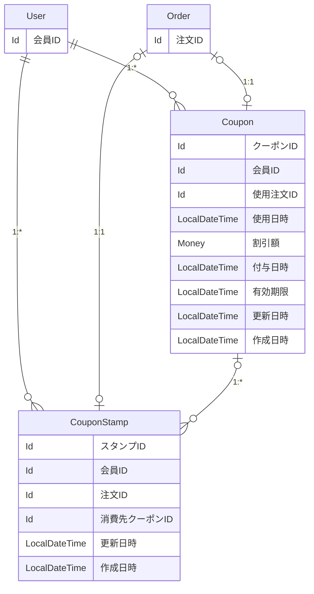

# 問題1：スタンプカード（ポイント） — 詳細要件定義

対象：会員のスタンプ付与と割引クーポン ／ 前提：[要件定義](./p1_01_REQUIREMENTS.md)で合意済み

---

# 本体：確定したエンティティ要件

## 用語 — 全体の用語集に追加する呼称

追加を申請する呼称

| 呼称（これで統一する） | 何を指すか | 言い換えない |
|---|---|---|
| クーポンスタンプ | 受け渡し 1 回につき 1 個押される、貯める単位の 1 個分 | 「ポイント」「来店記録」「判子」 |
| クーポン | 注文の合計から一定額を引ける権利 | 「無料券」「特典」「チケット」 |
| 消費 | クーポンスタンプ 10 個がクーポンに引き換えられること | 「使用」「消化」「変換」 |
| 使用 | 発行済みクーポンを注文に適用し、割引を受けること | 「利用」「消費」「引き換え」 |
| 割引額 | そのクーポンで注文の合計から引ける金額 | 「値引き」「特典額」「クーポン額」 |
| 付与 | スタンプやクーポンが会員のものになること | 「発行」「配布」「獲得」 |

**「言い換えない」列が、この表の本体です。** 何と呼ぶかを決めるだけでは足りません。何と呼ばないかを決めないと、次の会議で言い換えが起きます。

> ⚠️ **「消費」と「使用」を必ず区別してください。** どちらも「使う」と言いたくなりますが、指すものが違います。
>
> | 業務で起きること | 呼称 | 何が変わるか |
> |---|---|---|
> | スタンプ 10 個 → クーポン 1 枚になる | **消費** | スタンプ側にクーポンへの紐付けが入る |
> | クーポン 1 枚 → 注文が割引される | **使用** | クーポン側に使用した注文と日時が入る |

> ⚠️ **「無料券」と呼びません。** 600 円の割引券なので、700 円の商品なら 100 円かかります。「無料」と呼ぶと客とのトラブルになります。

## ER 図

まず、データの繋がりだけを確認します。**何が必須か、期限切れをどう表すかは、この図では決めません。**



図で読み取ってほしいのは 3 点です。

- **`CouponStamp` に有効期限も付与日もありません。** スタンプは失効しません（→ [論点1](#論点1有効期限をスタンプに持たせるかクーポンに持たせるか)）
- **`Coupon → CouponStamp` は `1:*`。** `1:10` 固定ではありません。誕生日クーポンはスタンプ 0 個で発行されます（→ [論点5](#論点5スタンプ-0-個のクーポン発行に対応するか)）
- **`Coupon` が `MenuItem` を参照していません。** 金券型にしたので対象商品を持ちません（→ [論点2](#論点2特典を商品券型にするか金券型にするか)）

## EntityModel

属性の表を作るより、`EntityModel` をそのまま書いたほうが早く、正確です。型がそのまま「必須か任意か」を語ります。

### `CouponStamp` — 受け渡し 1 回ごとに押されるスタンプ

```scala
case class CouponStamp(
  id:        Option[Id],           // 管理 ID（永続化前は None）
  userId:    User.Id,              // 誰のスタンプか（店舗をまたいで共通）
  orderId:   Order.Id,             // どの注文で押されたか（一意）
  couponId:  Option[Coupon.Id],    // 消費先のクーポン。None ＝ 未消費
  updatedAt: LocalDateTime = Now,  // データ更新日
  createdAt: LocalDateTime = Now   // データ作成日
) extends EntityModel[Id]

object CouponStamp:

  type   Id = Id.Repr
  object Id extends Entity.Id[Long]
```

**ここで型が語っていること**

- **有効期限も付与日もありません。** スタンプは失効しないため、期限判定に使う日付が不要です（→ [論点1](#論点1有効期限をスタンプに持たせるかクーポンに持たせるか)）
- **取り消しの記録を持ちません。** 受け渡し完了が付与のトリガーなので、付与された後にキャンセルされることがありません（→ [論点3](#論点3付与のトリガーを支払いにするか受け渡しにするか)）
- **`couponId` の `None` が「未消費」。** 別に `isConsumed` のようなフラグを持ちません。**同じ意味を 2 通りに書ける構造は、必ずどちらか片方を書き忘れます**（→ [論点6](#論点6消費済みをフラグで持つかクーポンへの紐付けで表すか)）
- **`shopId` を持ちません。** 「店舗をまたいで共通」なので、どの店舗で押されたかはスタンプの意味に関与しません
- **フィールドは 3 つだけ**（`id` と日時を除く）。期限をクーポン側に移したことで、当初の設計から 2 列減りました

**型では守れない決めごと**

- **`orderId` は一意。** 1 回の受け渡しにつきスタンプは 1 個なので、同じ注文で 2 個押せません。`UNIQUE(order_id)` を張れば、矛盾の防止がアプリの仕事から DB の仕事になります
- **`couponId` が入ったら、以後変えない。** 消費は取り消せません
- **付与するのは `Order.Status` が受渡し完了（`IS_DELIVERED`）になったときだけ。** キャンセル・未受け取りの注文には付与しません
- **10 個を選ぶ順序は `id` の昇順（古い順）。** スタンプは失効しないのでどの 10 個を選んでも結果は同じですが、動作を一定にするため順序を決めておきます（→ [論点7](#論点7-10-個を選ぶ順序を何で決めるか)）

**保存されるデータの例**（会員 ID 100）

| id | orderId | couponId | 業務での状態 | 保有数に数える |
|---|---|---|---|---|
| 51 | 5001 | `Some(7)` | 消費済み（クーポン 7 番になった） | いいえ |
| 52 | 5002 | `Some(7)` | 消費済み（同じクーポン） | いいえ |
| 61 | 5011 | `None` | 未消費 | **はい** |
| 62 | 5012 | `None` | 未消費 | **はい** |

**4 行とも同じモデル・同じ形です。** 区分値を 1 つも持たずに、消費済みと未消費が区別できています。

### `Coupon` — 注文の合計から一定額を引ける権利

```scala
case class Coupon(
  id:          Option[Id],             // 管理 ID（永続化前は None）
  userId:      User.Id,                // 誰のクーポンか
  usedOrderId: Option[Order.Id],       // 使用した注文。None ＝ 未使用
  usedAt:      Option[LocalDateTime],  // 使用日時。None ＝ 未使用
  discount:    Money,                  // 割引額。この額を注文の合計から引く
  grantedAt:   LocalDateTime,          // 付与日時
  expiresAt:   LocalDateTime,          // 有効期限
  updatedAt:   LocalDateTime = Now,    // データ更新日
  createdAt:   LocalDateTime = Now     // データ作成日
) extends EntityModel[Id]

object Coupon:

  type   Id = Id.Repr
  object Id extends Entity.Id[Long]
```

**ここで型が語っていること**

- **割引額を自分で持ちます。** 対象商品やカテゴリを持たないので、`common/menu` を参照しません。コンテキストをまたぐ依存が増えません（→ [論点2](#論点2特典を商品券型にするか金券型にするか)）
- **有効期限を 1 枚ごとに持ちます。** 一律ではないので、スタンプ由来は発行から 1 年、誕生日クーポンは 1 ヶ月など、発行時に自由に決められます
- **期限切れを表す状態を持ちません。** `expiresAt` と現在日時を比べて判定します（→ [論点8](#論点8期限切れを区分値で持つか都度計算するか)）
- **消費されたスタンプへの参照を持ちません。** 参照は `CouponStamp.couponId` の側が持ちます（多い側が持つ）
- **`expiresAt` は `LocalDateTime`。** 問い合わせ対応で時刻まで分かるほうが便利なため、日付だけにしていません
- **フィールドは型ではなく役割で並べています。** ID を上にまとめたうえで、**連動する `usedOrderId` / `usedAt` を隣に置く**（`usedAt` は日時ですが `grantedAt` / `expiresAt` とは離しています）。一緒にしか意味を持たない値を近くに置くことで、検証の書き忘れを防ぎます
- **`grantedAt` と `createdAt` は別物です。** `grantedAt` は「このクーポンが付与された」という業務上の事実、`createdAt` は行が作られた運用上の記録。普段は一致しますが、データ移行や障害復旧ではズレます（→ [論点11](#論点11発行日時のフィールド名を何にするか)）

**型では守れない決めごと**

- **`usedOrderId` と `usedAt` は連動します。** 組み合わせは 4 通りありますが、有効なのは 2 通りだけです

  | `usedOrderId` | `usedAt` | 扱い |
  |---|---|---|
  | `None` | `None` | 有効。未使用 |
  | `Some` | `Some` | 有効。使用済み |
  | `Some` | `None` | **無効。** 注文は分かるが日時が不明 |
  | `None` | `Some` | **無効。** 日時だけあって注文が不明 |

  型では表せないので、モデルを作るときに検証します（→ [論点4](#論点4使用の記録を-1-つの-option-に束ねるか-2-つに分けるか)）
- **`usedOrderId` が入ったら、以後変えない。** 使用は取り消せません
- **使用時は `expiresAt` を過ぎていないことを確認する。** 期限切れのクーポンは使えません
- **割引額が注文の合計を超える場合、超過分は切り捨てる。** 繰り越しません
- **`usedOrderId` は一意。** 1 注文で使えるクーポンは 1 枚までです
- **スタンプ由来のクーポンの割引額は 600 円、有効期限は発行から 1 年。** どちらもコード上の定数で管理します

**保存されるデータの例**（会員 ID 100、今が 2026-08-03）

| id | discount | expiresAt | usedOrderId | usedAt | 業務での状態 |
|---|---|---|---|---|---|
| 7 | 600 円 | 2026-11-02 10:15 | `Some(5120)` | `Some(2026-01-08 12:30)` | 使用済み |
| 12 | 600 円 | 2027-06-20 19:40 | `None` | `None` | 未使用・期限内 |
| 13 | 600 円 | 2026-07-28 12:05 | `None` | `None` | 未使用だが**期限切れ** |
| 14 | 300 円 | 2026-09-01 00:00 | `None` | `None` | 未使用・期限内（誕生日クーポンの例） |

**13 番のように、期限切れのクーポンも行として残ります。** 表示時に除外するだけです。
**14 番のように、割引額と期限はクーポンごとに違えられます。**

## 区分値の考え方 — なぜ区分値が 0 個で足りるか

**今回追加した 2 つのエンティティは、どちらも `enum` を持ちません。** 業務の言葉は 4 つありますが、すべて `Option` の有無か、日時の比較で表せました。

| 業務の言葉 | どう表すか | 保存するか |
|---|---|---|
| 消費（スタンプがクーポンになった） | `CouponStamp.couponId` が `Some` | する |
| 未消費 | `CouponStamp.couponId` が `None` | する |
| 使用（クーポンを使った） | `Coupon.usedOrderId` が `Some` | する |
| **期限切れ** | **何も保存しない。** `expiresAt` と現在日時を比べて判定 | **しない** |

**呼称の数と、区分値の数は一致しません。** とくに期限切れは、データに一切書かれていないのに業務では明確な言葉として存在します。

> **比べれば分かるものは保存しません。** 期限切れを区分値で持つと、期限が過ぎた瞬間から書き換えられるまでの間、実態と食い違います。毎日書き換えるバッチが必要になり、そのバッチが落ちた日は期限切れのクーポンが使えてしまいます。

## 未消費のスタンプ数を数え上げる条件

**条件は 1 つだけです。**

- `couponId` が `None`（まだクーポンになっていない）

スタンプは失効せず、取り消しもされないため、他の条件は要りません。**保有数はどこにも保存されず、この条件で行を数えた結果です。**

## 受け渡し完了時の処理順序

1. `CouponStamp` を 1 件追加する
2. `couponId` が `None` のスタンプを数える
3. **10 件以上あれば**、`id` の昇順で 10 件の `couponId` に新しいクーポンの ID を書く
4. `Coupon` を 1 件追加する（`discount` ＝ 600 円、`expiresAt` ＝ 発行から 1 年）

**11 個目が残る場合があります。** 11 件貯まっていたら、古い 10 件が消費され、11 件目は `couponId` が `None` のまま残ります。これが「使用済みの 10 個」と「たまり始めた新しい 1 個」の区別で、**フラグを持たずに参照の有無だけで表せています。**

## クーポンを使用するときの計算

```
支払額 = max(注文の合計 − 割引額, 0)
```

超過分は切り捨てます。600 円のクーポンを 300 円の注文に使ったら支払額は 0 円で、残り 300 円は消えます。

## エンティティ一覧

### 追加するもの

| エンティティ | テーブル | 役割 | 多重度 |
|---|---|---|---|
| `CouponStamp` | `sales_coupon_stamp` | 受け渡し 1 回ごとに押されるスタンプ 1 個分 | `User` と `1:*`、`Order` と `1:1`、`Coupon` と `1:*` の子側 |
| `Coupon` | `sales_coupon` | 注文の合計から一定額を引ける権利 | `User` と `1:*`、`Order` と `1:1`、`CouponStamp` と `1:*` |

**追加は 2 つだけです。** 洗い出しで拾った 21 個の名詞のうち、19 個は既存で足りるか、保存しないものでした。

### 既存で足りるもの（変更しない）

| エンティティ | なぜ足りるか |
|---|---|
| `User` | 会員そのもの。**スタンプ数を保存しないので、属性を足す必要がありません** |
| `Order` | スタンプを押すきっかけ。`CouponStamp` から参照されるだけで、`Order` 側は何も知りません |
| `Order.Status` | 受渡し完了（`IS_DELIVERED`）が付与のトリガー。**問題2 で追加した値をそのまま使います** |
| `Payment` | 支払い済みであることの確認に使いますが、付与のトリガーではありません |
| `MenuItem` | **参照しません。** 金券型なので対象商品を持ちません |
| `Shop` | 「店舗をまたいで共通」なので、店舗ごとのスタンプ設定は持ちません |
| `Money` | 割引額の型として使います。既存の値オブジェクトです |

**`User` に `stampCount` を足していないことが、この表の要点です。** 「いま何個たまっているか」は要求文に明記されていますが、`CouponStamp` の行を数えれば求まるので保存しません。

### 既存から動かすもの

**ありません。**

`CouponStamp` と `Coupon` は既存の `Order` / `User` を**参照する側**なので、参照の向きが一方向になり、既存側に変更が入りません。

### 新しく持つ参照

**既存テーブルには列を足しません。**

| どこに | 何を | なぜ |
|---|---|---|
| `sales_coupon_stamp.user_id` | `User.Id` | 会員のスタンプを数えるのが最頻の操作 |
| `sales_coupon_stamp.order_id` | `Order.Id` | 「いつ・どの注文で押されたか」を一覧するため |
| `sales_coupon_stamp.coupon_id` | `Coupon.Id`（任意） | 消費先。`NULL` なら未消費 |
| `sales_coupon.user_id` | `User.Id` | 会員の使えるクーポンを引くため |
| `sales_coupon.used_order_id` | `Order.Id`（任意） | 使用した注文。`NULL` なら未使用 |

## 置き場所（コンテキスト）

**判断：既存の `sales` コンテキストに入れる。新しく作らない。**

**理由：** 日常的に書き換えるのは**会員の注文・受け取り行為**であり、`Order` と**触る人・更新頻度・書き換わるトリガー（受け渡し完了）が一致する**からです。

| 日常的に書き換える人 | 何を書き換えるか | 更新の頻度 | 見る画面 |
|---|---|---|---|
| **会員**（受け渡しを受けることで、システムが） | スタンプの行が 1 本増える | 受け渡しのたび（毎日・大量） | 会員アプリのスタンプ画面 |
| **会員** | クーポンに使用した注文と日時を書き込む | 10 回の受け渡しごと | 注文画面 |

> ⚠️ **「スタンプを押すきっかけが注文だから `sales`」という理由づけは採っていません。** きっかけではなく、**日々書き換える主体が `Order` と同じ**という理由で `sales` に置きます。

`common` には置けません。3 条件すべてで落ちます。

| 条件 | 判定 | 理由 |
|---|---|---|
| 1. 業務の操作では変わらない | ✗ | **受け渡しのたびに行が増える。** マスタではない |
| 2. 管理者が別にいる | ✗ | 会員の行為で自動的に変わる |
| 3. 他のコンテキストから参照されるだけ | ✗ | `User.Id` と `Order.Id` を**参照する側**。逆流が生まれる |

新しいコンテキスト（`loyalty` など）も作りません。専用画面で見る／店舗をまたいで共通／`Order` より寿命が長いといった新設の根拠はありますが、**触る人が `Order` と同じ**なので分ける理由がありません（→ [論点9](#論点9新しいコンテキストを作るか)）。**コンテキストは 4 つのまま、増えません。**

テーブル名はコンテキストのパスを頭に付け、単数形にします。名前順に並べると、こうなります。

```
sales_cart                ← 既存
sales_cart_item           ← 既存
sales_cart_item_option    ← 既存
sales_coupon              ← 今回追加
sales_coupon_stamp        ← 今回追加
sales_order               ← 既存
sales_order_item          ← 既存
sales_order_item_option   ← 既存
sales_payment             ← 既存
```

`sales_coupon` の隣に `sales_coupon_stamp` が来て、`Coupon*` 一族として固まっています。既存の `sales_order` / `sales_order_item`（親 ＋ 子）と同じ形です。

---

# 付録

ここから先は本体ではありません。**「作らないもの」と「なぜそう決めたのか」**です。

## 付録A：今回やらないこと

- **誕生日クーポン・キャンペーンクーポンの発行機能そのもの**（スタンプ 0 個でも発行できる形にはしておくが、発行のきっかけは作らない）
- **クーポンの券面額を管理画面から変更すること**（コード上の定数で管理する）
- **クーポンの残額を次回に繰り越すこと**（超過分は切り捨て）
- **1 注文で 2 枚以上のクーポンを使うこと**
- **有効期限が近いクーポンのお知らせ通知**
- **スタンプ・クーポンの譲渡**
- **管理者によるスタンプの手動付与・手動取り消し**
- **スタンプ数の推移や利用状況の集計・分析画面**
- **期限切れクーポンの自動削除**（行は残す）
- **クーポン使用時の会計処理**（`Order` の割引額をどう記録するかは 04 章のテーブル設計で扱う）

## 付録B：判断の記録

迷ったところと、その決着を残します。半年後にモデルを直す人にとって、いちばん価値があるのはここです。

### 論点1：有効期限をスタンプに持たせるか、クーポンに持たせるか

**判断：クーポンに持たせる。スタンプは失効しない。**

初回の設計では、スタンプに `grantedAt`（付与日）を持たせ、「付与日から 1 年」で失効させていました。要求文の「有効期限は最後の注文から 1 年」を、スタンプ 1 個ごとの期限として読み替えたものです。

しかしこれには問題がありました。

| 問題 | 内容 |
|---|---|
| **計算が必要** | 保有数を数えるたびに「付与日 + 1 年 > 今日」を判定する |
| **体験が悪い** | 9 個貯まった状態で最古のスタンプが失効すると 8 個に戻る |
| **拡張しにくい** | クーポンの種類が増えたとき、期限の扱いをスタンプ側で考え続けることになる |

**期限をクーポンに移すと、これらが同時に消えます。**

- スタンプは「消費したか」だけを見ればよく、日付の計算が要らない
- 貯めている途中でスタンプが減らない
- クーポンごとに期限を変えられる（スタンプ由来は 1 年、誕生日は 1 ヶ月）

**同時に消えたもの：** `CouponStamp` の `canceledAt` 列、および「失効しているか判定する」「スタンプを取り消す」の 2 動詞。
`grantedAt`（付与日時）は `CouponStamp` から消え、**`Coupon` 側に移りました。**

**代償：** 要求文の「有効期限は最後の注文から 1 年」という記述と形が違います。①の質問リストで合意を取ります。

### 論点2：特典を商品券型にするか、金券型にするか

**判断：金券型（`discount: Money`）にする。**

要求文は「ハンバーガー 1 つが無料」で、これは商品券型の表現です。しかし商品券型にすると、決めなければならないことが増えます。

| 決めること | 商品券型 | 金券型 |
|---|---|---|
| 対象範囲の持ち方 | 特定商品 / カテゴリ / カテゴリ + 上限額 のどれか | **不要** |
| 注文にバーガーが 2 つあったらどちらが無料か | **決める必要あり** | 問題にならない |
| 対象商品が無い注文への対応 | 使えない判定が必要 | **不要** |
| `common/menu` への依存 | **あり**（`MenuCategory.Id` を参照） | **なし** |
| 対象商品が販売終了したら | クーポンが使えなくなる | 影響なし |

**金券型のほうが、持つフィールドが少なく、参照するコンテキストも少なくなります。**

そして将来「500 円引き」「ドリンク無料相当」など別の特典を出すとき、**金額を変えるだけで済みます。**

**代償：**

- 要求文の「無料」ではなくなる。600 円を超える商品には差額がかかる
- 価格改定で意味が変わる（600 円のバーガーが 650 円になったら、無料にならない）
- **「無料券」と呼べなくなる**ので、用語表で明記した

**判断が変わる条件：** 「必ず 1 品無料」を業務として保証する必要があるなら、商品券型（カテゴリ + 上限額）に変えます。そのときは `common/menu` への参照が増えます。

### 論点3：付与のトリガーを支払いにするか、受け渡しにするか

**判断：受け渡し完了（`Order.Status` が `IS_DELIVERED`）にする。**

初回の設計では支払い確定をトリガーにしていました。そのため「支払い後にキャンセルされたらスタンプを取り消す」という処理が必要で、`canceledAt` 列を持っていました。

**受け渡し完了に変えると、この処理が丸ごと不要になります。**

問題2 で確定した状態遷移を見ると、受渡し完了は**終端状態**です。ここに到達した注文は、もう状態が変わりません。

| ケース | 起きるか |
|---|---|
| 受渡し完了 → キャンセル | **起きない**（終端から動かない） |
| キャンセルされた注文にスタンプが付く | **起きない**（受渡し完了に到達しない） |
| 未受け取りの注文にスタンプが付く | **起きない**（同上） |

**「起きないケース」のために列を持たないので、`canceledAt` を消せました。**

**代償：** 未受け取りの注文にはスタンプが付きません。会員からすると「支払ったのにスタンプが付かない」ことになります。①の質問リストで合意を取ります。

**判断が変わる条件：** 「支払ったならスタンプは付けるべき」という運用に変わったら、支払い確定をトリガーに戻し、`canceledAt` を復活させます。

### 論点4：使用の記録を 1 つの `Option` に束ねるか、2 つに分けるか

**判断：2 つに分ける（`usedOrderId` と `usedAt`）。**

当初は `usedOrder: Option[(Order.Id, LocalDateTime)]` として組で持つ案でした。「一緒にしか意味を持たない値は束ねる」という原則に従ったものです。束ねれば**無効な組み合わせが構造上作れず、検証が不要**になります。

しかしレビューでフィールドを分ける方針となったため、分けています。

**代償：** 無効な組み合わせが 2 通り生まれるため、モデルを作るときに検証が必要になります。

| `usedOrderId` | `usedAt` | 扱い |
|---|---|---|
| `Some` | `None` | **無効。** 注文は分かるが日時が不明 |
| `None` | `Some` | **無効。** 日時だけあって注文が不明 |

**利点：** DB のカラムと 1:1 で対応するため、クエリが素直に書けます（`WHERE used_order_id IS NULL`）。組で持つ場合も DB では 2 カラムに分かれるので、モデルと永続化の形が一致します。

### 論点5：スタンプ 0 個のクーポン発行に対応するか

**判断：対応する。`Coupon` と `CouponStamp` の多重度を `1:*` にする。**

要求文はスタンプ 10 個で 1 枚発行する仕組みだけを求めています。しかし将来、誕生日クーポンやキャンペーンクーポンを出す想定があります。これらは**スタンプ 0 個で発行されます。**

そのため「クーポン 1 枚には必ずスタンプ 10 個が紐づく」という制約を持ちません。

| | 紐づくスタンプ |
|---|---|
| スタンプ由来のクーポン | 10 個 |
| 誕生日クーポン | **0 個** |
| キャンペーンクーポン | **0 個** |

**この判断が命名にも影響しました。** `StampCoupon`（スタンプ由来のクーポン）という名前は、スタンプ 0 個のクーポンが入ると嘘になるため却下しています（→ ②の命名の評価）。

**今回作らないもの：** 誕生日・キャンペーンの発行機能そのもの。**受け入れる形にはしておくが、発行のきっかけは作りません。**

### 論点6：消費済みをフラグで持つか、クーポンへの紐付けで表すか

**判断：`couponId: Option[Coupon.Id]` の紐付けで表す。フラグは持たない。**

「10 個貯まって使った 10 個」と「たまり始めた新しい 1 個」を区別する必要がありました（受け入れ条件）。方法は 2 つあります。

| 案 | 内容 | なぜ採らなかったか |
|---|---|---|
| A. フラグ | `isConsumed: Boolean` を持つ | **どの 10 個が、どのクーポンになったかが分からない。** 2 枚発行された会員のスタンプ 20 個が、区別なく `true` になる |
| B. 紐付け（採用） | 消費先のクーポン ID を持つ | フラグの情報を含んだうえで、対応関係まで残る |

**紐付けにするとフラグが不要になります。** ID が入っていれば消費済み、`None` なら未消費と読めるので、**二重管理が起きません。**

**副産物：** クーポン 1 枚から、それを構成した 10 個のスタンプを逆引きできます。誕生日クーポンなら 0 件が返ります。

### 論点7：10 個を選ぶ順序を何で決めるか

**判断：`id` の昇順（古い順）。**

初回の設計では `grantedAt`（付与日）の昇順でした。スタンプが失効する設計だったため、**古いものが先に消える前に使う**という業務上の意味がありました。

**スタンプが失効しなくなったので、この意味は消えました。** どの 10 個を選んでも結果は同じです。

それでも順序を決めておくのは、**動作を一定にするため**です。実装者や実行タイミングで結果が変わらないようにします。

`id` を使う理由は、**必ず一意で単調増加するから**です。`createdAt` は秒単位だと同一値になる可能性が残ります。

**「業務上の意味はない」と明記しておきます。** これを書かないと、後の人が「古い順に選ぶ理由があるはずだ」と探してしまいます。

### 論点8：期限切れを区分値で持つか、都度計算するか

**判断：都度計算する。`expiresAt` と現在日時を比べる。区分値を持たない。**

`Status`（`IS_VALID` / `IS_EXPIRED`）を持つ案もありますが、**誰かが書き換える必要があります**（毎日動くバッチなど）。

| | 区分値を持つ | 都度計算（採用） |
|---|---|---|
| 期限を過ぎた瞬間 | まだ有効。**バッチが動くまで嘘のまま** | 即座に期限切れと判定される |
| バッチが落ちた日 | **期限切れのクーポンが使えてしまう** | 影響なし |
| 必要な仕組み | 毎日動くバッチ | **なし** |

**期限切れのクーポンも行は残します。** 「使われずに期限切れになった枚数」を数えられ、問い合わせにも答えられます。表示時に除外するだけです。

### 論点9：新しいコンテキストを作るか

**判断：作らない。既存の `sales` に入れる。**

`loyalty` のような新コンテキストも検討しました。根拠はありました——会員アプリの**専用画面**で見る、**店舗をまたいで共通**、`Order` より**寿命が長い**。

しかし払うコストが見合いません。

- パッケージ・`Module`・`RepositoryFacade`・`app-api` の配線が 1 セット増える
- スタンプ画面を 1 つ描くのに、`sales` と新コンテキストの 2 つのリポジトリを呼んで自分で組み立てることになる
- `Order.Id` と `User.Id` を参照するので、コンテキスト間の依存が増える

**決め手は「触る人が `Order` と同じ（会員）で、書き換わるトリガーも同じ（受け渡し完了）」という点です。** 迷ったら大きめに作って、後から割る。

### 論点10：命名（`Coupon` / `CouponStamp`）

**判断：`Coupon` を親、`CouponStamp` を子とする。**

多重度の「1」側が `Coupon` なので、そちらを接頭辞にします。既存の `Order` / `OrderItem` と同じ形です。

初回の設計では `Stamp` / `StampCoupon` でしたが、2 つの理由で変えました。

1. **親子関係が逆だった。** 多重度の「1」側が `Coupon` なのに、接頭辞が `Stamp` だった
2. **`StampCoupon` は「スタンプ由来のクーポン」を意味するが、誕生日クーポンも同じテーブルに入る**（→ [論点5](#論点5スタンプ-0-個のクーポン発行に対応するか)）ため、由来を名前に含められなくなった

**候補の点数表と却下理由は ②の「命名の評価」に記録しています。**

**判断が変わる条件：** スタンプがクーポン以外の用途でも使われるようになったら、`CouponStamp` の「クーポンに属する」が嘘になるので `Stamp` に戻します。


### 論点11：付与日時のフィールド名を何にするか

**判断：`grantedAt` にする。**

当初は `issuedAt`（発行日時）でした。しかし 2 つの問題がありました。

1. **`issue`（発行）は業務の人が使わない言葉。** 要求文は「スタンプを 1 個押す」「クーポンが付与される」という表現で、「発行」という語は出てきません
2. **`expiresAt` との時制が揃わない。** `issued` は受動の過去分詞、`expires` は現在形

候補を評価しました。

| 候補 | ① 役割差 | ② 意味の正確さ | ③ 並び | ④ 業務に通じる | ⑤ 長さ | **総合** |
|---|:-:|:-:|:-:|:-:|:-:|:-:|
| **`grantedAt`** | 9 | 9 | 8 | **9** | 9 | **9** |
| `startsAt` | 9 | 8 | **10** | 7 | 9 | **8** |
| `issuedAt` | 8 | 9 | 8 | **5** | 9 | **7** |
| `publishedAt` | 6 | 6 | 8 | 4 | 8 | **5** |
| `createdAt` | **3** | 4 | 9 | 6 | 9 | **4** |

| 候補 | 却下理由 |
|---|---|
| `createdAt` | **①が 3 点。** 既存の `createdAt`（行が INSERT された時刻）と衝突する。**同じテーブルに 2 つは置けない** |
| `publishedAt` | 「公開された」。クーポンは公開物ではない |
| `startsAt` | `expiresAt` との対比が最も美しい（開始 / 終了）。ただし**「いつから使えるか」を別に持つ意味になる。** 今回は付与と同時に使えるので、開始日という概念は要らない |

**`grantedAt` を採った理由：**

- **業務の言葉に近い。** 「付与」は要求文でも用語表でも使われている
- **語彙が増えない。** 初回の設計で `CouponStamp` が持っていた `grantedAt` を、期限と一緒にクーポン側へ移した形になる
- **`usedAt` と時制が揃う。** `grantedAt` / `usedAt` が「起きた事実」、`expiresAt` が「これから起きること」。役割の違いが時制に出る

**判断が変わる条件：** 「今日付与するが、来月から使える」というキャンペーンが出たら、`startsAt` と `expiresAt` の対比が正しくなります。そのときは `grantedAt` と `startsAt` の 2 つを持つことになります。
