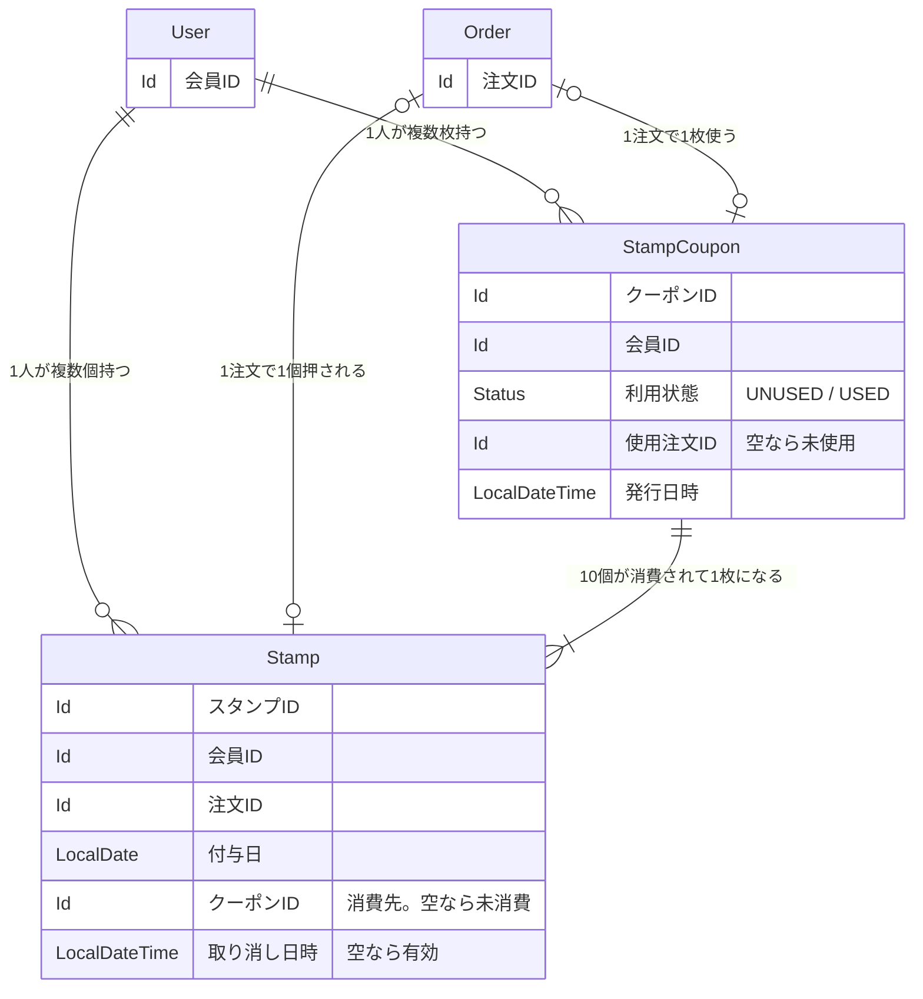

# 問題1：スタンプカード（ポイント） — 詳細要件定義

## 用語 — 全体の用語集に追加する呼称
| 呼称（これで統一する） | 何を指すか | 言い換えない |
|---|---|---|
|スタンプ|１回の注文ごとにたまるポイント。|ポイント、来店記録|
|有効期限|一つのスタンプの有効期限。付与されてから１年間有効|失効日、期限日、有効期間|
|クーポン|スタンプが１０個貯まったら付与される|無料券|


## ER 図


## EntityModel
### スタンプ
```
case class salesStamp(
  id:            Option[Id],           // 管理 ID（永続化前は None）
  shopId:        Shop.Id,              // どの店舗の設定か
  orderId:       Order.Id,             // どの注文によるものか
  stampDeadLine: LocalDate,            // スタンプの有効期限
  stampCoupon:   Int,                  // クーポンの数
  usedAt:        Option[LocalDate],    // クーポンを使用した日(使用しなかったらNone)
  updatedAt:     LocalDateTime = Now,  // データ更新日
  createdAt:     LocalDateTime = Now   // データ作成日
) extends EntityModel[Id]

object ShopBusinessHour:

  type   Id = Id.Repr
  object Id extends Entity.Id[Long]
```

**ここで型が語っていること**
- usedAtのOption の None が「未使用」。
- 有効期限は日にちで判断する(時刻で判断しない)

**型では守れない決めごと**
- スタンプが10個たまると、クーポンに切り替わる,11個目は新しい1つとして判断する
- スタンプは付与された日にちから1年間

**保存されるデータの例**
（パターンごとに 1 行ずつ、**実際に入る値**で）

## 区分値の考え方


## 置き場所（コンテキスト）
判断：sales

理由：スタンプ は注文（Order）の結果として動く。<br>
      だから Order と同じ sales に置き、menu や shop から切り離す

---

# 付録A：今回やらないこと
- 店頭でのスタンプ付与はしない(オンライン限定)
- クーポンの有効期限をつけない
- 有効期限間近になった時のお知らせ
- スタンプの譲渡の有無
- クーポンが使用できるハンバーガーメニューに制限を設けない

# 付録B：判断の記録
### 論点1：クーポンをエンティティにするか値オブジェクトにするか
判断：値オブジェクトにするか<br>
理由: クーポンに関して、有効期限や取得した際の履歴などを追跡する
      必要がないため。今回はクーポン数が何個あるかだけ見て判断するので、
      値オブジェクトして0個や1個として扱う。ただし実務で有効期限や
      使用先の追跡が必要になることもあるため、必要があれば、
      エンティティに昇格させる

### 論点2:
