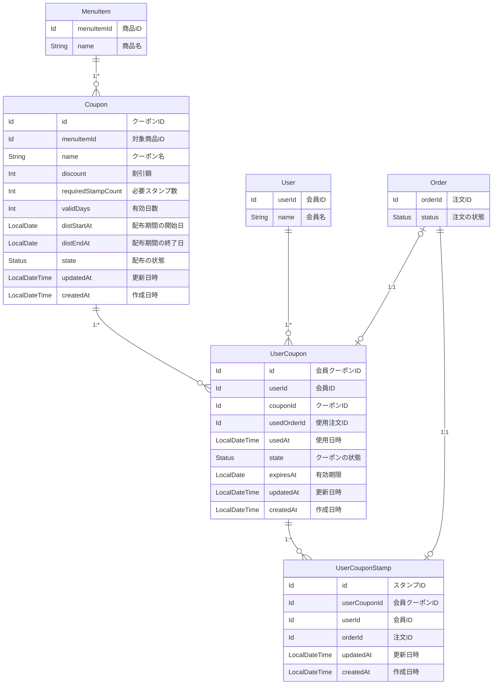
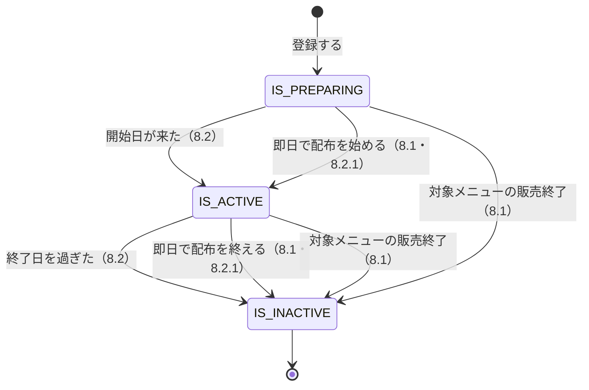
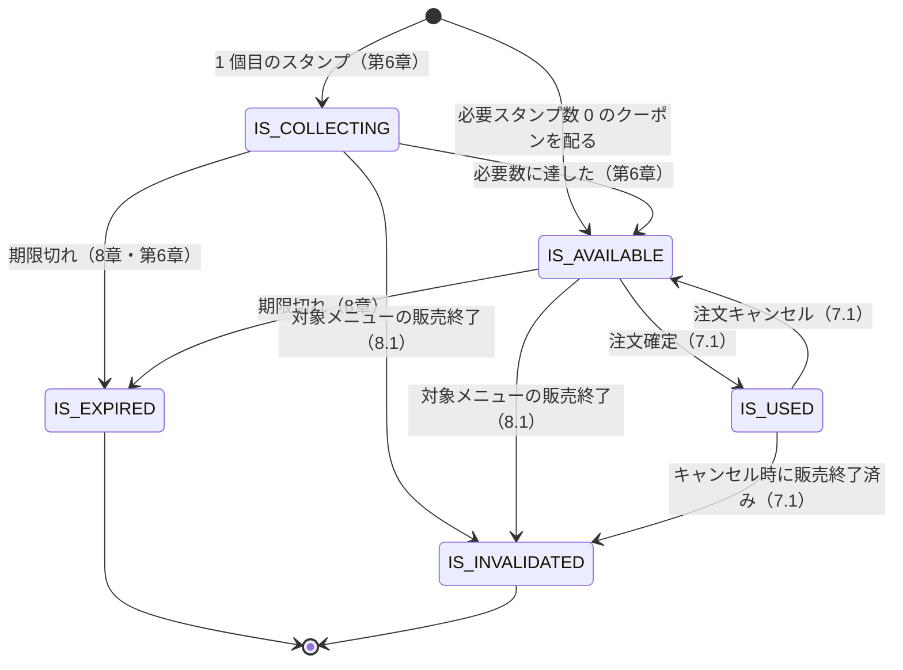
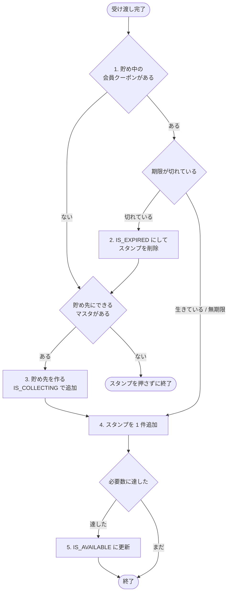

# スタンプカード（ポイント） — 詳細要件定義

対象：クーポンの管理と、会員のスタンプ付与 ／ 前提：[要件定義](./01_requirements.md)で合意済み

## 1. 概要

本部がクーポンの種類（対象商品・割引額・必要スタンプ数・有効日数）を登録できるようにする。会員は受け渡しが完了した注文 1 件につきスタンプを 1 個貯め、必要数に達したクーポンを注文で使用できる。スタンプは店舗をまたいで共通で、有効期限はクーポン 1 枚ごとに持つ。

既存の `User` `Order` `Payment` `Shop` `MenuItem` は変更しない。エンティティを 3 つ追加し、2 つのコンテキストに分けて配置する。

| エンティティ | コンテキスト |
|---|---|
| `Coupon` | `common/coupon`（新しいサブカテゴリ） |
| `UserCoupon` | `sales` |
| `UserCouponStamp` | `sales` |

## 2. 用語

全体の用語集への追加を申請する。

| 呼称 | 何を指すか | 言い換えない |
|---|---|---|
| クーポン | 本部が登録するクーポンの種類 | クーポンマスタ、クーポンの種類、テンプレート |
| 会員クーポン | 会員が持っているクーポン 1 枚 | カード、スタンプカード、無料券、特典 |
| 会員クーポンスタンプ | 受け渡し 1 回につき 1 個押されるスタンプ | ポイント、来店記録、判子 |
| 準備中 / 配布中 / 配布終了 | そのクーポンが今どの段階か | 有効 / 無効 |
| 貯め中 | 会員クーポンのうち、必要スタンプ数に達していないもの | 未完成、途中 |
| 使用可能 | 必要スタンプ数に達し、まだ使っていないもの | 有効、完成 |
| 無効化 | 対象メニューの販売終了により、期限前に使えなくなった会員クーポン | 期限切れ |

「クーポン」が 2 つのものを指していた。「夏はドリンクのクーポンを配ろう」は種類の話、「私のクーポンが期限切れになった」は 1 枚の話である。本部が登録するものを「クーポン」、会員が持つものを「会員クーポン」と呼び分ける。

「カード」と「クーポン」は同じモデルである。貯めている途中は「カード」、完成したら「クーポン」と業務では呼ばれるが、`UserCoupon` の状態が違うだけ。2 つのモデルに分けると、必要数に達した瞬間に「カード」の行を消して「クーポン」の行を作る移し替えが必要になり、途中で失敗するとどちらも存在しない状態が生まれる。同じ会員クーポンを指す ID も 2 つになるため、どのカードから生まれたかを追う参照が要る。1 つのモデルなら `state` を書き換えるだけで済む。業務の言葉が 2 つあることは、モデルを 2 つにする理由にならない。

「配布終了」「期限切れ」「無効化」は別物である。配布終了は新しく配らないこと、期限切れは日付によって使えなくなること、無効化は対象メニューの販売終了によって期限前に使えなくなること。通常の配布終了にしても、すでに配られた会員クーポンは期限まで使える。

## 3. データ構成

本部が登録するクーポン 1 種類に対して、会員クーポンが 1 対多で紐づく。会員クーポン 1 枚に対して、スタンプが 1 対多で紐づく。



図で読み取ってほしいのは 4 点。

- `UserCouponStamp` は `userCouponId` が必須。スタンプは必ずどこかの会員クーポンに属する（論点2）。
- `UserCouponStamp` は `userId` を持つ。親の `UserCoupon.userId` をコピーしたもので、障害調査のために持つ。
- `Coupon` は `sales` を参照しない。マスタ側は自分が何枚配られたかを知らない（第10章）。
- `UserCoupon` に付与日時がない。`createdAt` が兼ねる。

## 4. モデル定義

### 4.1 クーポン（`common/coupon`）

```scala
case class Coupon(
  id:                 Option[Id],           // 管理 ID（永続化前は None）
  menuItemId:         MenuItem.Id,          // 対象商品
  name:               String,               // 「バーガー無料券」
  discount:           Option[Int],          // 割引額（円）。None ＝ 対象商品が無料
  requiredStampCount: Int,                  // 必要なスタンプ数。0 なら即配布できる
  validDays:          Option[Int],          // 有効日数（配ってから何日有効か）。None ＝ 無期限
  distStartAt:        LocalDate,            // 配布期間の開始日
  distEndAt:          LocalDate,            // 配布期間の終了日
  state:              Status,               // 配布の状態
  updatedAt:          LocalDateTime = Now,  // データ更新日
  createdAt:          LocalDateTime = Now   // データ作成日
) extends EntityModel[Id]

object Coupon:

  type   Id = Id.Repr
  object Id extends Entity.Id[Long]

  /** 配布の状態 */
  enum Status(val code: Int) extends EnumStatus[Int]:
    case IS_PREPARING  extends Status(code =  0) // 準備中
    case IS_ACTIVE     extends Status(code =  1) // 配布中
    case IS_INACTIVE   extends Status(code = -1) // 配布終了
```

状態は一方向にのみ進む。通常は日次バッチ（8.2）が配布期間と比べて進め、バッチを待たず即座に反映させたいときだけ手で書き換える（8.1・8.2.1）。



`menuItemId` は必須である。対象商品のないクーポンは作れないため、「注文全体から◯◯円引く」という金券型が構造的に排除される。

`discount` の `None` が「無料」を意味する。組み合わせは 2 通りで、どちらも有効なので検証が要らない。

| `discount` | 意味 |
|---|---|
| None | その商品が無料 |
| `Some(200)` | その商品が 200 円引き |

`requiredStampCount` は可変にしている。10 固定ではないため「5 個で 1 枚」のキャンペーンもマスタの登録だけで実現できる。

日付に関わる項目が 3 つあり、混同しやすいので整理する。**「いつ配るか」と「配ったものがいつまで使えるか」は別の軸である**（論点5・論点6）。

| 項目 | どちらの軸か | 型 | 決まるタイミング |
|---|---|---|---|
| `Coupon.distStartAt` / `distEndAt` | いつ配るか（絶対） | `LocalDate` | マスタの登録時 |
| `Coupon.validDays` | 配ってから何日使えるか（相対） | `Option[Int]` | マスタの登録時 |
| `UserCoupon.expiresAt` | いつまで使えるか（絶対） | `Option[LocalDate]` | 会員に配った時に計算 |

```
マスタ        ├──── 配布期間（distStartAt 〜 distEndAt）────┤
                    │                        │
              配られる                  配られる
                    ↓                        ↓
会員クーポンA        ├──── validDays ────┤
会員クーポンB                             ├──── validDays ────┤
                                          ↑                   ↑
                                       createdAt          expiresAt
```

マスタが日数（相対）を持ち、会員クーポンが期限（絶対）を持つ分担にしている。マスタ 1 件から何枚も配られ、配られるタイミングが会員ごとに違うため、マスタ側に絶対的な期限を書けない。

`validDays` が `None` なら無期限で、配られる会員クーポンの `expiresAt` も `None` になる（論点6）。

`state` は配布期間から日次バッチが導く値であり、キャッシュである（論点3 の `expiresAt` と `state` の関係と同じ構図）。

型では守れない決めごと。

- `discount` は正の値。0 や負は無効。
- `discount` が対象商品の価格を超えてもよい。超過分は切り捨てて実質無料になる。
- `requiredStampCount` は 0 以上。0 ならスタンプなしで配れる。
- `requiredStampCount > 0` のマスタは、`IS_ACTIVE` である期間が重複しないように登録する。同時に配布中のマスタが複数あると、スタンプを貯める先が自動で選べない。マスタの登録は本部が年に数回行うだけなので、DB 制約で強制せず運用で担保する。配布を終えたマスタ同士で過去の期間が重なることは、この制約の対象外である。同時に配布中になり得ないため。
- `requiredStampCount = 0` のマスタは何個あってもよい。誕生日クーポンなどは配布処理が明示的にマスタを指定するので、自動選択が起きない。
- `validDays` は `Some` の場合 1 以上。`None` は無期限（論点6）。
- `distEndAt` は `distStartAt` 以降。
- `state` は `IS_PREPARING → IS_ACTIVE → IS_INACTIVE` の一方向にのみ遷移する。通常は日次バッチが配布期間と比べて自動で進める（論点5）。手動で戻すことはしない。
- `state` を手で書き換えるのは、販売終了やキャンペーンの即日切り替えのように、バッチを待たず反映させたい場合だけである（8.1・8.2.1）。そのときは配布期間も同時に書き換える。片方だけを変えない。原則として `state` は配布期間から導かれる値と一致させるが、開始当日に販売終了する場合だけはその日 1 日ずれる（8.1）。
- 通常の配布終了にしても、すでに配られた会員クーポンは期限まで使える。対象 `MenuItem` の販売終了時は、会員クーポンを無効化する。

条件をいつ変更できるかは、`state` で決まる。基準は「その条件に依存する会員クーポンが既に存在するか」である。

| `state` | 変更できるもの | 理由 |
|---|---|---|
| `IS_PREPARING`（準備中） | すべての条件 | まだ 1 枚も配られていないため、辻褄が合わなくなる相手がいない |
| `IS_ACTIVE`（配布中） | `distEndAt` のみ | 配られた会員クーポンは登録時の条件で期限などが確定済み。今後いつまで配るかだけは変えられる |
| `IS_INACTIVE`（配布終了） | なし | 配布は終わっており、変えても何も起きない |

`IS_ACTIVE` になった後に対象商品・割引額・必要スタンプ数・有効日数・`distStartAt` を変えたくなったら、新しい `Coupon` を登録し、旧クーポンを配布終了にする。

`IS_ACTIVE` の `distEndAt` は延長も前倒しもできる。ただし `IS_INACTIVE` になった後に書き換えても、日次バッチは `IS_INACTIVE` から戻さないため反映されない（論点5）。

保存されるデータの例。

| id | menuItemId | name | discount | requiredStampCount | validDays | distStartAt | distEndAt | state |
|---|---|---|---|---|---|---|---|---|
| 1 | 101（バーガー） | バーガー無料券 | None | 10 | `Some(365)` | 2026-01-01 | 2026-06-30 | 配布終了 |
| 2 | 205（ドリンク） | 誕生日ドリンク券 | None | 0 | None | 2026-01-01 | 2027-12-31 | 配布中 |
| 3 | 101（バーガー） | バーガー200円引き券 | `Some(200)` | 5 | `Some(90)` | 2026-07-01 | 2026-12-31 | 配布中 |
| 4 | 101（バーガー） | 秋のバーガー無料券 | None | 10 | `Some(365)` | 2027-09-01 | 2028-02-28 | 準備中 |

2 番の `validDays` が `None` なのは、誕生日クーポンを無期限で運用する想定のためである（論点6）。同じ「誕生日ドリンク券」でも `requiredStampCount = 0` と `validDays = None` は別の軸で、たまたま両方が「特別扱い」を受けているだけである。

4 行とも同じモデル・同じ形。「無料券」「割引券」「誕生日券」という業務の言葉が複数あるが、区分値は「準備中 / 配布中 / 配布終了」の 3 値だけ。1 番と 4 番は同じ商品・同じ条件だが、`IS_ACTIVE` である期間が重ならないように登録されている。

### 4.2 会員クーポン（`sales`）

```scala
case class UserCoupon(
  id:          Option[Id],             // 管理 ID（永続化前は None）
  userId:      User.Id,                // 誰のクーポンか
  couponId:    Coupon.Id,              // どのクーポンから配られたか
  usedOrderId: Option[Order.Id],       // 使用した注文。None ＝ 未使用
  usedAt:      Option[LocalDateTime],  // 使用日時。None ＝ 未使用
  state:       Status,                 // クーポンの状態
  expiresAt:   Option[LocalDate],      // 有効期限（作成日 + マスタの validDays）。None ＝ 無期限
  updatedAt:   LocalDateTime = Now,    // データ更新日
  createdAt:   LocalDateTime = Now     // データ作成日。配られた日時を兼ねる
) extends EntityModel[Id]

object UserCoupon:

  type   Id = Id.Repr
  object Id extends Entity.Id[Long]

  /** クーポンの状態 */
  enum Status(val code: Int) extends EnumStatus[Int]:
    case IS_COLLECTING   extends Status(code = 100) // 貯め中
    case IS_AVAILABLE    extends Status(code = 200) // 使用可能
    case IS_USED         extends Status(code =  -1) // 使用済み
    case IS_EXPIRED      extends Status(code =  -2) // 期限切れ
    case IS_INVALIDATED  extends Status(code =  -3) // 対象メニュー販売終了で無効化
```



図で読み取ってほしいのは 3 点。

| 読み取ること | 意味 |
|---|---|
| `IS_USED` から戻る矢印がある | 使用は注文確定で確定するため、キャンセルで戻す必要がある（7.1）。他の負の状態は終端 |
| `IS_INVALIDATED` に 3 本入るが、入り方が違う | 貯め中と使用可能は、対象メニューの販売終了で落ちる（8.1）。使用済みは販売終了では落ちず、その後キャンセルされたときに初めて落ちる（7.1） |
| 開始が 2 つある | スタンプを貯めて作る経路と、必要数 0 のクーポンを直接配る経路 |

`couponId` は必須である。どのマスタから配られたかが必ず分かるため、クーポン別の使用状況が集計できる。

付与日時のフィールドを持たない。行が作られる瞬間が配られた瞬間なので、`createdAt` が兼ねる。

`expiresAt` は保存する。マスタの `validDays` を後から変えても、既に配ったクーポンの期限は変わらない。マスタの `validDays` が `None` なら、配られる会員クーポンの `expiresAt` も `None`（無期限）になる（論点6）。

`code` の符号が意味を持つ。正はまだ使える可能性がある、負は終わったことを表し、`code > 0` で「生きているクーポンか」を判定できる。正の値は 100 刻みにしているため、間に状態が増えても `150` で挿入できる。ただし `IS_USED` だけは例外で、注文がキャンセルされると `IS_AVAILABLE` に戻る（対象メニューが販売終了なら `IS_INVALIDATED`。7.1）。

対象商品や割引額は持たない。マスタが持っているので `couponId` から辿る。

型では守れない決めごと。

- `usedOrderId` と `usedAt` は連動する。組み合わせは 4 通りあるが、有効なのは次の 2 通りのみ。生成時に検証する。

  | `usedOrderId` | `usedAt` | 扱い |
  |---|---|---|
  | None | None | 有効。まだ使っていない |
  | `Some` | `Some` | 有効。この注文で使った |
  | `Some` | None | 無効。注文は分かるが日時が不明 |
  | None | `Some` | 無効。日時だけあって注文が不明 |

- `state` が `IS_USED` のとき、`usedOrderId` と `usedAt` は必ず埋まっている（逆も同様）。
- 会員あたり、`IS_COLLECTING` の行は最大 1 枚。1 回の受け渡しで押されるスタンプは 1 個なので、貯める先が 2 つあると決まらない。この条件は運用では守れないため、DB の一意制約で担保する。MySQL は部分ユニークインデックスを持たないので、`state` が `IS_COLLECTING` のときだけ `user_id` を返す生成列を作り、そこに一意制約を張る。第6章のステップ 1〜5 は 1 トランザクションで行い、重複キーで落ちた側はステップ 1 からやり直す。ステップ 5 を外すと、必要スタンプ数に達しているのに `IS_COLLECTING` のまま残る行が生まれ、次の受け渡しでその行が貯め先として拾われてしまう。
- `usedOrderId` は一意。1 注文で使えるクーポンは 1 枚まで。
- 使用時は `state` が `IS_AVAILABLE` かつ `expiresAt` が今日より前でないことを両方確認する。`state` はキャッシュであり、正は `expiresAt` である（論点3）。`expiresAt` が `None`（無期限）のときは、この期限確認を行わない（論点6）。
- `expiresAt` は配った日の `LocalDate + validDays` として計算し、以後変えない。期限日は利用可能で、翌日から期限切れとする。マスタの `validDays` が `None` なら `expiresAt` も `None` にする。
- 対象メニューの販売終了時は、`IS_COLLECTING` と `IS_AVAILABLE` を `IS_INVALIDATED` に更新する。通常の配布終了では更新しない。
- 使用を確定するのは注文確定時である。その注文がキャンセルされたら `IS_AVAILABLE` に戻し、`usedOrderId` と `usedAt` を None に戻す（7.1）。ただし対象メニューが販売終了になっていれば `IS_INVALIDATED` に落とし、紐づくスタンプも削除する（7.1）。未受け取りで終わった場合は戻さない。
- 使用確定は対象行をロックし、`state` が `IS_AVAILABLE` であることを確認してから更新する。二重使用を防いでいるのはこの確認だけであり、`usedOrderId` の一意制約では防げない（7.1）。

保存されるデータの例（会員 ID 100、今が 2026-10-15）。

| id | couponId | state | usedOrderId | expiresAt | 業務での状態 |
|---|---|---|---|---|---|
| 51 | 1 | `IS_USED` | `Some(5120)` | `Some(2027-01-15)` | 使用済み |
| 52 | 1 | `IS_AVAILABLE` | None | `Some(2027-05-01)` | 使える |
| 53 | 3 | `IS_COLLECTING` | None | `Some(2027-01-03)` | 貯め中（スタンプ 3 個） |
| 54 | 2 | `IS_AVAILABLE` | None | None | 誕生日券（無期限。スタンプ 0 個） |
| 55 | 3 | `IS_EXPIRED` | None | `Some(2026-10-03)` | 期限切れ。スタンプは削除済み |

54 番の `expiresAt` が `None` なのは、マスタ（クーポン 2 番）の `validDays` が `None` だからである。この行は日次バッチの対象にならず、`IS_EXPIRED` に落ちることがない。

53 番と 54 番が対比になっている。54 番は `requiredStampCount = 0` なので、作った瞬間に `IS_AVAILABLE` になる。

55 番のように、期限切れの行は残す。使われずに終わった枚数を数えるため。ただし紐づくスタンプは削除される。

55 番と 53 番はどちらもクーポン 3 番から配られている。55 番が 2026-10-03 に期限切れになり、その後の受け渡しで 53 番が作られた。貯め中は会員あたり 1 枚なので、この 2 つが同時に貯め中であることはない。

### 4.3 会員クーポンスタンプ（`sales`）

```scala
case class UserCouponStamp(
  id:           Option[Id],           // 管理 ID（永続化前は None）
  userCouponId: UserCoupon.Id,        // どの会員クーポンに属するか
  userId:       User.Id,              // どの会員のスタンプか
  orderId:      Order.Id,             // どの注文で押されたか（一意）
  updatedAt:    LocalDateTime = Now,  // データ更新日
  createdAt:    LocalDateTime = Now   // データ作成日
) extends EntityModel[Id]

object UserCouponStamp:

  type   Id = Id.Repr
  object Id extends Entity.Id[Long]
```

`userCouponId` は必須である（`Option` ではない）。スタンプは必ずどこかの会員クーポンに属するため、親子関係が構造として成立し、親が期限切れになればスタンプごと削除できる（論点2）。

`userId` を持つ。スタンプを数える単位は `userCouponId` であり、`userId` はそのためではない。障害調査など、会員を起点に横断的に引きたい場面のために持つ。平常運用のクエリはすべて `userCouponId` で絞れるが、会員IDを起点に横断的に洗い出したい場面では `UserCoupon` を経由した JOIN が必要になり、調査の初動が遅れる。親の `UserCoupon.userId` を作成時にコピーしたものであり、以後変更しない。

有効期限も付与日時も持たない。スタンプ単体は失効せず、期限は親が持つ。取り消しの記録も持たない。受け渡し完了が付与のトリガーなので、押された後にキャンセルされることがない（7.1）。

型では守れない決めごと。

- `orderId` は一意。1 回の受け渡しにつきスタンプは 1 個。
- `userId` は親の `UserCoupon.userId` と常に一致する。`UserCoupon` の `userId` は作成後に変わらないため、コピーしたスタンプ側もズレない。
- 親の `UserCoupon` が `IS_EXPIRED` または `IS_INVALIDATED` になったら、紐づくスタンプは削除する。日次バッチ（8章）、販売終了時の処理（8.1）、キャンセルで `IS_INVALIDATED` に落ちたとき（7.1）、受け渡し完了時に期限切れを検出したとき（第6章のステップ 2）の 4 経路があり、いずれも削除する側で行う。
- `UserCoupon` が `IS_COLLECTING` 以外のとき、スタンプを追加しない。

### 4.4 区分値

追加する 3 つのエンティティのうち、区分値を持つのは 2 つである。

| エンティティ | 区分値 | 値の数 |
|---|---|---|
| `Coupon` | `Status`（配布の状態） | 3 |
| `UserCoupon` | `Status`（クーポンの状態） | 5 |
| `UserCouponStamp` | なし | — |

`UserCouponStamp` が区分値を持たないのは、行を足すだけの操作しかないため。

| 業務の言葉 | どう表すか | 保存するか |
|---|---|---|
| 準備中 | `Coupon.state` が `IS_PREPARING` | する（ただしキャッシュ。論点5） |
| 配布中 / 配布終了 | `Coupon.state` | する（ただしキャッシュ。論点5） |
| 貯め中 | `UserCoupon.state` が `IS_COLLECTING` | する |
| 使用可能 | `UserCoupon.state` が `IS_AVAILABLE` | する |
| 使用済み | `UserCoupon.state` が `IS_USED` | する |
| 期限切れ | `UserCoupon.state` が `IS_EXPIRED` | する（ただしキャッシュ） |
| 無効化 | `UserCoupon.state` が `IS_INVALIDATED` | する |
| あと何個か | `requiredStampCount − スタンプ数` | しない |
| 無料券 / 割引券 | `Coupon.discount` の有無 | する（区分値ではない） |

「無料券」と「割引券」に区分値を作っていない。`discount` が None かどうかで区別でき、無効な組み合わせも生まれない。

キャッシュである区分値が 2 つある。`UserCoupon` の `IS_EXPIRED` と、`Coupon.state` の 3 値である。どちらも日付から導ける値を保存しているため、日次バッチが書き換えるまで実態とズレる。

| キャッシュ | 正 | 書き換えるもの |
|---|---|---|
| `UserCoupon.state` が `IS_EXPIRED` か | `expiresAt` | 8章の日次バッチ（論点3） |
| `Coupon.state`（準備中 / 配布中 / 配布終了） | `distStartAt` / `distEndAt` | 8.2 の日次バッチ（論点5） |

どちらも、判定するときは `state` だけでなく正の側も確認する。`UserCoupon` の使用時は `expiresAt`（4.2）、貯め先マスタの選択時は配布期間（第6章のステップ 3）を併せて見る。

`UserCoupon` の残り 4 つ（`IS_COLLECTING` / `IS_AVAILABLE` / `IS_USED` / `IS_INVALIDATED`）はキャッシュではない。導出元になる日付がなく、業務の操作でしか変わらないためである。

## 5. 貯めているスタンプ数を数える

```
WHERE user_coupon_id = ?
```

条件は 1 つだけ。スタンプは失効せず、取り消しもされず、必ず 1 つの会員クーポンに属するため、他の条件は要らない。

「あと何個か」は `Coupon.requiredStampCount − スタンプ数` で求まる。どちらも保存しない。

## 6. 受け渡し完了時の処理順序

1. その会員の `IS_COLLECTING` な `UserCoupon` を探す。
2. 見つかった会員クーポンの `expiresAt` が `Some` かつ今日より前なら、その場で `IS_EXPIRED` に更新し、紐づく `UserCouponStamp` を削除する。見つからなかったものとして次に進む。`expiresAt` が `None`（無期限）なら、この判定は行わない。
3. 貯め先が無ければ作る。`state` が `IS_ACTIVE` かつ配布期間内（`distStartAt <= 今日 <= distEndAt`）かつ `requiredStampCount > 0` のマスタを 1 件取り、`UserCoupon` を `IS_COLLECTING` で追加する。マスタの `validDays` が `Some(n)` なら `expiresAt` ＝ 今日 + `n` 日、`None` なら `expiresAt` ＝ `None`。
4. `UserCouponStamp` を 1 件追加する。
5. スタンプ数が `requiredStampCount` に達したら、`state` を `IS_AVAILABLE` に更新する。



ステップ 1〜5 は 1 トランザクションで行う（4.2）。

図の右下、貯め先にできるマスタが 1 件も無い経路に注意する。この受け渡しにはスタンプが押されず、記録も残らない。ステップ 3 の条件は `state` が `IS_ACTIVE` かつ配布期間内かつ `requiredStampCount > 0` の 3 つで、3 つすべてを満たすマスタが 1 件も無ければこの経路に落ちる。キャンペーンの切り替え日にバッチが走る前や、配布期間に隙間がある場合に起こり得る（8.2.1）。

ステップ 3 が今回の設計の核心である。1 個目のスタンプと同時にクーポンが作られるため、スタンプが親のない状態で存在することがない。

ステップ 2 は、付与のときも期限の正を `expiresAt` に置くための手順である（論点3）。`state` だけで判定すると、日次バッチが走る前の時間帯や、バッチが落ちた日に、期限切れの会員クーポンへスタンプを足してしまう。そのスタンプは次のバッチで会員クーポンごと削除されるため、受け渡しの記録が失われる。来店した時点で正しい状態に直し、その後来店しない会員の後始末をバッチが引き受ける、という分担にする。

`requiredStampCount = 0` のマスタから配る場合（誕生日など）は、この流れを通らない。配布処理が `UserCoupon` を直接 `IS_AVAILABLE` で作る。

## 7. クーポンを使用するときの計算

```
支払額 = max(対象商品の価格 − 割引額, 0)
```

`discount` が None なら対象商品が無料になる。超過分は切り捨てる。

対象商品が注文に入っていないと使えない。`Coupon.menuItemId` の商品が `OrderItem` に含まれているか確認する。

「対象商品の価格」は `MenuItem` の基準価格を指す。オプションによる加算分は割引の対象外とし、オプション代は割り引かれずに残る。対象商品が注文に複数個含まれる場合は、そのうち 1 個にのみ適用する。

| 注文の内容 | クーポン | 割り引く額 |
|---|---|---|
| バーガー 1 個（500 円） | バーガー無料券 | 500 円 |
| バーガー 1 個（500 円）＋ チーズ追加（100 円） | バーガー無料券 | 500 円（チーズ代 100 円は残る） |
| バーガー 2 個（1,000 円） | バーガー無料券 | 500 円（1 個分のみ） |

### 7.1 使用を確定する時点

注文確定時に `state` を `IS_USED` に更新し、`usedOrderId` と `usedAt` を書き込む。受け渡しの完了は待たない。

| 時点 | クーポンについて何をするか |
|---|---|
| 注文確定 | `state` が `IS_AVAILABLE` であることを確認し、`expiresAt` が `Some` の場合は今日より前でないことも確認して、`IS_USED` に更新する |
| 支払い | 何もしない |
| 受け渡し完了 | 何もしない（スタンプの付与は行う） |
| 注文キャンセル | `IS_USED` を `IS_AVAILABLE` に戻し、`usedOrderId` と `usedAt` を None に戻す。ただし対象メニューが販売終了になっていれば `IS_INVALIDATED` に落とす |

どちらに戻す場合も、`usedOrderId` と `usedAt` は None に戻す。注文がキャンセルされた以上そのクーポンは使われていないので、使用の記録を残さない。これにより「`usedOrderId` が埋まっているのは `IS_USED` のときだけ」という不変条件（4.2）が保たれる。`IS_INVALIDATED` に落とす場合は、紐づく `UserCouponStamp` も削除する。他の無効化の経路と揃える。

戻す先が 2 通りあるのは、使用中に対象メニューが販売終了になる場合があるためである。8.1 は `IS_COLLECTING` と `IS_AVAILABLE` だけを無効化するので、そのとき `IS_USED` だった会員クーポンは対象から外れる。無条件に `IS_AVAILABLE` へ戻すと、販売終了した商品のクーポンが「使える」状態で復活してしまう（論点4）。期限切れは日次バッチが拾い直すので自己修復するが、販売終了は一度きりの処理なので自己修復しない。

スタンプの付与とは逆の時点になる。付与は行を 1 本足すだけの操作なので、後戻りしない受け渡し完了まで待てる。使用は 1 枚しかない権利を消費する操作なので、確定を遅らせると同じ会員クーポンを指定した注文が 2 件通ってしまう。受け渡し完了まで `IS_AVAILABLE` のままにすると、どちらの注文も割引後の額で決済され、受け渡しの段になって 2 件目が弾かれる。金銭を受け取った後に権利が無いと分かる状態になり、店頭では解決できない。

二重使用を止めているのは `state` の確認だけである。使用確定は対象行をロックし、`state` が `IS_AVAILABLE` であることを確認してから更新する。`usedOrderId` の一意制約はここでは効かない。あれは 1 つの注文が 2 枚のクーポンを使うことを防ぐ制約であり、1 枚のクーポンが 2 つの注文に使われる場合は書き込む値が衝突しないためである。

代償として `IS_USED` から `IS_AVAILABLE` へ戻る遷移が生まれ、「負 ＝ 終わった」という `code` の読み方に例外ができる。集計では、キャンセルで戻った分が使用枚数に計上されない点に注意する。

未受け取りで終わった注文では、クーポンを戻さない。商品は確保されており、受け渡しに至らなかった理由が会員側にあるため。

## 8. 日次バッチ

1. `expiresAt < 今日` かつ `state` が `IS_COLLECTING` または `IS_AVAILABLE` の `UserCoupon` を `IS_EXPIRED` に更新する。
2. `IS_EXPIRED` になった `UserCoupon` に紐づく `UserCouponStamp` を削除する。

ステップ 2 により、貯めきれなかったスタンプが溜まり続けることを防ぐ。親子関係にしたことで、削除対象が `userCouponId` で引ける。

ステップ 1 の条件はそのままで無期限のクーポン（`expiresAt` が `None`）を除外できる。SQL では `NULL` との比較は常に真にならないため、`expiresAt < 今日` は `expiresAt` が `NULL` の行に対して自動的に false になる。特別な分岐を書く必要はない。

## 8.1 対象メニューを販売終了にするとき

販売終了にするメニューを対象とする `Coupon` を、`state` ごとに次のように扱う。同じメニューを対象とするクーポンが複数あれば、そのすべてに対して行う。

| 対象の `state` | ステップ 1 で何をするか |
|---|---|
| `IS_ACTIVE`（配布中） | `distEndAt` を昨日に縮め、`state` を `IS_INACTIVE` に更新する。`distStartAt` が今日なら `distEndAt` も今日にする |
| `IS_PREPARING`（準備中） | `distStartAt` と `distEndAt` の両方を昨日にし、`state` を `IS_INACTIVE` に更新する |
| `IS_INACTIVE`（配布終了） | 何もしない。すでに配布は終わっている |

1. 上の表のとおり `Coupon` を配布終了にする。
2. 配布中だったクーポンの `requiredStampCount` が 1 以上なら、後継のクーポンを `distStartAt` ＝ 今日で登録し、`state` を `IS_ACTIVE` にする。
3. 販売終了にしたメニューを対象とする `Coupon` に紐づく `IS_COLLECTING` と `IS_AVAILABLE` の `UserCoupon` を `IS_INVALIDATED` に更新する。すでに `IS_INACTIVE` だったクーポンから配られた会員クーポンも対象に含める。
4. `IS_INVALIDATED` になった `UserCoupon` に紐づく `UserCouponStamp` を削除する。

`state` ごとに扱いを分ける理由は、いずれも 4.1 の決めごとを守るためである。

| なぜ | 4.1 のどの決めごとか |
|---|---|
| 準備中は `distStartAt` も昨日にする | 配布期間を過去に置かないと、そこから導かれる値が「準備中」のままで `state` と食い違う。準備中はすべての条件を変更できるので動かしてよい |
| 配布中で `distStartAt` が今日なら `distEndAt` も今日にする | `distEndAt` は `distStartAt` 以降、という条件を守るため。この日 1 日だけ導出値とズレるが翌日には一致する。`distStartAt` を動かせば即座に一致するが、今日から配り始めた記録を書き換えることになるので行わない |
| 配布終了には何もしない | `IS_INACTIVE` になった後は `distEndAt` を変更できない。配布は終わっているので縮める必要もない。ただしステップ 3 は行う |

ステップ 1〜2 について、守ることが 2 つある。

| 守ること | 破るとどうなるか |
|---|---|
| 1 トランザクションで行う | 貯め先が 0 件になる時間か 2 件並ぶ時間が生まれ、第6章のステップ 3 で貯める先が決まらない（4.1） |
| `state` と配布期間を同時に書き換える | 正である配布期間は「配布中」、`state` は「配布終了」という食い違いが恒久的に残る。第6章は両方を見るので実害は出ないが、配布期間だけで判定する集計や画面が、販売終了したクーポンを拾う |

`state` を手で書き換えるのは、8.2 の日次バッチを待たずに即座に反映させるためである。後継クーポンを `IS_PREPARING` のまま置くと、翌日のバッチが `IS_ACTIVE` にするまで貯め先が 0 件になる。配布期間と `state` の両方を正しい値にしておけば、次のバッチが実行されても結果は変わらない。

一時的な品切れではこの処理を行わない。対象メニューの販売終了だけが無効化のトリガーである。

## 8.2 配布期間による `Coupon` の状態遷移（日次バッチ）

1. `state` が `IS_PREPARING` かつ `distStartAt <= 今日` の `Coupon` を `IS_ACTIVE` に更新する。
2. `state` が `IS_ACTIVE` かつ `distEndAt < 今日` の `Coupon` を `IS_INACTIVE` に更新する。

`state` は配布期間から導ける値であり、キャッシュである（論点5）。正は `distStartAt` / `distEndAt` であるため、第6章のステップ 3 でマスタを選ぶときは `state = IS_ACTIVE` に加えて配布期間も確認する。`state` だけを信じると、終了日を過ぎたのにバッチが落ちてまだ `IS_ACTIVE` のままのマスタが選ばれ続けてしまう（論点3 の `expiresAt` と同じ理由）。

逆に、開始日当日でバッチがまだ走っていないマスタは、この確認では拾えない。`state` が `IS_PREPARING` である以上、2 つの条件を AND で結んでいる限り選ばれないためである。

### 8.2.1 キャンペーンを切り替えるとき

配布期間を隙間なく連続させて登録しておけば、このバッチが期日に切り替える。「バーガー無料券」の `distEndAt` の翌日から「ドリンク無料券」の `distStartAt` が始まるようにしておく。貯め中の会員はバーガー券として完成させ、次の 1 個目からドリンク券になる。

ただし切り替え日の未明からバッチが実行されるまでは、貯め先が 0 件になる。旧マスタは配布期間を過ぎており、新マスタはまだ `IS_PREPARING` のためである。第6章のステップ 3 は `state` と配布期間の両方を確認するので、どちらも選ばれない。この時間帯に受け渡しが起きると、その 1 回分のスタンプが押されない。

この窓を許容するかどうかは、バッチの実行時刻と営業時間しだいである。深夜に実行し、その時間帯に受け渡しがないなら問題にならない。許容できないなら、8.1 と同じように配布期間と `state` を同時に書き換えて即日で切り替える。

切り替えの予定そのものを前倒しする場合も同じである。旧マスタの `distEndAt` を縮め、新マスタの `distStartAt` を早める。新マスタはまだ準備中なのですべての条件を変更できる（4.1）。ただし日付を直すだけではバッチを待つことになるので、即日で反映させたいなら `state` も同時に書き換える。

## 9. エンティティ一覧

### 追加するもの

| エンティティ | テーブル | コンテキスト | 役割 |
|---|---|---|---|
| `Coupon` | `common_coupon` | `common/coupon` | 本部が登録するクーポンの種類 |
| `UserCoupon` | `sales_user_coupon` | `sales` | 会員が持っているクーポン 1 枚 |
| `UserCouponStamp` | `sales_user_coupon_stamp` | `sales` | 受け渡し 1 回ごとのスタンプ |

### 既存で足りるもの

| エンティティ | なぜ足りるか |
|---|---|
| `User` | 会員そのもの。スタンプ数を保存しないため、属性を足す必要がない |
| `Order` | スタンプを押すきっかけ。参照されるだけで、`Order` 側は何も知らない |
| `Order.Status` | 受渡し完了（`IS_DELIVERED`）が付与のトリガー。問題2 で追加した値をそのまま使う |
| `MenuItem` | マスタが `menuItemId` として参照する。`MenuItem` 側は変わらない |
| `Payment` | 支払い済みであることの確認に使うが、付与のトリガーではない |
| `Shop` | 店舗をまたいで共通のため、店舗ごとのスタンプ設定を持たない |

### 既存から動かすもの

なし。追加する 3 つは既存を参照する側のため、参照の向きが一方向になり、既存側に変更が入らない。

### 新しく持つ参照

既存テーブルには列を足さない。

| どこに | 何を | コンテキストをまたぐか |
|---|---|---|
| `common_coupon.menu_item_id` | `MenuItem.Id` | `common/coupon → common/menu` |
| `sales_user_coupon.user_id` | `User.Id` | `sales → udb` |
| `sales_user_coupon.coupon_id` | `Coupon.Id` | `sales → common/coupon` |
| `sales_user_coupon.used_order_id` | `Order.Id`（任意） | `sales` 内 |
| `sales_user_coupon_stamp.user_coupon_id` | `UserCoupon.Id` | `sales` 内 |
| `sales_user_coupon_stamp.order_id` | `Order.Id` | `sales` 内 |

すべて ID だけの参照で、向きは一方向である。

## 10. 置き場所

`Coupon` は `common/coupon` に、`UserCoupon` と `UserCouponStamp` は `sales` に置く。新しいコンテキストは作らない。

| 日常的に書き換える人 | 何を書き換えるか | 更新の頻度 | 見る画面 |
|---|---|---|---|
| 本部 | クーポンの種類を登録・配布終了にする | 年に数回 | 本部の管理画面 |
| 会員（受け渡しを受けることで、システムが） | スタンプの行が増える／状態が変わる | 受け渡しのたび（毎日・大量） | 会員アプリ |
| 会員 | クーポンを使用済みにする | クーポンを使うとき | 注文画面 |

触る人と頻度が明確に分かれる。マスタは本部が年に数回、会員クーポンは会員が毎日。`common/menu`（本部が管理）と `sales`（会員が触る）の関係と同じ構図である。

`common` の 3 条件は、同じ「クーポン」でも判定が真逆になる。

| 条件 | `Coupon`（マスタ） | `UserCoupon`（会員の 1 枚） |
|---|---|---|
| 業務の操作では変わらない | ○ | ✗ 受け渡しのたびに変わる |
| 管理者が別にいる | ○ 本部 | ✗ 会員の行為で変わる |
| 他のコンテキストから参照されるだけ | ○ `MenuItem` を参照するだけ | ✗ `User` / `Order` を参照する側 |

マスタは 3 つすべてを満たし、会員クーポンは 3 つすべてで落ちる。決め手は条件 3 である。マスタが参照するのは同じ `common` 内の `MenuItem` だけなので依存が一方向のまま保たれるが、`UserCoupon` は `udb` と `sales` を参照するため `common` に置くと逆流する。

なお `common/coupon` は 02_BURGER_DOMAIN で既に想定されていた置き場所である。

```
edu/common/
├── menu/      … メニュー
├── geo/       … 都道府県
└── coupon/    … クーポンの定義（今後）
```

サブカテゴリとして仕切るため、コンテキストは 4 つのまま増えない。配線も 1 セットのままである。

テーブル名はコンテキストのパスを頭に付け、単数形にする。名前順に並べると次のようになる。

```
common_coupon             ← 今回追加
common_menu_category      ← 既存
common_menu_item          ← 既存
sales_cart                ← 既存
sales_cart_item           ← 既存
sales_cart_item_option    ← 既存
sales_order               ← 既存
sales_order_item          ← 既存
sales_order_item_option   ← 既存
sales_payment             ← 既存
sales_user_coupon         ← 今回追加
sales_user_coupon_stamp   ← 今回追加
```

`sales_user_coupon*` の 2 つが隣り合い、既存の `sales_order` / `sales_order_item`（親 ＋ 子）と同じ形になる。同じ「クーポン」でも置き場所が違うことが接頭辞で読める。

---

# 付録A 今回やらないこと

- 誕生日クーポン・キャンペーンクーポンを配る機能そのもの。`requiredStampCount = 0` で配れる形にはしておくが、配るきっかけは作らない。
- 期間限定のスタンプカード（サマーキャンペーンなど）。通常カードと同時に貯めさせるなら、「貯め中は会員あたり 1 枚」を「マスタごとに 1 枚」に変え、`UserCouponStamp.orderId` の一意制約を `(userCouponId, orderId)` の複合に変える。1 回の受け渡しで複数のカードにスタンプが載るため。なお通常カードを止めて期間限定に切り替えることはできない。9 個貯めた会員が完成まで凍結され、リピートの動機を失う。

  ただし期間限定の「クーポンを配るだけ」なら、設計を変えずにできる。`requiredStampCount = 0` のマスタを配布期間つきで登録すればよい。スタンプを貯めさせるかどうかが分かれ目である。

- スタンプの倍率キャンペーン（2 倍デーなど）。`UserCouponStamp.orderId` の一意制約を外す。1 回の受け渡しで複数行が作られるため。
- 会員がどのクーポンを貯めるか選ぶ機能。
- クーポンの種類を登録する管理画面。モデルは用意するが画面は作らない。
- クーポンの発行枚数・使用枚数の集計画面。`couponId` で集計できる形にはしておく。
- 有効期限が近いクーポンのお知らせ通知。
- 会員クーポン・スタンプの譲渡。
- 管理者によるスタンプの手動付与・手動取り消し。
- 期限切れになった会員クーポンの行の削除。スタンプだけ削除し、クーポンの行は集計のため残す。
- クーポン使用時の会計処理。注文の割引額をどう記録するかは 04 章のテーブル設計で扱う。

# 付録B 判断の記録

## 論点1：商品券型にするか、金券型にするか

判断：商品券型。`menuItemId` を必須にする。

初回の設計では金券型（割引額のみ）だった。対象商品を持たないので実装が単純になり、`common/menu` への参照も不要だった。

しかし端数が出る。600 円の券を 700 円のバーガーに使うと 100 円かかり、「無料券」と呼べない。要求文は「ハンバーガー 1 つが無料」なので、ここが合わない。

商品券型に戻すと、対象商品の価格ちょうどが引かれるので端数が出ない。

`menuItemId` を必須にしたのが要点である。`Option` にすると「注文全体から◯◯円引く」という金券型が混入するため、必須にすることでクーポンは常に「特定商品に対する権利」になる。

そして `discount` と組み合わせると、2 通りがどちらも有効になった。None なら無料、`Some(200)` なら 200 円引き。無効な組み合わせが 1 つもないため検証が要らない。

代償：`common/coupon → common/menu` の参照が増える。ただし同じ `common` 内なので依存の逆流は起きない。

## 論点2：スタンプがクーポンに属する形にするか、独立させるか

判断：`userCouponId` を必須にし、スタンプは必ず会員クーポンに属する。

初回の設計では、10 個貯まった時点でクーポンを作り、そのときスタンプに参照を書き込む形だった（`Option` で持つ）。これには 2 つの問題があった。

`Option` である限りスタンプは独立して存在できるため、名前は `CouponStamp` なのに実体は無関係だった。そして貯めている途中のスタンプはどのクーポンにも属さないので、会員が離脱しても 9 個のスタンプが永久に残った。

1 個目のスタンプでクーポンを作る形にすると、両方が解決する。スタンプは必ず親を持ち、親が期限切れになれば `userCouponId` で引いてスタンプごと削除できる。

副産物として、スタンプを数える単位が `userId` から `userCouponId` に変わった。初回の設計では「会員のスタンプを数えるのが最頻の操作だから `userId` を直接持つ」としていたが、その必要がなくなった。なお `UserCouponStamp` は今も `userId` を持っている。数えるためではなく、障害調査で会員を起点に横断的に引くためである（4.3）。導出できる値をあえて持つ非正規化にあたる。

もう 1 つの副産物として、有効期限を「1 個目のスタンプで会員クーポンを作成した日から 1 年」と、カード単位で持てる。

## 論点3：期限切れを区分値で持つか、都度計算するか

判断：区分値（`IS_EXPIRED`）を持つ。ただし正は `expiresAt`。

「比べれば分かるものは保存しない」という原則からすると、`expiresAt` と現在日時を比べれば済む。区分値を持つと、期限が過ぎた瞬間から書き換えられるまで実態とズレる。

それでも持つ理由は 2 つある。第一に集計のため。「配った 100 枚のうち 60 枚使用・40 枚期限切れ」が `state` で絞れる。マスタを作った目的（使用状況の把握）に直結する。第二に削除のため。期限切れになったスタンプの削除対象が `state` で引ける。

二重管理になるため、どちらが正かを明記する。正は `expiresAt` であり `state` はキャッシュである。使用時は `state = IS_AVAILABLE` かつ `expiresAt` が今日より前でないことの両方を確認する。`state` だけを信じると、バッチが落ちた日に期限切れのクーポンが使えてしまう。

代償：日次バッチが必要になる。バッチが落ちても使用は防げるが、集計と削除が遅れる。

## 論点4：対象メニューの販売終了を、期限切れと同じ状態で表すか

判断：`IS_EXPIRED` とは別に `IS_INVALIDATED` を持つ。

対象メニューが販売終了になると、その商品を注文できなくなるため、会員クーポンは使いようがなくなる。`IS_AVAILABLE` のまま残すとアプリに「使える」と表示され続け、注文画面で初めて使えないと分かることになる。何らかの形で終端に落とす必要がある。

`IS_EXPIRED` に落とす案を採らなかったのは、原因が違うためである。期限切れは日付で決まり、放っておけば必ずそうなる。無効化は本部の操作で起きる、期限前の打ち切りである。同じ値にまとめると「配った 100 枚のうち 40 枚が期限切れ」という集計に販売終了分が混ざり、クーポンの設計（必要スタンプ数や有効日数）が会員に対して厳しすぎたのか、商品を切ったせいなのかが区別できなくなる。マスタを作った目的が使用状況の把握である以上、この 2 つは分けて数えられる必要がある。

配布終了（`Coupon.IS_INACTIVE`）で代用することもできない。配布終了は新しく配らないという意味であり、すでに配られた会員クーポンは期限まで使える（8.2.1 のキャンペーン切り替え）。販売終了はその前提が崩れる場合なので、会員クーポン側の状態として持つ。

`code` は `-3`。負の値なので、`code > 0` で「生きているクーポンか」を判定する既存の規則はそのまま効く。

紐づくスタンプを削除するのは `IS_EXPIRED` と同じ理由である。親が終端に達し、貯め先として二度と使われないため、残す意味がない。

代償：会員は貯めていたスタンプを、自分の行為とは関係なく失う。一時的な品切れで発動しないよう、トリガーを販売終了だけに限っている。

判断が変わる条件：販売終了時に代替商品のクーポンへ振り替える運用にするなら、`IS_INVALIDATED` に落とすのではなく `couponId` の付け替えになる。そのときは付け替えの履歴を残すかどうかが新しい論点になる。

## 論点5：配布期間をマスタの属性として持つか

判断：`distStartAt` / `distEndAt` を持つ。`state` に `IS_PREPARING` を追加し、日次バッチが配布期間から自動で遷移させる。

初回の設計では、配布の開始・終了は `state` を本部が手で切り替えるだけで表していた（`IS_ACTIVE` / `IS_INACTIVE`）。いつから配るかを先に決めて登録し、その日が来るまで見えない状態にしておきたい、という要望に対して、この 2 値では応えられない。

配布期間を持たせると、もう一つの要望にも応えられる。**将来のキャンペーンを先行登録できる。** 「秋のバーガー無料券」を今のうちに作っておき、開始日が来たら自動で配布中に切り替わる。本部が開始日当日に手で切り替える必要がない。

先行登録した状態を表すために `IS_PREPARING`（`code = 0`）を追加した。`IS_ACTIVE` にする前の段階であり、まだ会員から見えない。この状態は `requiredStampCount > 0` の「同時に配布中は1つ」という制約（4.1）の対象外である。準備中のマスタは複数あってもよい。将来のキャンペーンを何本でも並べて先行登録できる。

`state` はこの配布期間から導ける値であり、`UserCoupon.expiresAt` と `state` の関係（論点3）と同じ構図のキャッシュである。通常は日次バッチが期間と比べて進めるため、手で戻すことはしない。`IS_PREPARING → IS_ACTIVE → IS_INACTIVE` の一方向のみである。

条件をいつまで直せるかも、この 3 段階で決めた（4.1）。準備中はまだ 1 枚も配っていないのですべて直せる。配布中に入ると、配られた会員クーポンが登録時の条件で確定しているため、`distEndAt` 以外は直せない。直したい場合は新しい `Coupon` を登録する。基準を `state` に寄せたので、「どの項目が変更可能か」を項目ごとに覚える必要がない。

論点3で学んだ通り、キャッシュには「バッチが走る前」の窓が空く。第6章のステップ 3（貯め先マスタの選択）は `state = IS_ACTIVE` だけでなく配布期間も確認するようにした。これで防げるのは、終了日を過ぎたのにバッチが落ちてまだ `IS_ACTIVE` のままのマスタが選ばれ続ける事故である。配布期間が過ぎていれば、`state` が何であれ選ばれない。

一方、開始日当日にバッチがまだ走っていない場合は、この確認では救えない。`state` が `IS_PREPARING` である以上、配布期間を併せて見ても選ばれないためである。2 つの条件を AND で結んでいるので、条件を足すほど厳しくなり、緩くはならない。この窓は 8.2.1 で扱う。即日で切り替えたい場合は、8.1 と同じように配布期間と `state` を同時に書き換えてバッチを待たない。

配布中に入った後も変更できるのは `distEndAt` だけである。他の条件と違って、終了日は「もう少し続けたい」「早めに切りたい」という判断が実際の配布期間中に入りやすい。新しい `Coupon` を登録し直す方式だと、旧マスタを配布終了にしてから新マスタを配布中にする間に窓が空き、8.1 で対処したのと同じ「貯め先が一意に決まらない」問題を毎回起こす。既存行の日付を書き換えるだけにすれば、この窓は生まれない。

変更が効くのは `state` が `IS_INACTIVE` になる前だけである。日次バッチは `IS_INACTIVE` を `IS_ACTIVE` に戻さないため、既に終了したマスタの `distEndAt` を書き換えても復活しない。延長したい場合は、バッチが実行される前に変更する必要がある。

代償：`requiredStampCount > 0` のマスタは、`IS_ACTIVE` である期間が重ならないように登録する運用ルールが増える（4.1 の「同時に配布中は1つ」と同じ性質の制約）。バッチが1本増える。`distEndAt` を延長すると、後から登録された別マスタの配布期間と重なる可能性があるため、延長時は他マスタの `distStartAt` との重複を本部が確認する必要がある。

判断が変わる条件：無期限に配り続けるマスタ（終了日を決めない運用）が必要になったら、`distEndAt` を `Option` にする。そのときは `None` の場合の日次バッチの扱いを別途決める必要がある。

## 論点6：無期限のクーポンを許すか

判断：`Coupon.validDays` と `UserCoupon.expiresAt` を `Option` にする。`None` は無期限を表す。

論点5 の `distStartAt` / `distEndAt`（マスタがいつ配られるか）とは別の軸である。こちらは、配られた**個々の会員クーポンがいつまで使えるか**の話であり、誕生日クーポンのように、会員に配った後は期限を切らずに持たせ続ける運用を想定している。

初回の設計では `validDays: Int` を必須にしていた。当時は「起きない組み合わせは型で排除する」という方針を優先し、無期限クーポンという具体的な計画がない段階で `Option` にするのは、起きないケースのための予防的な変更であり、この方針に反すると判断していた。今回、無期限運用を実際に検討している旨の確認が取れたため、判断を変える。

`Option` にする以上、影響は `validDays` 単体では終わらない。`expiresAt = createdAt + validDays` という計算式がある限り、`validDays` が `None` なら `expiresAt` も `None` にする必要があり、`UserCoupon.expiresAt` も連動して `Option` にした。

`validDays = 0` で無期限を表す案は採らなかった。`expiresAt = createdAt.plusDays(0)` は「配られた当日に期限切れ」を意味し、無期限の対極になる。0 という値そのものに算術的な意味があるところへ、別の意味（無期限）を上書きすると、`requiredStampCount = 0`（0 個で配布可能、という自然な意味）と違って、読み手には型からも値からも判別できない。将来「0日はバグだろう」と誰かに直された瞬間、無期限のつもりのクーポンに期限が生まれる。

`None` への対応は、期限を確認する箇所すべてに要る。使用時の期限確認（4.2）、第6章ステップ 2（付与時の期限チェック）、7.1（注文確定時の期限確認）で、`expiresAt` が `None` なら期限確認をスキップするよう分岐を足した。8章の日次バッチ（`expiresAt < 今日`）は分岐が要らない。SQL の `NULL` 比較は常に真にならないため、`expiresAt` が `NULL` の行は元から対象外になる。

代償：期限を確認する箇所が増えるたびに、`Some` / `None` の分岐を書く必要がある。分岐を1箇所でも書き忘れると、無期限のつもりのクーポンが誤って期限切れ扱いされる、あるいはその逆が起きる。

判断が変わる条件：無期限クーポンの運用が実際に始まったら、本部の管理画面で「このクーポンは無期限」と分かる表示が必要になる。`validDays` が空欄であることが、入力漏れなのか意図的な無期限なのかを画面上で区別できるようにする。
