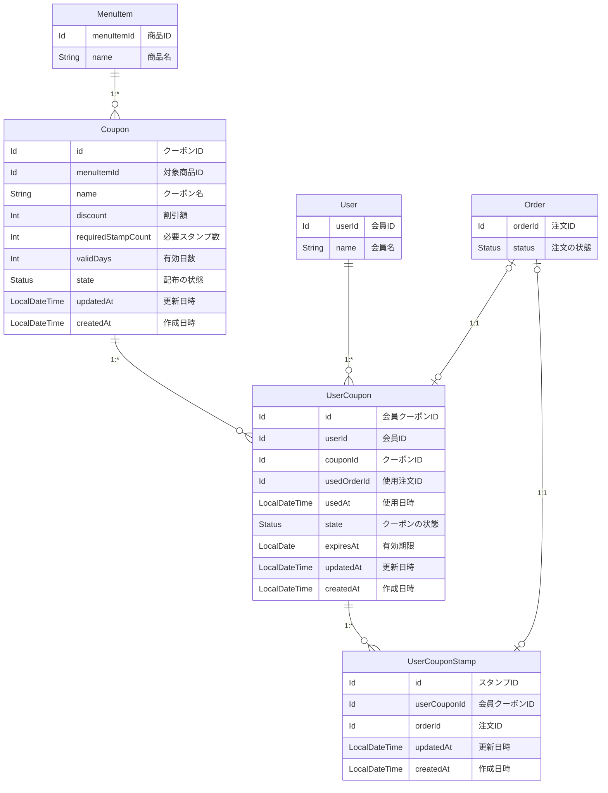

# 問題1：スタンプカード（ポイント） — 詳細要件定義

対象：クーポンの管理と、会員のスタンプ付与 ／ 前提：[要件定義](./01_requirements.md)で合意済み

---

# 本体：確定したエンティティ要件

## 用語 — 全体の用語集に追加する呼称

追加を申請する呼称

| 呼称（これで統一する） | 何を指すか | 言い換えない |
|---|---|---|
| クーポン | 本部が登録するクーポンの種類。対象商品・割引額・必要スタンプ数・有効日数を持つ | 「クーポンマスタ」「クーポンの種類」「テンプレート」 |
| 会員クーポン | 会員が持っているクーポン 1 枚 | 「カード」「スタンプカード」「無料券」「特典」 |
| 会員クーポンスタンプ | 受け渡し 1 回につき 1 個押されるスタンプ | 「ポイント」「来店記録」「判子」 |
| 配布中 / 配布終了 | そのクーポンを新しく配るかどうか | 「有効 / 無効」（会員クーポンの状態と混ざる） |
| 貯め中 | 会員クーポンのうち、必要スタンプ数に達していないもの | 「未完成」「途中」 |
| 使用可能 | 必要スタンプ数に達し、まだ使っていないもの | 「有効」「完成」 |

**「言い換えない」列が、この表の本体です。** 何と呼ぶかを決めるだけでは足りません。何と呼ばないかを決めないと、次の会議で言い換えが起きます。

> ⚠️ **「クーポン」が 2 つのものを指していました。**
>
> | 会議での発言 | 指しているもの | 呼称 |
> |---|---|---|
> | 「夏はドリンクのクーポンを配ろう」 | 種類の話 | **クーポン** |
> | 「私のクーポンが期限切れになった」 | 1 枚の話 | **会員クーポン** |
>
> **本部が登録するのが「クーポン」、会員が持つのが「会員クーポン」** と呼び分けます。

> ⚠️ **「カード」と「クーポン」は同じモデルです。** 貯めている途中は「カード」、完成したら「クーポン」と業務では呼ばれますが、**`UserCoupon` の状態が違うだけ**です。別のモデルにすると、完成した瞬間に行を移し替える処理が必要になります。

> ⚠️ **「配布終了」と「期限切れ」を混同しないでください。** 配布終了は新しく配らないこと、期限切れは持っているものが使えなくなること。**配布終了にしても、すでに配られた会員クーポンは期限まで使えます。**

## ER 図

まず、データの繋がりだけを確認します。**何が必須か、期限切れをどう表すかは、この図では決めません。**



図で読み取ってほしいのは 4 点です。

- **`UserCouponStamp` は `userCouponId` が必須。** スタンプは必ずどこかの会員クーポンに属します（→ [論点2](#論点2スタンプがクーポンに属する形にするか独立させるか)）
- **`UserCouponStamp` は `userId` を持ちません。** 親の `UserCoupon` が持っているので不要です
- **`Coupon` は `sales` を参照しません。** マスタ側は自分が何枚配られたかを知りません（→ [論点8](#論点8マスタをどのコンテキストに置くか)）
- **`UserCoupon` に付与日時がありません。** `createdAt` が兼ねます（→ [論点5](#論点5付与日時を持つか-createdat-で兼ねるか)）

## EntityModel

属性の表を作るより、`EntityModel` をそのまま書いたほうが早く、正確です。型がそのまま「必須か任意か」を語ります。

### `Coupon` — 本部が登録するクーポンの種類（`common/coupon`）

```scala
case class Coupon(
  id:                 Option[Id],           // 管理 ID（永続化前は None）
  menuItemId:         MenuItem.Id,          // 対象商品
  name:               String,               // 「バーガー無料券」
  discount:           Option[Int],          // 割引額（円）。None ＝ 対象商品が無料
  requiredStampCount: Int,                  // 必要なスタンプ数。0 なら即配布できる
  validDays:          Int,                  // 有効日数（配ってから何日有効か）
  state:              Status,                // 配布の状態
  updatedAt:          LocalDateTime = Now,  // データ更新日
  createdAt:          LocalDateTime = Now   // データ作成日
) extends EntityModel[Id]

object Coupon:

  type   Id = Id.Repr
  object Id extends Entity.Id[Long]

  /** 配布の状態 */
  enum Status(val code: Int) extends EnumStatus[Int]:
    case IS_ACTIVE   extends Status(code =  1) // 配布中
    case IS_INACTIVE extends Status(code = -1) // 配布終了
```

**ここで型が語っていること**

- **`menuItemId` は必須。** 対象商品のないクーポンは作れません。これにより「注文全体から◯◯円引く」という金券型が**構造的に排除される**（→ [論点1](#論点1商品券型にするか金券型にするか)）
- **`discount` の `None` が「無料」。** 別に「無料フラグ」を持ちません。組み合わせは 2 通りで、**どちらも有効**なので検証が要りません

  | `menuItemId` | `discount` | 意味 |
  |---|---|---|
  | 必須なので常にある | `None` | その商品が無料 |
  | 同じ | `Some(200)` | その商品が 200 円引き |

- **`validDays` は日数で、日時ではありません。** マスタは何枚もの会員クーポンのテンプレートなので、絶対的な期限を持てません。期限は配った時点で決まります（→ [論点6](#論点6マスタが持つのは有効日数か有効期限か)）
- **`requiredStampCount` を可変にしています。** 10 固定ではないので「5 個で 1 枚」のキャンペーンもマスタの登録だけでできます
- **`code` は 0 を使わず、正が配布中・負が配布終了。** 問題2 で決めた規約にそろえています

**型では守れない決めごと**

- **`discount` は正の値。** 0 や負は無効
- **`discount` が対象商品の価格を超えてもよい。** 超過分は切り捨てて実質無料になります
- **`requiredStampCount` は 0 以上。** 0 なら誕生日クーポンのようにスタンプなしで配れます
- **`requiredStampCount > 0` のマスタは、同時に 1 つだけ配布中にする。** スタンプを貯める先が自動で選ばれるため、複数あると決まりません。マスタの登録は本部が行うので運用で担保します（→ [論点4](#論点4スタンプを貯める先をどう決めるか)）
- **`validDays` は 1 以上**
- **配布終了にしても、すでに配られた `UserCoupon` は期限まで使える。** `MenuItem` の販売終了と同じ扱いです
- **クーポンの条件（対象商品・割引額・必要スタンプ数・有効日数）は登録後に変更しない。** 条件を変えるときは新しい `Coupon` を登録し、旧クーポンを配布終了にします

**保存されるデータの例**

| id | menuItemId | name | discount | requiredStampCount | validDays | state |
|---|---|---|---|---|---|---|
| 1 | 101（バーガー） | バーガー無料券 | `None` | 10 | 365 | 配布中 |
| 2 | 205（ドリンク） | 誕生日ドリンク券 | `None` | **0** | 30 | 配布中 |
| 3 | 101（バーガー） | バーガー200円引き券 | `Some(200)` | 5 | 90 | **配布終了** |

**3 行とも同じモデル・同じ形です。** 「無料券」「割引券」「誕生日券」という業務の言葉が 3 つありますが、区分値は「配布中 / 配布終了」の 2 値だけです。

### `UserCoupon` — 会員が持っているクーポン 1 枚（`sales`）

```scala
case class UserCoupon(
  id:          Option[Id],             // 管理 ID（永続化前は None）
  userId:      User.Id,                // 誰のクーポンか
  couponId:    Coupon.Id,              // どのクーポンから配られたか
  usedOrderId: Option[Order.Id],       // 使用した注文。None ＝ 未使用
  usedAt:      Option[LocalDateTime],  // 使用日時。None ＝ 未使用
  state:       Status,                 // クーポンの状態
  expiresAt:   LocalDate,              // 有効期限（作成日 + マスタの validDays）
  updatedAt:   LocalDateTime = Now,    // データ更新日
  createdAt:   LocalDateTime = Now     // データ作成日。配られた日時を兼ねる
) extends EntityModel[Id]

object UserCoupon:

  type   Id = Id.Repr
  object Id extends Entity.Id[Long]

  /** クーポンの状態 */
  enum Status(val code: Int) extends EnumStatus[Int]:
    case IS_COLLECTING extends Status(code = 100) // 貯め中
    case IS_AVAILABLE  extends Status(code = 200) // 使用可能
    case IS_USED       extends Status(code =  -1) // 使用済み
    case IS_EXPIRED    extends Status(code =  -2) // 期限切れ
```

**ここで型が語っていること**

- **`couponId` は必須。** どのマスタから配られたかが必ず分かります。これにより「クーポン別の使用状況」が集計できます
- **付与日時のフィールドがありません。** 行が作られる瞬間 ＝ 配られた瞬間なので、`createdAt` が兼ねます（→ [論点5](#論点5付与日時を持つか-createdat-で兼ねるか)）
- **`expiresAt` を保存します。** マスタの `validDays` を後から変えても、既に配ったクーポンの期限は変わりません
- **`code` の符号が意味を持ちます。** 正 ＝ まだ使える可能性がある、負 ＝ 終わった。`code > 0` で「生きているクーポンか」を判定できます
- **正の値は 100 刻み。** 「貯め中」と「使用可能」の間に状態が増えても `150` で挿入できます
- **対象商品や割引額を持ちません。** マスタが持っているので、`couponId` から辿ります

**型では守れない決めごと**

- **`usedOrderId` と `usedAt` は連動します。** 組み合わせは 4 通りありますが、有効なのは 2 通りだけです

  | `usedOrderId` | `usedAt` | 扱い |
  |---|---|---|
  | `None` | `None` | 有効。まだ使っていない |
  | `Some` | `Some` | 有効。この注文で使った |
  | `Some` | `None` | **無効。** 注文は分かるが日時が不明 |
  | `None` | `Some` | **無効。** 日時だけあって注文が不明 |

- **`state` が `IS_USED` のとき、`usedOrderId` と `usedAt` は必ず埋まっている**（逆も同様）
- **会員あたり、`IS_COLLECTING` の行は最大 1 枚。** 1 回の受け渡しで押されるスタンプは 1 個なので、貯める先が 2 つあると決まりません
- **`usedOrderId` は一意。** 1 注文で使えるクーポンは 1 枚までです
- **使用時は `state` が `IS_AVAILABLE` かつ `expiresAt` を過ぎていないことを両方確認する。** `state` はキャッシュであり、**正は `expiresAt`** です（→ [論点3](#論点3期限切れを区分値で持つか都度計算するか)）
- **`expiresAt` は配った日の `LocalDate + validDays` として計算し、以後変えない。** 期限日は利用可能で、翌日から期限切れとします

**保存されるデータの例**（会員 ID 100、今が 2026-08-03）

| id | couponId | state | usedOrderId | expiresAt | 業務での状態 |
|---|---|---|---|---|---|
| 51 | 1 | `IS_USED` | `Some(5120)` | 2026-11-02 | 使用済み |
| 52 | 1 | `IS_AVAILABLE` | `None` | 2027-06-20 | 使える |
| 53 | 1 | `IS_COLLECTING` | `None` | 2027-07-15 | **貯め中**（スタンプ 7 個） |
| 54 | 2 | `IS_AVAILABLE` | `None` | 2026-09-01 | 誕生日券（スタンプ 0 個） |
| 55 | 3 | `IS_EXPIRED` | `None` | 2026-07-28 | 期限切れ。スタンプは削除済み |

**53 番と 54 番が対比になっています。** どちらも `IS_COLLECTING` を経由しますが、54 番は `requiredStampCount = 0` なので**作った瞬間に `IS_AVAILABLE`** になります。

**55 番のように、期限切れの行は残します。** 「使われずに終わった枚数」を数えるためです。ただし紐づくスタンプは削除されます。

### `UserCouponStamp` — 受け渡し 1 回ごとに押されるスタンプ（`sales`）

```scala
case class UserCouponStamp(
  id:           Option[Id],           // 管理 ID（永続化前は None）
  userCouponId: UserCoupon.Id,        // どの会員クーポンに属するか
  orderId:      Order.Id,             // どの注文で押されたか（一意）
  updatedAt:    LocalDateTime = Now,  // データ更新日
  createdAt:    LocalDateTime = Now   // データ作成日
) extends EntityModel[Id]

object UserCouponStamp:

  type   Id = Id.Repr
  object Id extends Entity.Id[Long]
```

**ここで型が語っていること**

- **`userCouponId` は必須（`Option` ではない）。** スタンプは必ずどこかの会員クーポンに属します。これにより**親子関係が構造として成立し、親が期限切れになればスタンプごと削除できます**（→ [論点2](#論点2スタンプがクーポンに属する形にするか独立させるか)）
- **`userId` を持ちません。** 親の `UserCoupon` が持っているので不要です。スタンプ数を数えるときは `userCouponId` で絞ります
- **有効期限も付与日時も持ちません。** スタンプ単体は失効せず、期限は親が持ちます
- **取り消しの記録を持ちません。** 受け渡し完了が付与のトリガーなので、押された後にキャンセルされることがありません（→ [論点7](#論点7付与のトリガーを支払いにするか受け渡しにするか)）
- **実質 2 フィールドだけ**（`id` と日時を除く）。当初の設計から 4 列減りました

**型では守れない決めごと**

- **`orderId` は一意。** 1 回の受け渡しにつきスタンプは 1 個です
- **親の `UserCoupon` が `IS_EXPIRED` になったら、紐づくスタンプは削除する。** 日次バッチで行います
- **`UserCoupon` が `IS_COLLECTING` 以外のとき、スタンプを追加しない**

**保存されるデータの例**（会員クーポン ID 53、スタンプ 7 個）

| id | userCouponId | orderId |
|---|---|---|
| 701 | 53 | 5201 |
| 702 | 53 | 5202 |
| ... | 53 | ... |
| 707 | 53 | 5207 |

**7 行すべてが同じ `userCouponId` を持ちます。** 「あと 3 個」は `requiredStampCount − 7` で求まります。

## 区分値の考え方

追加する 3 つのエンティティのうち、区分値を持つのは 2 つです。

| エンティティ | 区分値 | 値の数 |
|---|---|---|
| `Coupon` | `Status`（配布の状態） | 2 |
| `UserCoupon` | `Status`（クーポンの状態） | 4 |
| `UserCouponStamp` | **なし** | — |

**`UserCouponStamp` が区分値を持たないのは、行を足すだけの操作しかないから**です。②で動詞を仕分けたとき、「スタンプを押す」は行を 1 本足す操作でした。

### 業務の言葉と区分値の対応

| 業務の言葉 | どう表すか | 保存するか |
|---|---|---|
| 配布中 / 配布終了 | `Coupon.state` | する |
| 貯め中 | `UserCoupon.state` が `IS_COLLECTING` | する |
| 使用可能 | `UserCoupon.state` が `IS_AVAILABLE` | する |
| 使用済み | `UserCoupon.state` が `IS_USED` | する |
| 期限切れ | `UserCoupon.state` が `IS_EXPIRED` | **する（ただしキャッシュ）** |
| あと何個か | `requiredStampCount − スタンプ数` | しない |
| 無料券 / 割引券 | `Coupon.discount` の有無 | する（区分値ではない） |

**「無料券」と「割引券」に区分値を作っていない**のがポイントです。`discount` が `None` かどうかで区別でき、しかも無効な組み合わせが生まれません。

### 期限切れだけがキャッシュである

`IS_EXPIRED` は、**期限が過ぎた瞬間には切り替わりません。** 日次バッチが書き換えるまで `IS_AVAILABLE` のままです。

> **正は `expiresAt`、`state` はキャッシュ。**
> 使用時は必ず両方を確認します。`state` だけを信じると、バッチが落ちた日に期限切れのクーポンが使えてしまいます。

区分値を持つ理由は 2 つです（→ [論点3](#論点3期限切れを区分値で持つか都度計算するか)）。

1. **集計のため。** 「配った 100 枚のうち、60 枚使用・40 枚期限切れ」が `state` で絞れる
2. **削除のため。** 期限切れになったスタンプを一括削除する対象が `state` で引ける

## 貯めているスタンプ数を数える

```
WHERE user_coupon_id = ?
```

**条件は 1 つだけです。** スタンプは失効せず、取り消しもされず、必ず 1 つの会員クーポンに属するので、他の条件は要りません。

「あと何個か」は `Coupon.requiredStampCount − スタンプ数` で求まります。どちらも保存しません。

## 受け渡し完了時の処理順序

1. その会員の `IS_COLLECTING` な `UserCoupon` を探す
2. **無ければ作る。** 配布中で `requiredStampCount > 0` のマスタを 1 件取り、
   `UserCoupon` を `IS_COLLECTING` で追加する（`expiresAt` ＝ 今 + `validDays`）
3. `UserCouponStamp` を 1 件追加する
4. スタンプ数が `requiredStampCount` に達したら、`state` を `IS_AVAILABLE` に更新する

**ステップ 2 が今回の設計の核心です。** 1 個目のスタンプと同時にクーポンが作られるので、スタンプが親のない状態で存在することがありません。

**`requiredStampCount = 0` のマスタから配る場合**（誕生日など）は、この流れを通りません。配布処理が `UserCoupon` を直接 `IS_AVAILABLE` で作ります。

## クーポンを使用するときの計算

```
支払額 = max(対象商品の価格 − 割引額, 0)
```

`discount` が `None` なら対象商品が無料になります。超過分は切り捨てます。

**対象商品が注文に入っていないと使えません。** `Coupon.menuItemId` の商品が `OrderItem` に含まれているか確認します。

## 日次バッチ

1. `expiresAt < 今日` かつ `state` が `IS_COLLECTING` または `IS_AVAILABLE` の `UserCoupon` を、
   `IS_EXPIRED` に更新する
2. **`IS_EXPIRED` になった `UserCoupon` に紐づく `UserCouponStamp` を削除する**

ステップ 2 が、レビュー指摘（スタンプが消えずに溜まり続ける）への対応です。**親子関係にしたことで、削除対象が `userCouponId` で引けます。**

## エンティティ一覧

### 追加するもの

| エンティティ | テーブル | コンテキスト | 役割 |
|---|---|---|---|
| `Coupon` | `common_coupon` | **`common/coupon`** | 本部が登録するクーポンの種類 |
| `UserCoupon` | `sales_user_coupon` | `sales` | 会員が持っているクーポン 1 枚 |
| `UserCouponStamp` | `sales_user_coupon_stamp` | `sales` | 受け渡し 1 回ごとのスタンプ |

**追加は 3 つで、2 つのコンテキストに分かれます。**

### 既存で足りるもの（変更しない）

| エンティティ | なぜ足りるか |
|---|---|
| `User` | 会員そのもの。**スタンプ数を保存しないので、属性を足す必要がありません** |
| `Order` | スタンプを押すきっかけ。参照されるだけで、`Order` 側は何も知りません |
| `Order.Status` | 受渡し完了（`IS_DELIVERED`）が付与のトリガー。**問題2 で追加した値をそのまま使います** |
| `MenuItem` | **マスタが `menuItemId` として参照します。** `MenuItem` 側は変わりません |
| `Payment` | 支払い済みであることの確認に使いますが、付与のトリガーではありません |
| `Shop` | 「店舗をまたいで共通」なので、店舗ごとのスタンプ設定は持ちません |

### 既存から動かすもの

**ありません。**

追加する 3 つは既存を**参照する側**なので、参照の向きが一方向になり、既存側に変更が入りません。

### 新しく持つ参照

**既存テーブルには列を足しません。**

| どこに | 何を | コンテキストをまたぐか |
|---|---|---|
| `common_coupon.menu_item_id` | `MenuItem.Id` | `common/coupon → common/menu` |
| `sales_user_coupon.user_id` | `User.Id` | `sales → udb` |
| `sales_user_coupon.coupon_id` | `Coupon.Id` | **`sales → common/coupon`** |
| `sales_user_coupon.used_order_id` | `Order.Id`（任意） | `sales` 内 |
| `sales_user_coupon_stamp.user_coupon_id` | `UserCoupon.Id` | `sales` 内 |
| `sales_user_coupon_stamp.order_id` | `Order.Id` | `sales` 内 |

**すべて ID だけの参照で、向きは一方向です。** `Coupon`（マスタ）は自分が何枚配られたかを知りません。

## 置き場所（コンテキスト）

**判断：`Coupon` は `common/coupon` に、`UserCoupon` と `UserCouponStamp` は `sales` に置く。**

| 日常的に書き換える人 | 何を書き換えるか | 更新の頻度 | 見る画面 |
|---|---|---|---|
| **本部** | クーポンの種類を登録・配布終了にする | **年に数回** | 本部の管理画面 |
| **会員**（受け渡しを受けることで、システムが） | スタンプの行が増える／状態が変わる | 受け渡しのたび（毎日・大量） | 会員アプリ |
| **会員** | クーポンを使用済みにする | クーポンを使うとき | 注文画面 |

**理由：触る人と頻度が明確に分かれます。** マスタは本部が年に数回、会員クーポンは会員が毎日。`common/menu`（本部が管理）と `sales`（会員が触る）の関係と同じ構図です。

### `Coupon` を `common` に置けるか — 3 条件

| 条件 | 判定 | 理由 |
|---|---|---|
| 1. 業務の操作では変わらない | **○** | 会員の注文や受け渡しでは変わらない。本部が別のタイミングで更新する |
| 2. 管理者が別にいる | **○** | 本部が管理する |
| 3. 他のコンテキストから参照されるだけ | **○** | `MenuItem.Id`（同じ `common` 内）を参照するだけ。`sales` を参照しない |

**3 条件すべてを満たします。**

### `UserCoupon` を `common` に置けないか — 3 条件

| 条件 | 判定 | 理由 |
|---|---|---|
| 1. 業務の操作では変わらない | ✗ | 受け渡しのたびに行が増え、状態が変わる |
| 2. 管理者が別にいる | ✗ | 会員の行為で自動的に変わる |
| 3. 他のコンテキストから参照されるだけ | ✗ | `User.Id` と `Order.Id` を**参照する側**。逆流が生まれる |

**3 条件すべてで落ちます。** 同じ「クーポン」という言葉でも、マスタと会員の 1 枚で判定が真逆になります。

### `common/coupon` は既に想定されていた

02_BURGER_DOMAIN の `common` の説明にこう書かれています。

```
edu/common/
├── menu/      … メニュー（この部で作る）
├── geo/       … 都道府県（配達を作るときに使う）
└── coupon/    … クーポンの定義（今後）
```

**新しく考えた置き場所ではありません。** 予定されていた席に入る形です。

### 新しいコンテキストを作らないか

`loyalty` のような新コンテキストは作りません。

- **新設の根拠**：スタンプ機能としてまとまっている／専用画面で見る
- **払うコスト**：配線が 1 セット増える。しかも `Coupon` は `common` に置きたいので、結局 2 つに分かれる
- **決め手**：`UserCoupon` を触るのは会員で、`Order` と同じ。**分ける理由がありません**

**コンテキストは 4 つのまま、増えません。** `common` の中に `coupon/` というサブカテゴリが 1 つ増えるだけです。

### テーブル名

```
common_coupon             ← 今回追加
common_menu_category      ← 既存
common_menu_item          ← 既存
sales_cart                ← 既存
sales_cart_item           ← 既存
sales_cart_item_option    ← 既存
sales_order               ← 既存
sales_order_item          ← 既存
sales_order_item_option   ← 既存
sales_payment             ← 既存
sales_user_coupon         ← 今回追加
sales_user_coupon_stamp   ← 今回追加
```

`sales_user_coupon*` の 2 つが隣り合い、既存の `sales_order` / `sales_order_item`（親 ＋ 子）と同じ形です。**同じ「クーポン」でも置き場所が違うことが、接頭辞で読めます。**

---

# 付録

ここから先は本体ではありません。**「作らないもの」と「なぜそう決めたのか」**です。

## 付録A：今回やらないこと

- **誕生日クーポン・キャンペーンクーポンを配る機能そのもの**（`requiredStampCount = 0` で配れる形にはしておくが、配るきっかけは作らない）
- **期間限定のスタンプカード**（サマーキャンペーンなど。→ [論点4](#論点4スタンプを貯める先をどう決めるか) の「判断が変わる条件」）
- **スタンプの倍率キャンペーン**（2 倍デーなど。同上）
- **会員がどのクーポンを貯めるか選ぶ機能**
- **クーポンの種類を登録する管理画面**（モデルは用意するが画面は作らない）
- **クーポンの発行枚数・使用枚数の集計画面**（`couponId` で集計できる形にはしておく）
- **有効期限が近いクーポンのお知らせ通知**
- **会員クーポン・スタンプの譲渡**
- **管理者によるスタンプの手動付与・手動取り消し**
- **期限切れになった `UserCoupon` の行の削除**（スタンプだけ削除し、クーポンの行は集計のため残す）
- **クーポン使用時の会計処理**（`Order` の割引額をどう記録するかは 04 章のテーブル設計で扱う）

## 付録B：判断の記録

迷ったところと、その決着を残します。半年後にモデルを直す人にとって、いちばん価値があるのはここです。

### 論点1：商品券型にするか、金券型にするか

**判断：商品券型。`menuItemId` を必須にする。**

初回の設計では金券型（`discount: Money` のみ）でした。対象商品を持たないので実装が単純になり、`common/menu` への参照も不要でした。

しかし**端数が出ます。** 600 円の券を 700 円のバーガーに使うと 100 円かかり、「無料券」と呼べません。要求文は「ハンバーガー 1 つが**無料**」なので、ここが合いません。

商品券型に戻すと、対象商品の価格ちょうどが引かれるので端数が出ません。

**`menuItemId` を必須にしたのが今回の要点です。** `Option` にすると「注文全体から◯◯円引く」という金券型が混入します。必須にすることで、**クーポンは常に「特定商品に対する権利」**になります。

そして `discount` と組み合わせると、2 通りが**どちらも有効**になりました。

| `discount` | 意味 |
|---|---|
| `None` | その商品が無料 |
| `Some(200)` | その商品が 200 円引き |

**無効な組み合わせが 1 つもないので、検証が要りません。** 記入例の「一緒にしか意味を持たない値は束ねる」と同じ効果が、片方を必須にすることで得られました。

**代償：** `common/coupon → common/menu` の参照が増えます。ただし同じ `common` 内なので、依存の逆流は起きません。

### 論点2：スタンプがクーポンに属する形にするか、独立させるか

**判断：`userCouponId` を必須にし、スタンプは必ず会員クーポンに属する。**

初回の設計では `couponId: Option[Coupon.Id]` でした。10 個貯まった時点でクーポンを作り、そのときスタンプに参照を書き込む形です。

これには 2 つの問題がありました。

| 問題 | 内容 |
|---|---|
| **親子になっていない** | `Option` である限り、スタンプは独立して存在できる。名前は `CouponStamp` なのに実体は無関係 |
| **スタンプが消えない** | 貯めている途中のスタンプ（`couponId` が `None`）は、どのクーポンにも属さないので永久に残る |

2 つ目が実務的な問題です。会員が離脱しても 9 個のスタンプが残り続けます。

**1 個目のスタンプでクーポンを作る形にすると、両方が解決します。**

- スタンプは必ず親を持つ（`Option` が外れる）
- 親が期限切れになれば、`userCouponId` で引いてスタンプごと削除できる

**副産物：** `UserCouponStamp` から `userId` が消えました。親が持っているので不要です。初回の設計では「会員のスタンプを数えるのが最頻の操作だから直接持つ」という論点がありましたが、**数える単位が `userCouponId` に変わったので不要になりました。**

**もう 1 つの副産物：** 有効期限を「1 個目のスタンプで会員クーポンを作成した日から 1 年」と、カード単位で持てます。

### 論点3：期限切れを区分値で持つか、都度計算するか

**判断：区分値（`IS_EXPIRED`）を持つ。ただし正は `expiresAt`。**

「比べれば分かるものは保存しない」という原則からすると、`expiresAt` と現在日時を比べれば済みます。区分値を持つと**期限が過ぎた瞬間から書き換えられるまで、実態とズレます。**

それでも持つ理由は 2 つです。

| 理由 | 内容 |
|---|---|
| **集計** | 「配った 100 枚のうち、60 枚使用・40 枚期限切れ」が `WHERE state = -2` で引ける。マスタを作った目的（使用状況の把握）に直結する |
| **削除** | 期限切れになったスタンプの削除対象を `state` で引ける |

**二重管理になるので、どちらが正かを明記します。**

> **正は `expiresAt`。`state` はキャッシュ。**
> 使用時は `state = IS_AVAILABLE` かつ `expiresAt > 今` の**両方**を確認する。
> `state` だけを信じると、バッチが落ちた日に期限切れのクーポンが使えてしまう。

**代償：** 日次バッチが必要になります。バッチが落ちても使用は防げますが、集計と削除が遅れます。

### 論点4：スタンプを貯める先をどう決めるか

**判断：`requiredStampCount > 0` のマスタは、同時に 1 つだけ配布中にする（運用ルール）。**

受け渡し完了時に `UserCoupon` を作るとき、`couponId` に何を入れるか決める必要があります。配布中のマスタが 2 つあると、プログラムは選べません。

検討した案は 3 つです。

| 案 | 内容 | なぜ採らなかったか |
|---|---|---|
| A. 運用ルール（採用） | 配布中を 1 つに限る | — |
| B. デフォルトフラグ | マスタに「これがデフォルト」の印を持つ | 「配布中」と「デフォルト」の二重管理になる。「配布終了なのにデフォルト」が作れる |
| C. DB 制約 | 配布中が 1 つだけになるよう強制 | マスタの登録は年に数回・本部の管理画面から。**過剰** |
| D. 会員が選ぶ | アプリでどれを貯めるか選ばせる | 画面が必要。選んでいない会員のデフォルトが必要で B に戻る |

**`requiredStampCount = 0` のマスタは何個あってもかまいません。** 誕生日クーポンなどは配布処理が明示的にマスタを指定するので、自動選択が起きません。

**キャンペーンの切り替えは自然に動きます。** 「バーガー無料券」を配布終了して「ドリンク無料券」を配布中にすると、貯め中の会員はバーガー券として完成させ、次の 1 個目からドリンク券になります。

**判断が変わる条件：**

- **スタンプ 2 倍キャンペーンをやるなら**、`UserCouponStamp.orderId` の一意制約を外す。1 回の受け渡しで複数行が作られる
- **期間限定の別カード（サマーカードなど）を通常と同時に貯めさせるなら**、「貯め中は会員あたり 1 枚」を「マスタごとに 1 枚」に変える。**なお通常カードを止めて期間限定に切り替えることはできない。** 9 個貯めた会員が完成まで凍結され、リピートの動機を失うため
- **期間限定クーポンを配るだけなら、設計を変えなくてよい。** `requiredStampCount = 0` のマスタを作って配れば、誕生日クーポンと同じ仕組みで実現できる

### 論点5：付与日時を持つか、`createdAt` で兼ねるか

**判断：`createdAt` で兼ねる。付与日時のフィールドを持たない。**

初回の設計では `grantedAt`（付与日時）を持っていました。「業務上の事実」と「運用上の記録」は別物という理由です。

しかし**今回の設計では意味がありません。**

| | 初回の設計 | 今回 |
|---|---|---|
| クーポンが作られるタイミング | 10 個貯まった時（スタンプの後） | **1 個目のスタンプと同時** |
| `grantedAt` の意味 | 「10 個目が押された日時」 | 「行が作られた日時」 |

**行が作られる瞬間 ＝ 配られた瞬間**なので、`createdAt` と完全に一致します。そして期限は `expiresAt` として保存するので、計算のためにも不要です。

**代償：** データ移行で過去のクーポンを一括登録すると、`createdAt` が移行日になり、配られた日時が失われます。ただし今回そのような運用は想定していません。

### 論点6：マスタが持つのは有効日数か、有効期限か

**判断：有効日数（`validDays: Int`）。マスタは日時を持たない。**

マスタ 1 件から、会員クーポンが何枚も配られます。配られるタイミングが会員ごとに違うので、**期限も 1 枚ごとに違います。**

マスタに「2027-04-01 まで」と書くと、8 月に配られた会員も 4 月で切れることになります。

| | 持つもの | 型 |
|---|---|---|
| `Coupon`（マスタ） | 有効期間の**長さ** | `Int`（日数） |
| `UserCoupon`（1 枚） | 有効**期限** | `LocalDateTime` |

**長さは相対、日時は絶対**という分担です。記入例が営業時間を「開店時刻 ＋ 営業の長さ」で持ったのと同じ考え方です。

**判断が変わる条件：** 「夏キャンペーン券は 8/31 に一斉失効」のような絶対期限が必要になったら、マスタに `expiresAt` を足します。そのときは `validDays` と `expiresAt` のどちらか一方だけ埋まる形になり、無効な組み合わせが 2 通り生まれるので検証が必要になります。

### 論点7：付与のトリガーを支払いにするか、受け渡しにするか

**判断：受け渡し完了（`Order.Status` が `IS_DELIVERED`）にする。**

支払い確定をトリガーにすると、「支払い後にキャンセルされたらスタンプを取り消す」処理が必要になり、取り消し日時の列を持つことになります。

**受け渡し完了に変えると、この処理が丸ごと不要になります。**

問題2 で確定した状態遷移において、受渡し完了は**終端状態**です。到達した注文はもう状態が変わらないので、後からキャンセルされることがありません。キャンセルされた注文や未受け取りの注文は、受渡し完了に到達しないのでスタンプが押されません。

**起きないケースのために列を持たないので、取り消し日時の列を消せました。**

**代償：** 未受け取りの注文にはスタンプが押されません。会員からすると「支払ったのにスタンプが押されない」ことになります。①の質問リストで合意を取ります。

### 論点8：マスタをどのコンテキストに置くか

**判断：`common/coupon` に置く。`UserCoupon` は `sales` に残す。**

同じ「クーポン」という言葉ですが、`common` の 3 条件の判定が真逆になります。

| | `Coupon`（マスタ） | `UserCoupon`（会員の 1 枚） |
|---|---|---|
| 業務の操作では変わらない | ○ | ✗ |
| 管理者が別にいる | ○ 本部 | ✗ 会員の行為で変わる |
| 参照されるだけ | ○ `MenuItem` を参照するだけ | ✗ `User` / `Order` を参照する側 |

**マスタは 3 つ全部満たし、会員クーポンは 3 つ全部落ちます。**

決め手は条件 3 です。マスタが参照するのは同じ `common` 内の `MenuItem` だけなので、依存が一方向のまま保たれます。一方 `UserCoupon` は `udb` と `sales` を参照するので、`common` に置くと逆流します。

**1 つの機能が 2 つのコンテキストに分かれるのは正常です。** 画面を 1 つ描くのに 2 つのリポジトリを呼ぶことになりますが、カリキュラムもそれを前提にしています。

### 論点9：命名（`Coupon` / `UserCoupon` / `UserCouponStamp`）

**判断：本部が登録するものを `Coupon`、会員が持つものを `UserCoupon` とする。**

検討した候補と点数は ②の「命名の評価」に記録しています。決定打は**④ 業務の人に通じるか**でした。

`CouponMaster` / `CouponType` / `CouponDefinition` の 3 案が、すべて④で 4〜5 点まで落ちています。

> 本部の人は「クーポンを登録する」と言い、「クーポンマスタを登録する」とは言わない。

**業務の人にとって、本部が登録するものこそが「クーポン」です。** `Master` `Type` `Definition` はいずれも実装側の語彙で、`注文 → Transaction` と同じ距離があります。

`CouponUser` ではなく `UserCoupon` にしたのは、交差エンティティの規則（所有する側 → される側）に従ったためです。`ShopMenuStock` が `MenuShopStock` でないのと同じです。

**判断が変わる条件：** 会員以外（店舗・法人）にもクーポンを配るようになったら、`UserCoupon` の `User` が実態と合わなくなります。`CouponHolder` などに変えます。

### 論点10：「カード」と「クーポン」を別のモデルにするか

**判断：同じモデル（`UserCoupon`）で、状態で区別する。**

業務では貯めている途中を「カード」、完成したものを「クーポン」と呼び分けます。2 つのモデルにしたくなりますが、分けません。

分けた場合に起きることを考えます。10 個目のスタンプが押された瞬間に、**「カード」の行を削除して「クーポン」の行を作る**という移し替えが必要になります。移し替えの途中で失敗したら、どちらも存在しない状態が生まれます。

そして**同じ会員クーポンを指す ID が 2 つになる**ので、「このクーポンはどのカードから生まれたか」を追跡する参照も必要になります。

1 つのモデルにすれば、`state` を書き換えるだけです。

> **同じ人が、同じ画面で、同時に扱うものは 1 つにまとめる。**
> 業務の言葉が 2 つあることは、モデルを 2 つにする理由になりません。

これは記入例の「臨時休業と時短営業を分けない」と同じ判断です。
