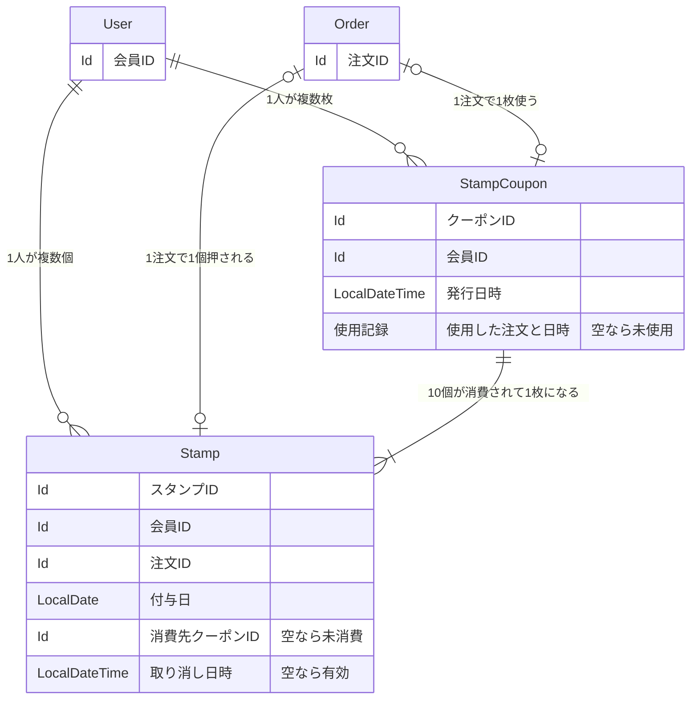

# スタンプカード（ポイント） — 詳細要件定義

対象：会員のスタンプ付与と無料クーポン ／ 前提：[要件定義](./01_REQUIREMENTS.md)で合意済み

## 1. 概要

注文 1 回につきスタンプを 1 個付与し、10 個たまった時点で無料クーポンを 1 枚発行する。スタンプは店舗をまたいで会員ごとに共通で、付与日から 1 年で失効する。会員はアプリの専用画面で保有数を確認できる。

既存の `User` `Order` `OrderDetail` `Payment` `Shop` は変更しない。`sales` コンテキストにエンティティを 2 つ追加する。

## 2. 用語

全体の用語集への追加を申請する。

| 呼称 | 何を指すか | 言い換えない |
|---|---|---|
| スタンプ | 注文 1 回につき 1 個押される、貯める単位の 1 個分 | ポイント、来店記録、判子 |
| 付与日 | そのスタンプが押された日付 | 取得日、獲得日、押印日 |
| 有効期限 | スタンプが有効な期限。付与日から 1 年後 | 失効日、期限日、有効期間 |
| 失効 | 付与日から 1 年を過ぎ、保有数に数えられなくなること | 期限切れ、消滅、無効化 |
| 消費 | スタンプ 10 個がクーポンに引き換えられること | 使用、消化、変換 |
| クーポン | スタンプ 10 個と引き換えに発行される、ハンバーガー 1 つ無料の権利 | 無料券、特典、チケット |
| 使用 | 発行済みクーポンを注文で使い、無料になること | 利用、消費、引き換え |
| 取り消し | 注文キャンセルにより、押したスタンプが無効になること | 削除、取消、返却 |

「消費」と「使用」は別物として呼び分ける。消費はスタンプ 10 個がクーポン 1 枚になること、使用はクーポン 1 枚で注文が無料になること。

「失効」と「消費」も別物。どちらもスタンプが保有数から消えるが、原因が違う。消費済みのスタンプは失効しない。

## 3. データ構成

会員に対して、スタンプが 1 対多、クーポンが 1 対多で紐づく。スタンプ 10 個がクーポン 1 枚に対応する。



有効期限とスタンプ保有数は保持しない。いずれも付与日と現在日時から求まる派生情報のため（論点1）。

`Order` から 2 本の線が出ているのは、1 つの注文が「スタンプを押させる」と「クーポンを使う」の 2 役を同時に果たすことがあるため。

## 4. モデル定義

### 4.1 スタンプ

```scala
case class Stamp(
  id:         Option[Id],                // 管理 ID（永続化前は None）
  userId:     User.Id,                   // 誰のスタンプか（店舗をまたいで共通）
  orderId:    Order.Id,                  // どの注文で押されたか（一意）
  grantedAt:  LocalDate,                 // 付与日。有効期限はここから計算する
  couponId:   Option[StampCoupon.Id],    // 消費先のクーポン。None ＝ 未消費
  canceledAt: Option[LocalDateTime],     // 注文キャンセルによる取り消し日時。None ＝ 有効
  updatedAt:  LocalDateTime = Now,       // データ更新日
  createdAt:  LocalDateTime = Now        // データ作成日
) extends EntityModel[Id]

object Stamp:

  type   Id = Id.Repr
  object Id extends Entity.Id[Long]
```

有効期限は持たず、付与日から都度計算する。消費済みかどうかはクーポンへの参照の有無で表し、フラグは持たない。取り消しは行を削除せず、日時を記録する。

どの店舗で押されたかは持たない。店舗をまたいで共通のため、スタンプの意味に関与しない。必要なら `orderId` から辿る。

型では守れない決めごと。

- `orderId` は一意。注文 1 回につきスタンプは 1 個。
- `couponId` が入ったら以後変えない。消費は取り消せない。
- `canceledAt` が入っているスタンプは保有数に数えず、消費の対象にも選ばない。
- 失効判定は `grantedAt` から 1 年。カレンダー上の同日で判定する（2026-07-29 付与なら 2027-07-29 まで有効）。
- 消費済み（`couponId` が `Some`）のスタンプは失効の対象外。

保存されるデータの例（会員 ID 100、今日が 2026-07-30）。

| grantedAt | couponId | canceledAt | 業務での状態 | 保有数に数える |
|---|---|---|---|---|
| 2025-03-01 | `Some(7)` | None | 消費済み（クーポン 7 番になった） | いいえ |
| 2025-06-15 | None | None | 失効（1 年経過） | いいえ |
| 2026-05-10 | None | None | 有効・未消費 | はい |
| 2026-07-20 | None | `Some(...)` | 取り消し（注文キャンセル） | いいえ |
| 2026-07-28 | None | None | 有効・未消費 | はい |

5 行とも同じモデル・同じ形。消費済み・失効・取り消しという 3 つの理由で保有数から外れるが、区分値を持たずに表せている。失効はデータに何も書かれておらず、付与日と今日を比べて決まる。

### 4.2 クーポン

```scala
case class StampCoupon(
  id:        Option[Id],                         // 管理 ID（永続化前は None）
  userId:    User.Id,                            // 誰のクーポンか
  issuedAt:  LocalDateTime,                      // 発行日時（有効期限は持たない）
  usedOrder: Option[(Order.Id, LocalDateTime)],  // 使用した注文と日時。None ＝ 未使用
  updatedAt: LocalDateTime = Now,                // データ更新日
  createdAt: LocalDateTime = Now                 // データ作成日
) extends EntityModel[Id]

object StampCoupon:

  type   Id = Id.Repr
  object Id extends Entity.Id[Long]
```

使用済みかどうかは使用記録の有無で表し、区分値を持たない。使用した注文と日時は 2 つに分けず 1 つの `Option` にまとめる。分けると「注文は分かるが日時が不明」という無効な組み合わせが作れてしまう。

クーポンは無期限のため、有効期限は持たない。消費されたスタンプへの参照も持たない。参照は多い側の `Stamp.couponId` が持つ。

型では守れない決めごと。

- `usedOrder` が入ったら以後変えない。使用は取り消せない。
- 1 つのクーポンには、消費された `Stamp` がちょうど 10 件紐づく。DB 制約では表せないため、発行処理の側で保証する。
- 1 注文で使えるクーポンは 1 枚まで。`used_order_id` は一意。

保存されるデータの例（会員 ID 100）。

| id | issuedAt | usedOrder | 業務での状態 |
|---|---|---|---|
| 7 | 2025-11-02 10:15 | `Some(5120, 2026-01-08 12:30)` | 使用済み |
| 12 | 2026-06-20 19:40 | None | 未使用 |
| 13 | 2026-07-28 12:05 | None | 未使用（2 枚目） |

12 番と 13 番のように、未使用のまま複数枚持てる。発行枚数に上限はない。

### 4.3 区分値

追加する 2 つのエンティティは、どちらも区分値を持たない。業務の言葉は 4 つあるが、すべて `Option` の有無か日付の計算で表せる。

| 業務の言葉 | どう表すか | 保存するか |
|---|---|---|
| 消費 | `Stamp.couponId` が `Some` | する |
| 取り消し | `Stamp.canceledAt` が `Some` | する |
| 使用 | `StampCoupon.usedOrder` が `Some` | する |
| 失効 | 付与日と今日を比べて判定 | しない |

失効を区分値で持つと、日付が変わった瞬間に嘘になる。毎日書き換えるバッチが必要になり、そのバッチが落ちた日は期限切れのスタンプが有効なまま表示される。

## 5. 有効なスタンプを数え上げる条件

スタンプ 1 件が保有数に数えられるのは、次の 3 つすべてを満たすとき。

1. `canceledAt` が None（取り消されていない）
2. `couponId` が None（まだクーポンになっていない）
3. `grantedAt` が今日から 1 年以内（失効していない）

分岐はこの 3 つで全部。保有数はどこにも保存されず、この条件で行を数えた結果である。

## 6. 支払い確定時の処理順序

1. `Stamp` を 1 件追加する（`grantedAt` ＝ 支払い確定日）。
2. 第 5 節の 3 条件を満たす `Stamp` を数える。
3. 10 件以上あれば、`grantedAt` の古い順に 10 件を選び、`couponId` に新しいクーポンの ID を書く。
4. `StampCoupon` を 1 件追加する（`usedOrder` ＝ None）。

11 件たまっていた場合、古い 10 件が消費され、11 件目は `couponId` が None のまま残る。使用済みの 10 個と、たまり始めた新しい 1 個の区別が、参照の有無だけで表せている。

## 7. エンティティ一覧

追加するもの。

| エンティティ | テーブル | 役割 | 多重度 |
|---|---|---|---|
| `Stamp` | `stamp` | 注文 1 回ごとに押されるスタンプ 1 個分 | `User` と 1:*、`Order` と 1:0..1 |
| `StampCoupon` | `stamp_coupon` | スタンプ 10 個と引き換えに発行される無料の権利 | `User` と 1:*、`Stamp` と 1:10 |

既存で足りるもの。いずれも変更しない。

| エンティティ | なぜ足りるか |
|---|---|
| `User` | 会員そのもの。スタンプ数を保存しないため、属性を足す必要がない |
| `Order` | スタンプを押すきっかけ。参照されるだけで、`Order` 側は何も知らない |
| `OrderDetail` | 無料対象の商品を特定するのに使うが、持ち方は変わらない |
| `Payment` | 付与のタイミング（支払い確定）を知るのに使うが、持ち方は変わらない |
| `Shop` | 店舗をまたいで共通のため、店舗ごとのスタンプ設定を持たない |

既存から動かすものは無い。追加する 2 つは既存を参照する側のため、参照の向きが一方向になり、既存側に変更が入らない。

新しく持つ参照。既存テーブルには列を足さない。

| どこに | 何を |
|---|---|
| `stamp.user_id` | `User.Id` |
| `stamp.order_id` | `Order.Id` |
| `stamp.coupon_id` | `StampCoupon.Id`（任意） |
| `stamp_coupon.user_id` | `User.Id` |
| `stamp_coupon.used_order_id` | `Order.Id`（任意） |

## 8. 置き場所

既存の `sales` コンテキストに追加する。新しいコンテキストは作らない。

日常的に書き換えるのは会員の注文行為であり、`Order` と担当者・更新頻度・書き換わるトリガー（支払い確定）が一致する。スタンプを押すきっかけが注文だからではなく、日々書き換える主体が `Order` と同じであることを理由とする。

`common` には置けない。3 条件すべてを満たさない。

| 条件 | 判定 | 理由 |
|---|---|---|
| 業務の操作では変わらない | ✗ | 注文のたびに行が増える。マスタではない |
| 管理者が別にいる | ✗ | 会員の行為で自動的に変わる |
| 他のコンテキストから参照されるだけ | ✗ | `User.Id` と `Order.Id` を参照する側。依存が逆流する |

テーブル名にコンテキスト名は重ねない。名前順に並べると次のようになる。

```
order          ← 既存
order_detail   ← 既存
payment        ← 既存
stamp          ← 今回追加
stamp_coupon   ← 今回追加
```

---

# 付録A 今回やらないこと

- 店頭でのスタンプ付与。オンライン注文限定とする。
- 消費済みスタンプが、後から支払い後キャンセルで取り消された場合の扱い。運用で個別対応とする。
- 有効期限が近いスタンプのお知らせ通知。
- スタンプの譲渡・他会員への移動。
- クーポンで無料にできる商品の制限。ハンバーガーであれば値段を問わない。
- 1 注文で 2 枚以上のクーポンを使うこと。
- 管理者によるスタンプの手動付与・手動取り消し。
- スタンプ数の推移や利用状況の集計・分析画面。

# 付録B 判断の記録

## 論点1：有効期限とスタンプ保有数を保存するか

判断：保存しない。付与日だけを保存し、いずれも都度計算する。

洗い出しの初期には `stampDeadLine` という属性を置いていた。有効期限という業務の言葉があるため、対応する属性があるのが素直に見えた。しかし付与日と有効期限は常に「付与日 + 1 年」の関係にあり、同じことを 2 通りに書いた形になる。片方だけ書き換えられた瞬間に嘘になる。

同じ理由で保有数も保存しない。`User` に保有数を持つと、スタンプの行数との二重管理になる。受け入れ条件の「数え上げの結果と画面の表示が食い違わない構造」を満たすには、二重管理をしないのが最も確実。

代償：スタンプ画面を開くたびに、有効な行を数える問い合わせが走る。1 会員あたりのスタンプは多くても数十件のため、第 5 節の 3 条件による 1 本の問い合わせで足りる。

判断が変わる条件：1 会員あたりのスタンプが数万件規模になり、数え上げが表示速度に影響するようになったら、`User` にキャッシュを持つ。そのときは正がスタンプの行数であり、キャッシュは導出結果であることを明記する。

## 論点2：消費済みをフラグで持つか、クーポンへの紐付けで表すか

判断：消費先のクーポンへの参照で表す。フラグは持たない。

フラグ（`isConsumed`）で持つと、どの 10 個がどのクーポンになったかが分からない。2 枚発行された会員のスタンプ 20 個が、区別なく同じ値になる。参照で持てば、フラグの情報を含んだうえで対応関係まで残る。

参照にすることでフラグが不要になり、二重管理が起きない。ID が入っていれば消費済み、None なら未消費と読める。

副産物として、クーポン 1 枚からそれを構成した 10 個のスタンプを逆引きできる。

## 論点3：クーポンの使用状態を、区分値で持つか使用記録の有無で表すか

判断：区分値を持たない。使用記録（`usedOrder`）の有無で表す。

当初は `Status`（`IS_UNUSED` / `IS_USED`）を持つ案だった。業務が「未使用」「使用済み」を状態として呼んでいるため、業務の言葉に素直に対応する。

しかし区分値と使用記録を両方持つと、組み合わせが 4 通りになり、有効なのは 2 通りだけになる。

| 区分値 | `usedOrder` | 扱い |
|---|---|---|
| `IS_UNUSED` | None | 有効。まだ使っていない |
| `IS_USED` | `Some(...)` | 有効。この注文で使った |
| `IS_UNUSED` | `Some(...)` | 無効。使った記録があるのに未使用 |
| `IS_USED` | None | 無効。使ったが、どの注文か分からない |

`Option` 1 つに寄せれば、無効な組み合わせが構造上作れず、検証も要らない。使用済みかどうかは使用記録の有無で判定でき、意味が 1 つに定まる。

代償：未使用のクーポンを一覧するとき、状態で絞るのではなく使用記録が空の行を探すことになる。

判断が変わる条件：クーポンに「失効」「無効化」など第 3 の状態が加わったら `Option` では表せないため、区分値に戻す。今回はクーポンが無期限で、取りうる状態が 2 つのため `Option` で足りる。

## 論点4：スタンプに会員 ID を持つか、注文から辿るか

判断：会員 ID を直接持つ。

`Order` が会員 ID を持つため、注文経由で辿れる。正規化の観点では冗長になる。

しかし会員のスタンプを数える操作はアプリを開くたびに呼ばれる最頻の処理であり、これを注文テーブルとの結合で書くのは重い。また「スタンプは店舗をまたいで共通」という要求は、スタンプが注文ではなく会員に属することを示している。会員 ID を直接持つほうが意味に素直。

代償：注文の会員 ID が変わると不整合になる。ただし注文の所有者が後から変わる業務は存在しない。

## 論点5：クーポンをエンティティにするか、値オブジェクトにするか

判断：エンティティにする。

洗い出しの初期には、スタンプにクーポンの枚数を整数で持たせる案だった。何枚持っているかだけ分かれば足りるように見えた。

しかしクーポンには、10 個たまった時点で発行されること、未使用と使用済みが区別されること、未使用のまま複数枚持てること、どの注文で使ったかを追跡することが必要になった。整数では、どの 1 枚をいつ使ったのかが分からない。発行され、状態が変わり、いつか使われて終わる寿命があるため、ID で識別する。

判断が変わる条件：枚数だけで足り、いつ使ったかを追跡しないなら値オブジェクトで足りる。ただし論点2 の紐付け設計とは両立しない。

## 論点6：有効期限を「スタンプ 1 個ごと」にするか「カード全体」にするか

判断：スタンプ 1 個ごとに、付与日から 1 年。

要求文は「有効期限は最後の注文から 1 年」だった。文言どおりなら、カード全体が最後の注文日を起点に 1 年間有効という解釈になる。

しかしこの解釈では、1 年経つ直前に 1 回注文すれば全スタンプが維持される。その次もまた 1 年後ぎりぎりに行けばよく、1 年に 1 回来れば無期限に貯まり続ける。購買意欲を上げるという施策の目的に反する。

スタンプ 1 個ごとに期限を持てば、貯めている途中でも古いものから消えるため、10 個貯めるには 1 年以内に 10 回来る必要がある。

要求文と異なる解釈のため、[要件定義](./01_REQUIREMENTS.md)の確認事項として発注者に確認する。

副作用：9 個たまった状態で最古のスタンプが失効すると 8 個に戻る。10 個目の直前で保有数が減る体験になるが、上の理由を優先する。

## 論点7：新しいコンテキストを作るか

判断：作らない。既存の `sales` に入れる。

`loyalty` などの新コンテキストも検討した。会員アプリの専用画面で見ること、店舗をまたいで共通であること、`Order` より寿命が長いこと（1 年）が根拠になる。

しかし配線が 1 セット増え、スタンプ画面を 1 つ描くのに 2 つのリポジトリを呼ぶことになる。`Order.Id` と `User.Id` を参照するため、コンテキスト間の依存も増える。日常的に書き換える主体が `Order` と同じ会員であり、分ける理由がない。
