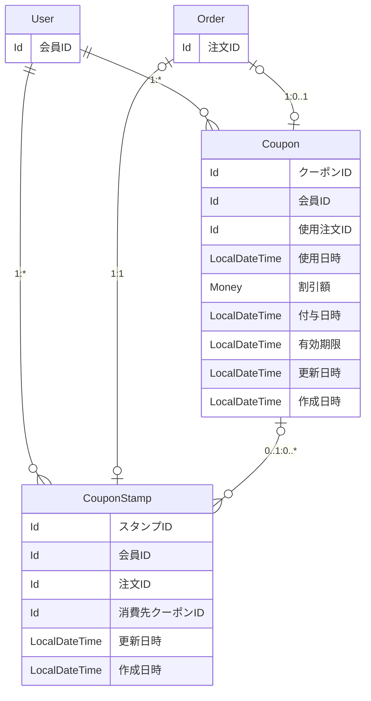

# スタンプカード（ポイント） — 詳細要件定義

対象：会員のスタンプ付与と割引クーポン ／ 前提：[要件定義](./01_REQUIREMENTS_stamp_card.md)で合意済み

## 1. 概要

受け渡しが完了した注文 1 件につきスタンプを 1 個付与し、10 個たまった時点で割引クーポンを 1 枚付与する。スタンプは店舗をまたいで会員ごとに共通で、失効しない。有効期限はクーポンが持つ。会員はアプリでスタンプ数と保有クーポンを確認できる。

既存の `User` `Order` `Payment` `Shop` `MenuItem` は変更しない。`sales` コンテキストにエンティティを 2 つ追加する。

## 2. 用語

全体の用語集への追加を申請する。

| 呼称 | 何を指すか | 言い換えない |
|---|---|---|
| クーポンスタンプ | 受け渡し 1 回につき 1 個押される、貯める単位の 1 個分 | ポイント、来店記録、判子 |
| クーポン | 注文の合計から一定額を引ける権利 | 無料券、特典、チケット |
| 割引額 | そのクーポンで注文の合計から引ける金額 | 値引き、特典額、クーポン額 |
| 付与 | スタンプやクーポンが会員のものになること | 発行、配布、獲得 |
| 消費 | クーポンスタンプ 10 個がクーポンに引き換えられること | 使用、消化、変換 |
| 使用 | 発行済みクーポンを注文に適用し、割引を受けること | 利用、消費、引き換え |

「消費」と「使用」は別物として区別する。スタンプが消費され、クーポンが使用される。両方を「使用」と呼ぶと、会議で「使ったスタンプ」が何を指すのか分からなくなる。

「無料券」とは呼ばない。600 円の割引券なので、700 円の商品なら 100 円かかる。

## 3. データ構成

会員に対して、クーポンスタンプとクーポンがそれぞれ 1 対多で紐づく。クーポン 1 枚に対して、消費されたスタンプが 0〜10 個紐づく。



図で読み取ってほしいのは 3 点。

- クーポンスタンプに有効期限も付与日時もない。スタンプは失効しない（論点1）。
- クーポンとスタンプは `0..1 : 0..*`。`1:10` 固定ではない。誕生日クーポンはスタンプ 0 個で付与される（論点5）。
- クーポンは `MenuItem` を参照しない。金券型のため対象商品を持たない（論点2）。

## 4. モデル定義

### 4.1 クーポンスタンプ

```scala
case class CouponStamp(
  id:        Option[Id],           // 管理 ID（永続化前は None）
  userId:    User.Id,              // 誰のスタンプか（店舗をまたいで共通）
  orderId:   Order.Id,             // どの注文で押されたか（一意）
  couponId:  Option[Coupon.Id],    // 消費先のクーポン。None ＝ 未消費
  updatedAt: LocalDateTime = Now,  // データ更新日
  createdAt: LocalDateTime = Now   // データ作成日
) extends EntityModel[Id]

object CouponStamp:

  type   Id = Id.Repr
  object Id extends Entity.Id[Long]
```

有効期限も付与日時も持たない。スタンプは失効しないため、期限判定に使う日付が不要である。取り消しの記録も持たない。受け渡し完了が付与のトリガーなので、付与された後にキャンセルされることがない。

消費済みかどうかは `couponId` の有無で表し、フラグは持たない。どの店舗で押されたかも持たない。店舗をまたいで共通のため、スタンプの意味に関与しない。

型では守れない決めごと。

- `orderId` は一意。1 回の受け渡しにつきスタンプは 1 個。
- `couponId` が入ったら以後変えない。消費は取り消せない。
- 付与するのは `Order.Status` が受渡し完了（`IS_DELIVERED`）になったときだけ。キャンセル・未受け取りの注文には付与しない。
- 10 個を選ぶ順序は `id` の昇順（古い順）。スタンプは失効しないためどの 10 個を選んでも結果は同じだが、動作を一定にするため順序を決めておく（論点7）。

保存されるデータの例（会員 ID 100）。

| id | orderId | couponId | 業務での状態 | 保有数に数える |
|---|---|---|---|---|
| 51 | 5001 | `Some(7)` | 消費済み（クーポン 7 番になった） | いいえ |
| 52 | 5002 | `Some(7)` | 消費済み（同じクーポン） | いいえ |
| 61 | 5011 | None | 未消費 | はい |
| 62 | 5012 | None | 未消費 | はい |

4 行とも同じモデル・同じ形。区分値を 1 つも持たずに、消費済みと未消費が区別できている。

### 4.2 クーポン

```scala
case class Coupon(
  id:          Option[Id],             // 管理 ID（永続化前は None）
  userId:      User.Id,                // 誰のクーポンか
  usedOrderId: Option[Order.Id],       // 使用した注文。None ＝ 未使用
  usedAt:      Option[LocalDateTime],  // 使用日時。None ＝ 未使用
  discount:    Money,                  // 割引額。この額を注文の合計から引く
  grantedAt:   LocalDateTime,          // 付与日時
  expiresAt:   LocalDateTime,          // 有効期限
  updatedAt:   LocalDateTime = Now,    // データ更新日
  createdAt:   LocalDateTime = Now     // データ作成日
) extends EntityModel[Id]

object Coupon:

  type   Id = Id.Repr
  object Id extends Entity.Id[Long]
```

割引額を自分で持つため、対象商品やカテゴリを持たない。`common/menu` を参照しないので、コンテキストをまたぐ依存が増えない。

有効期限は 1 枚ごとに持つ。一律ではないため、スタンプ由来は付与から 1 年、誕生日クーポンは 1 ヶ月など、付与時に自由に決められる。期限切れを表す状態は持たず、`expiresAt` と現在日時を比べて判定する。

消費されたスタンプへの参照は持たない。参照は多い側の `CouponStamp.couponId` が持つ。

フィールドは型ではなく役割で並べる。ID を上にまとめたうえで、連動する `usedOrderId` / `usedAt` を隣に置く。一緒にしか意味を持たない値を近くに置くことで、検証の書き忘れを防ぐ。

`grantedAt` と `createdAt` は別物である。`grantedAt` は「このクーポンが付与された」という業務上の事実、`createdAt` は行が作られた運用上の記録。

型では守れない決めごと。

- `usedOrderId` と `usedAt` は連動する。組み合わせは 4 通りあるが、有効なのは次の 2 通りのみ。生成時に検証する。

  | `usedOrderId` | `usedAt` | 扱い |
  |---|---|---|
  | None | None | 有効。未使用 |
  | `Some` | `Some` | 有効。使用済み |
  | `Some` | None | 無効。注文は分かるが日時が不明 |
  | None | `Some` | 無効。日時だけあって注文が不明 |

- `usedOrderId` が入ったら以後変えない。使用は取り消せない。
- 使用時は `expiresAt` を過ぎていないことを確認する。期限切れのクーポンは使えない。
- 割引額が注文の合計を超える場合、超過分は切り捨てる。繰り越さない。
- `usedOrderId` は一意。1 注文で使えるクーポンは 1 枚まで。
- スタンプ由来のクーポンの割引額は 600 円、有効期限は付与から 1 年。どちらもコード上の定数で管理する。

保存されるデータの例（会員 ID 100、今が 2026-08-03）。

| id | usedOrderId | usedAt | discount | expiresAt | 業務での状態 |
|---|---|---|---|---|---|
| 7 | `Some(5120)` | `Some(2026-01-08 12:30)` | 600 円 | 2026-11-02 10:15 | 使用済み |
| 12 | None | None | 600 円 | 2027-06-20 19:40 | 未使用・期限内 |
| 13 | None | None | 600 円 | 2026-07-28 12:05 | 未使用だが期限切れ |
| 14 | None | None | 300 円 | 2026-09-01 00:00 | 未使用・期限内（誕生日クーポンの例） |

13 番のように、期限切れのクーポンも行として残る。表示時に除外するだけ。14 番のように、割引額と期限はクーポンごとに違えられる。

### 4.3 区分値

追加する 2 つのエンティティは、どちらも `enum` を持たない。業務の言葉は 4 つあるが、すべて `Option` の有無か日時の比較で表せる。

| 業務の言葉 | どう表すか | 保存するか |
|---|---|---|
| 消費 | `CouponStamp.couponId` が `Some` | する |
| 未消費 | `CouponStamp.couponId` が None | する |
| 使用 | `Coupon.usedOrderId` が `Some` | する |
| 期限切れ | `expiresAt` と現在日時を比べて判定 | しない |

呼称の数と区分値の数は一致しない。期限切れはデータに一切書かれていないが、業務では明確な言葉として存在する。

期限切れを区分値で持つと、期限が過ぎた瞬間から書き換えられるまでの間、実態と食い違う。毎日書き換えるバッチが必要になり、そのバッチが落ちた日は期限切れのクーポンが使えてしまう。

## 5. 未消費のスタンプ数を数え上げる条件

条件は 1 つだけ。

- `couponId` が None（まだクーポンになっていない）

スタンプは失効せず、取り消しもされないため、他の条件は要らない。保有数はどこにも保存されず、この条件で行を数えた結果である。

## 6. 受け渡し完了時の処理順序

1. `CouponStamp` を 1 件追加する。
2. `couponId` が None のスタンプを数える。
3. 10 件以上あれば、`id` の昇順で 10 件の `couponId` に新しいクーポンの ID を書く。
4. `Coupon` を 1 件追加する（`discount` ＝ 600 円、`expiresAt` ＝ 付与から 1 年）。

11 件たまっていた場合、古い 10 件が消費され、11 件目は `couponId` が None のまま残る。使用済みの 10 個と、たまり始めた新しい 1 個の区別が、参照の有無だけで表せている。

## 7. クーポンを使用するときの計算

```
支払額 = max(注文の合計 − 割引額, 0)
```

超過分は切り捨てる。600 円のクーポンを 300 円の注文に使った場合、支払額は 0 円で残り 300 円は消える。

## 8. エンティティ一覧

### 追加するもの

| エンティティ | テーブル | 役割 | 多重度 |
|---|---|---|---|
| `CouponStamp` | `sales_coupon_stamp` | 受け渡し 1 回ごとに押されるスタンプ 1 個分 | `User` と 1:*、`Order` と 1:1、`Coupon` と 0..1:1 |
| `Coupon` | `sales_coupon` | 注文の合計から一定額を引ける権利 | `User` と 1:*、`Order` と 1:0..1、`CouponStamp` と 1:0..* |

### 既存で足りるもの

| エンティティ | なぜ足りるか |
|---|---|
| `User` | 会員そのもの。スタンプ数を保存しないため、属性を足す必要がない |
| `Order` | スタンプを押すきっかけ。参照されるだけで、`Order` 側は何も知らない |
| `Order.Status` | 受渡し完了（`IS_DELIVERED`）が付与のトリガー。問題2 で追加した値をそのまま使う |
| `Payment` | 支払い済みであることの確認に使うが、付与のトリガーではない |
| `MenuItem` | 参照しない。金券型のため対象商品を持たない |
| `Shop` | 店舗をまたいで共通のため、店舗ごとのスタンプ設定を持たない |
| `Money` | 割引額の型として使う。既存の値オブジェクト |

`User` に `stampCount` を足していないことが、この表の要点である。「いま何個たまっているか」は要求文に明記されているが、`CouponStamp` の行を数えれば求まるので保存しない。

### 既存から動かすもの

なし。追加する 2 つは既存を参照する側のため、参照の向きが一方向になり、既存側に変更が入らない。

### 新しく持つ参照

既存テーブルには列を足さない。

| どこに | 何を |
|---|---|
| `sales_coupon_stamp.user_id` | `User.Id` |
| `sales_coupon_stamp.order_id` | `Order.Id` |
| `sales_coupon_stamp.coupon_id` | `Coupon.Id`（任意） |
| `sales_coupon.user_id` | `User.Id` |
| `sales_coupon.used_order_id` | `Order.Id`（任意） |

## 9. 置き場所

既存の `sales` コンテキストに追加する。新しいコンテキストは作らない。

| 日常的に書き換える人 | 何を書き換えるか | 更新の頻度 | 見る画面 |
|---|---|---|---|
| 会員（受け渡しを受けることで、システムが） | スタンプの行が 1 本増える | 受け渡しのたび（毎日・大量） | 会員アプリのスタンプ画面 |
| 会員 | クーポンに使用した注文と日時を書き込む | 10 回の受け渡しごと | 注文画面 |

日常的に書き換えるのは会員の注文・受け取り行為であり、`Order` と触る人・更新頻度・書き換わるトリガー（受け渡し完了）が一致する。スタンプを押すきっかけが注文だからではなく、日々書き換える主体が `Order` と同じであることを理由とする。

`common` には置けない。3 条件すべてを満たさない。

| 条件 | 判定 | 理由 |
|---|---|---|
| 業務の操作では変わらない | ✗ | 受け渡しのたびに行が増える。マスタではない |
| 管理者が別にいる | ✗ | 会員の行為で自動的に変わる |
| 他のコンテキストから参照されるだけ | ✗ | `User.Id` と `Order.Id` を参照する側。依存が逆流する |

テーブル名はコンテキストのパスを頭に付け、単数形にする。名前順に並べると次のようになる。

```
sales_cart                ← 既存
sales_cart_item           ← 既存
sales_cart_item_option    ← 既存
sales_coupon              ← 今回追加
sales_coupon_stamp        ← 今回追加
sales_order               ← 既存
sales_order_item          ← 既存
sales_order_item_option   ← 既存
sales_payment             ← 既存
```

`Coupon*` 一族として固まり、既存の `sales_order` / `sales_order_item`（親 ＋ 子）と同じ形になる。

---

# 付録A 今回やらないこと

- 誕生日クーポン・キャンペーンクーポンの付与機能そのもの。スタンプ 0 個でも付与できる形にはしておくが、付与のきっかけは作らない。
- クーポンの券面額を管理画面から変更すること。コード上の定数で管理する。
- クーポンの残額を次回に繰り越すこと。超過分は切り捨てる。
- 1 注文で 2 枚以上のクーポンを使うこと。
- 有効期限が近いクーポンのお知らせ通知。
- スタンプ・クーポンの譲渡。
- 管理者によるスタンプの手動付与・手動取り消し。
- スタンプ数の推移や利用状況の集計・分析画面。
- 期限切れクーポンの自動削除。行は残す。
- クーポン使用時の会計処理。`Order` の割引額をどう記録するかは 04 章のテーブル設計で扱う。

# 付録B 判断の記録

## 論点1：有効期限をスタンプに持たせるか、クーポンに持たせるか

判断：クーポンに持たせる。スタンプは失効しない。

初回の設計では、スタンプに付与日を持たせ「付与日から 1 年」で失効させていた。要求文の「有効期限は最後の注文から 1 年」を、スタンプ 1 個ごとの期限として読み替えたものである。

しかしこれには 3 つの問題があった。保有数を数えるたびに「付与日 + 1 年 > 今日」を判定する必要がある。9 個たまった状態で最古のスタンプが失効すると 8 個に戻り、体験が悪い。クーポンの種類が増えたとき、期限の扱いをスタンプ側で考え続けることになる。

期限をクーポンに移すと、これらが同時に消える。スタンプは「消費したか」だけを見ればよく日付の計算が要らない。貯めている途中でスタンプが減らない。クーポンごとに期限を変えられる。

同時に消えたもの：`CouponStamp` の取り消し日時の列、および「失効しているか判定する」「スタンプを取り消す」の 2 動詞。付与日時は `CouponStamp` から消え、`Coupon` 側に移った。

代償：要求文の「有効期限は最後の注文から 1 年」という記述と形が違う。要件定義の質問リストで合意を取る。

## 論点2：特典を商品券型にするか、金券型にするか

判断：金券型（`discount: Money`）にする。

要求文は「ハンバーガー 1 つが無料」で、これは商品券型の表現である。しかし商品券型にすると決めなければならないことが増える。

| 決めること | 商品券型 | 金券型 |
|---|---|---|
| 対象範囲の持ち方 | 特定商品 / カテゴリ / カテゴリ + 上限額 のどれか | 不要 |
| 注文にバーガーが 2 つあったらどちらが無料か | 決める必要あり | 問題にならない |
| 対象商品が無い注文への対応 | 使えない判定が必要 | 不要 |
| `common/menu` への依存 | あり（`MenuCategory.Id` を参照） | なし |
| 対象商品が販売終了したら | クーポンが使えなくなる | 影響なし |

金券型のほうが持つフィールドが少なく、参照するコンテキストも少ない。将来「500 円引き」など別の特典を出すときも、金額を変えるだけで済む。

代償：要求文の「無料」ではなくなる。600 円を超える商品には差額がかかる。価格改定で意味が変わる（600 円のバーガーが 650 円になったら無料にならない）。「無料券」と呼べなくなるため、用語表で明記した。

判断が変わる条件：「必ず 1 品無料」を業務として保証する必要があるなら、商品券型（カテゴリ + 上限額）に変える。そのときは `common/menu` への参照が増える。

## 論点3：付与のトリガーを支払いにするか、受け渡しにするか

判断：受け渡し完了（`Order.Status` が `IS_DELIVERED`）にする。

初回の設計では支払い確定をトリガーにしていた。そのため「支払い後にキャンセルされたらスタンプを取り消す」処理が必要で、取り消し日時の列を持っていた。

受け渡し完了に変えると、この処理が丸ごと不要になる。問題2 で確定した状態遷移において、受渡し完了は終端状態であり、到達した注文はもう状態が変わらない。したがって受渡し完了からキャンセルへ移ることはなく、キャンセルされた注文や未受け取りの注文にスタンプが付くこともない。

起きないケースのために列を持たないので、取り消し日時の列を消せた。

代償：未受け取りの注文にはスタンプが付かない。会員からすると「支払ったのにスタンプが付かない」ことになる。要件定義の質問リストで合意を取る。

判断が変わる条件：「支払ったならスタンプは付けるべき」という運用に変わったら、支払い確定をトリガーに戻し、取り消し日時の列を復活させる。

## 論点4：使用の記録を 1 つの `Option` に束ねるか、2 つに分けるか

判断：2 つに分ける（`usedOrderId` と `usedAt`）。

当初は `usedOrder: Option[(Order.Id, LocalDateTime)]` として組で持つ案だった。「一緒にしか意味を持たない値は束ねる」という原則に従ったものである。束ねれば無効な組み合わせが構造上作れず、検証が不要になる。

しかしレビューでフィールドを分ける方針となったため、分けている。

代償：無効な組み合わせが 2 通り生まれるため、モデルを作るときに検証が必要になる。

利点：DB のカラムと 1 対 1 で対応するため、クエリが素直に書ける（`WHERE used_order_id IS NULL`）。組で持つ場合も DB では 2 カラムに分かれるので、モデルと永続化の形が一致する。

なお分けたことにより、フィールドの並びで組を示す必要が生まれた。`usedOrderId` と `usedAt` を隣に置き、日時である `usedAt` を `grantedAt` / `expiresAt` から離している。型ではなく役割で並べる判断である。

## 論点5：スタンプ 0 個のクーポン付与に対応するか

判断：対応する。`Coupon` と `CouponStamp` の多重度を `1:0..*` にする。

要求文はスタンプ 10 個で 1 枚付与する仕組みだけを求めている。しかし将来、誕生日クーポンやキャンペーンクーポンを出す想定があり、これらはスタンプ 0 個で付与される。

そのため「クーポン 1 枚には必ずスタンプ 10 個が紐づく」という制約を持たない。

この判断が命名にも影響した。`StampCoupon`（スタンプ由来のクーポン）という名前は、スタンプ 0 個のクーポンが入ると嘘になるため却下している（論点10）。

今回作らないもの：誕生日・キャンペーンの付与機能そのもの。受け入れる形にはしておくが、付与のきっかけは作らない。

## 論点6：消費済みをフラグで持つか、クーポンへの紐付けで表すか

判断：`couponId: Option[Coupon.Id]` の紐付けで表す。フラグは持たない。

フラグ（`isConsumed`）で持つと、どの 10 個がどのクーポンになったかが分からない。2 枚付与された会員のスタンプ 20 個が、区別なく同じ値になる。紐付けで持てば、フラグの情報を含んだうえで対応関係まで残る。

紐付けにするとフラグが不要になり、二重管理が起きない。副産物として、クーポン 1 枚からそれを構成した 10 個のスタンプを逆引きできる。誕生日クーポンなら 0 件が返る。

## 論点7：10 個を選ぶ順序を何で決めるか

判断：`id` の昇順（古い順）。

初回の設計では付与日の昇順だった。スタンプが失効する設計だったため、古いものが先に消える前に使うという業務上の意味があった。

スタンプが失効しなくなったため、この意味は消えた。どの 10 個を選んでも結果は同じである。それでも順序を決めておくのは、実装者や実行タイミングで結果が変わらないようにするため。

`id` を使う理由は、必ず一意で単調増加するから。`createdAt` は秒単位だと同一値になる可能性が残る。

業務上の意味はないことを明記しておく。書かないと、後の人が「古い順に選ぶ理由があるはずだ」と探してしまう。

## 論点8：期限切れを区分値で持つか、都度計算するか

判断：都度計算する。`expiresAt` と現在日時を比べる。区分値を持たない。

`Status`（`IS_VALID` / `IS_EXPIRED`）を持つ案もあるが、誰かが書き換える必要がある。期限を過ぎた瞬間から書き換えられるまでの間は実態と食い違い、書き換えるバッチが落ちた日は期限切れのクーポンが使えてしまう。

期限切れのクーポンも行は残す。使われずに期限切れになった枚数を数えられ、問い合わせにも答えられる。表示時に除外するだけ。

## 論点9：新しいコンテキストを作るか

判断：作らない。既存の `sales` に入れる。

`loyalty` のような新コンテキストも検討した。会員アプリの専用画面で見ること、店舗をまたいで共通であること、`Order` より寿命が長いことが根拠になる。

しかし配線（パッケージ・`Module`・`RepositoryFacade`・`app-api`）が 1 セット増え、スタンプ画面を 1 つ描くのに 2 つのリポジトリを呼ぶことになる。`Order.Id` と `User.Id` を参照するため、コンテキスト間の依存も増える。

決め手は、触る人が `Order` と同じ会員であり、書き換わるトリガーも同じ（受け渡し完了）であること。迷ったら大きめに作って、後から割る。

## 論点10：命名（`Coupon` / `CouponStamp`）

判断：`Coupon` を親、`CouponStamp` を子とする。

多重度の「1」側が `Coupon` なので、そちらを接頭辞にする。既存の `Order` / `OrderItem` と同じ形である。

初回の設計では `Stamp` / `StampCoupon` だったが、2 つの理由で変えた。第一に、多重度の「1」側が `Coupon` なのに接頭辞が `Stamp` で、親子関係が逆だった。第二に、`StampCoupon` は「スタンプ由来のクーポン」を意味するが、誕生日クーポンも同じテーブルに入るため（論点5）、由来を名前に含められなくなった。

候補の点数表と却下理由は思考過程の「命名の評価」に記録している。

判断が変わる条件：スタンプがクーポン以外の用途でも使われるようになったら、`CouponStamp` の「クーポンに属する」が嘘になるので `Stamp` に戻す。

## 論点11：付与日時のフィールド名を何にするか

判断：`grantedAt` にする。

当初は `issuedAt`（発行日時）だった。しかし `issue`（発行）は業務の人が使わない言葉で、要求文も「スタンプを 1 個押す」「クーポンが付与される」という表現である。また `issued` は受動の過去分詞、`expires` は現在形で、`expiresAt` との時制が揃わない。

`createdAt` は既存の列（行が INSERT された時刻）と衝突するため使えない。`startsAt` は `expiresAt` との対比が最も美しいが、「いつから使えるか」を別に持つ意味になる。今回は付与と同時に使えるため、開始日という概念は要らない。

`grantedAt` を採った理由は 3 つ。業務の言葉に近い（「付与」は要求文でも用語表でも使われている）。初回の設計で `CouponStamp` が持っていた語をクーポン側へ移した形になるので語彙が増えない。`grantedAt` / `usedAt` が「起きた事実」、`expiresAt` が「これから起きること」で、役割の違いが時制に出る。

判断が変わる条件：「今日付与するが、来月から使える」というキャンペーンが出たら、`grantedAt` と `startsAt` の 2 つを持つことになる。

## 論点12：クーポンの注文 ID を `orderId` にするか `usedOrderId` にするか

判断：`usedOrderId` にする。

`orderId` のほうが短く、注文 ID だと一目で分かる。しかし `Coupon` にとって注文は 2 つの意味を持ち得る。使用した注文と、付与のきっかけになった注文（10 個目のスタンプが押された注文）である。後者は今回持たないが、`orderId` という名前ではどちらか判別できない。

また `CouponStamp.orderId`（スタンプが押された注文）と並べたとき、同じ名前が別の意味を指すことになる。

`used` を接頭辞に付けることで `usedAt` との組であることも読める。連動する 2 つのフィールドは、名前でも組だと分かるようにする。
