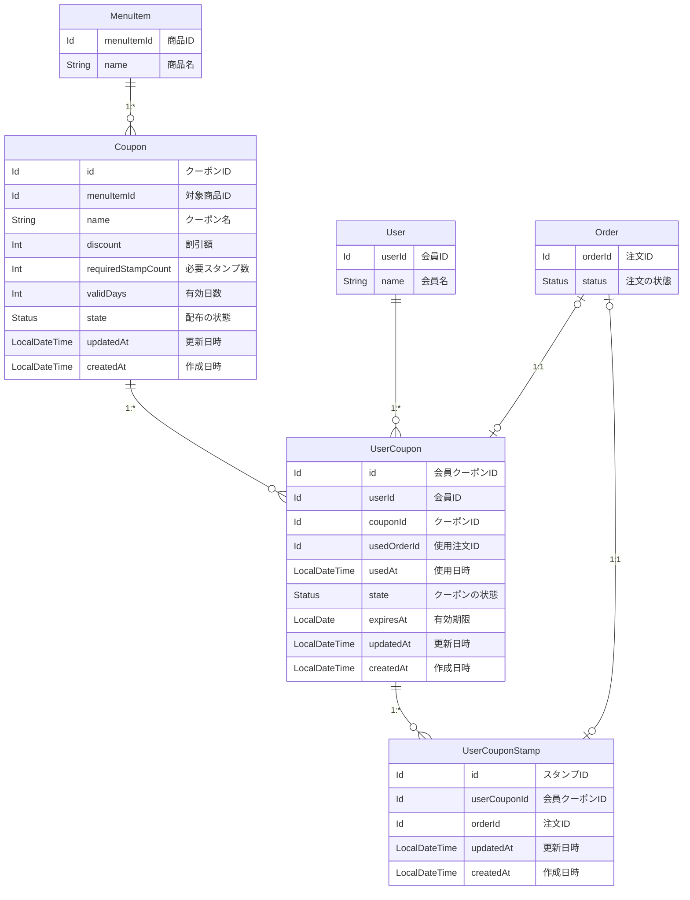

# スタンプカード（ポイント） — 詳細要件定義

対象：クーポンの管理と、会員のスタンプ付与 ／ 前提：[要件定義](./01_requirements.md)で合意済み

## 1. 概要

本部がクーポンの種類（対象商品・割引額・必要スタンプ数・有効日数）を登録できるようにする。会員は受け渡しが完了した注文 1 件につきスタンプを 1 個貯め、必要数に達したクーポンを注文で使用できる。スタンプは店舗をまたいで共通で、有効期限はクーポン 1 枚ごとに持つ。

既存の `User` `Order` `Payment` `Shop` `MenuItem` は変更しない。エンティティを 3 つ追加し、2 つのコンテキストに分けて配置する。

| エンティティ | コンテキスト |
|---|---|
| `Coupon` | `common/coupon`（新しいサブカテゴリ） |
| `UserCoupon` | `sales` |
| `UserCouponStamp` | `sales` |

## 2. 用語

全体の用語集への追加を申請する。

| 呼称 | 何を指すか | 言い換えない |
|---|---|---|
| クーポン | 本部が登録するクーポンの種類 | クーポンマスタ、クーポンの種類、テンプレート |
| 会員クーポン | 会員が持っているクーポン 1 枚 | カード、スタンプカード、無料券、特典 |
| 会員クーポンスタンプ | 受け渡し 1 回につき 1 個押されるスタンプ | ポイント、来店記録、判子 |
| 配布中 / 配布終了 | そのクーポンを新しく配るかどうか | 有効 / 無効 |
| 貯め中 | 会員クーポンのうち、必要スタンプ数に達していないもの | 未完成、途中 |
| 使用可能 | 必要スタンプ数に達し、まだ使っていないもの | 有効、完成 |

「クーポン」が 2 つのものを指していた。「夏はドリンクのクーポンを配ろう」は種類の話、「私のクーポンが期限切れになった」は 1 枚の話である。本部が登録するものを「クーポン」、会員が持つものを「会員クーポン」と呼び分ける。

「カード」と「クーポン」は同じモデルである。貯めている途中は「カード」、完成したら「クーポン」と業務では呼ばれるが、`UserCoupon` の状態が違うだけ。

「配布終了」と「期限切れ」は別物である。配布終了は新しく配らないこと、期限切れは持っているものが使えなくなること。配布終了にしても、すでに配られた会員クーポンは期限まで使える。

## 3. データ構成

本部が登録するクーポン 1 種類に対して、会員クーポンが 1 対多で紐づく。会員クーポン 1 枚に対して、スタンプが 1 対多で紐づく。



図で読み取ってほしいのは 4 点。

- `UserCouponStamp` は `userCouponId` が必須。スタンプは必ずどこかの会員クーポンに属する（論点2）。
- `UserCouponStamp` は `userId` を持たない。親の `UserCoupon` が持っているため不要。
- `Coupon` は `sales` を参照しない。マスタ側は自分が何枚配られたかを知らない（論点8）。
- `UserCoupon` に付与日時がない。`createdAt` が兼ねる（論点5）。

## 4. モデル定義

### 4.1 クーポン（`common/coupon`）

```scala
case class Coupon(
  id:                 Option[Id],           // 管理 ID（永続化前は None）
  menuItemId:         MenuItem.Id,          // 対象商品
  name:               String,               // 「バーガー無料券」
  discount:           Option[Int],          // 割引額（円）。None ＝ 対象商品が無料
  requiredStampCount: Int,                  // 必要なスタンプ数。0 なら即配布できる
  validDays:          Int,                  // 有効日数（配ってから何日有効か）
  state:              Status,               // 配布の状態
  updatedAt:          LocalDateTime = Now,  // データ更新日
  createdAt:          LocalDateTime = Now   // データ作成日
) extends EntityModel[Id]

object Coupon:

  type   Id = Id.Repr
  object Id extends Entity.Id[Long]

  /** 配布の状態 */
  enum Status(val code: Int) extends EnumStatus[Int]:
    case IS_ACTIVE   extends Status(code =  1) // 配布中
    case IS_INACTIVE extends Status(code = -1) // 配布終了
```

`menuItemId` は必須である。対象商品のないクーポンは作れないため、「注文全体から◯◯円引く」という金券型が構造的に排除される。

`discount` の `None` が「無料」を意味する。組み合わせは 2 通りで、どちらも有効なので検証が要らない。

| `discount` | 意味 |
|---|---|
| None | その商品が無料 |
| `Some(200)` | その商品が 200 円引き |

`validDays` は日数であり日時ではない。マスタは何枚もの会員クーポンのテンプレートなので、絶対的な期限を持てない（論点6）。

`requiredStampCount` は可変にしている。10 固定ではないため「5 個で 1 枚」のキャンペーンもマスタの登録だけで実現できる。

型では守れない決めごと。

- `discount` は正の値。0 や負は無効。
- `discount` が対象商品の価格を超えてもよい。超過分は切り捨てて実質無料になる。
- `requiredStampCount` は 0 以上。0 ならスタンプなしで配れる。
- `requiredStampCount > 0` のマスタは、同時に 1 つだけ配布中にする。スタンプを貯める先が自動で選ばれるため、複数あると決まらない。マスタの登録は本部が行うので運用で担保する（論点4）。
- `validDays` は 1 以上。
- 配布終了にしても、すでに配られた会員クーポンは期限まで使える。`MenuItem` の販売終了と同じ扱い。
- クーポンの条件（対象商品・割引額・必要スタンプ数・有効日数）は登録後に変更しない。条件を変えるときは新しい `Coupon` を登録し、旧クーポンを配布終了にする。

保存されるデータの例。

| id | menuItemId | name | discount | requiredStampCount | validDays | state |
|---|---|---|---|---|---|---|
| 1 | 101（バーガー） | バーガー無料券 | None | 10 | 365 | 配布中 |
| 2 | 205（ドリンク） | 誕生日ドリンク券 | None | 0 | 30 | 配布中 |
| 3 | 101（バーガー） | バーガー200円引き券 | `Some(200)` | 5 | 90 | 配布終了 |

3 行とも同じモデル・同じ形。「無料券」「割引券」「誕生日券」という業務の言葉が 3 つあるが、区分値は「配布中 / 配布終了」の 2 値だけ。

### 4.2 会員クーポン（`sales`）

```scala
case class UserCoupon(
  id:          Option[Id],             // 管理 ID（永続化前は None）
  userId:      User.Id,                // 誰のクーポンか
  couponId:    Coupon.Id,              // どのクーポンから配られたか
  usedOrderId: Option[Order.Id],       // 使用した注文。None ＝ 未使用
  usedAt:      Option[LocalDateTime],  // 使用日時。None ＝ 未使用
  state:       Status,                 // クーポンの状態
  expiresAt:   LocalDate,              // 有効期限（作成日 + マスタの validDays）
  updatedAt:   LocalDateTime = Now,    // データ更新日
  createdAt:   LocalDateTime = Now     // データ作成日。配られた日時を兼ねる
) extends EntityModel[Id]

object UserCoupon:

  type   Id = Id.Repr
  object Id extends Entity.Id[Long]

  /** クーポンの状態 */
  enum Status(val code: Int) extends EnumStatus[Int]:
    case IS_COLLECTING extends Status(code = 100) // 貯め中
    case IS_AVAILABLE  extends Status(code = 200) // 使用可能
    case IS_USED       extends Status(code =  -1) // 使用済み
    case IS_EXPIRED    extends Status(code =  -2) // 期限切れ
```

`couponId` は必須である。どのマスタから配られたかが必ず分かるため、クーポン別の使用状況が集計できる。

付与日時のフィールドを持たない。行が作られる瞬間が配られた瞬間なので、`createdAt` が兼ねる（論点5）。

`expiresAt` は保存する。マスタの `validDays` を後から変えても、既に配ったクーポンの期限は変わらない。

`code` の符号が意味を持つ。正はまだ使える可能性がある、負は終わったことを表し、`code > 0` で「生きているクーポンか」を判定できる。正の値は 100 刻みにしているため、間に状態が増えても `150` で挿入できる。

対象商品や割引額は持たない。マスタが持っているので `couponId` から辿る。

型では守れない決めごと。

- `usedOrderId` と `usedAt` は連動する。組み合わせは 4 通りあるが、有効なのは次の 2 通りのみ。生成時に検証する。

  | `usedOrderId` | `usedAt` | 扱い |
  |---|---|---|
  | None | None | 有効。まだ使っていない |
  | `Some` | `Some` | 有効。この注文で使った |
  | `Some` | None | 無効。注文は分かるが日時が不明 |
  | None | `Some` | 無効。日時だけあって注文が不明 |

- `state` が `IS_USED` のとき、`usedOrderId` と `usedAt` は必ず埋まっている（逆も同様）。
- 会員あたり、`IS_COLLECTING` の行は最大 1 枚。1 回の受け渡しで押されるスタンプは 1 個なので、貯める先が 2 つあると決まらない。
- `usedOrderId` は一意。1 注文で使えるクーポンは 1 枚まで。
- 使用時は `state` が `IS_AVAILABLE` かつ `expiresAt` を過ぎていないことを両方確認する。`state` はキャッシュであり、正は `expiresAt` である（論点3）。
- `expiresAt` は配った日の `LocalDate + validDays` として計算し、以後変えない。期限日は利用可能で、翌日から期限切れとする。

保存されるデータの例（会員 ID 100、今が 2026-08-03）。

| id | couponId | state | usedOrderId | expiresAt | 業務での状態 |
|---|---|---|---|---|---|
| 51 | 1 | `IS_USED` | `Some(5120)` | 2026-11-02 | 使用済み |
| 52 | 1 | `IS_AVAILABLE` | None | 2027-06-20 | 使える |
| 53 | 1 | `IS_COLLECTING` | None | 2027-07-15 | 貯め中（スタンプ 7 個） |
| 54 | 2 | `IS_AVAILABLE` | None | 2026-09-01 | 誕生日券（スタンプ 0 個） |
| 55 | 3 | `IS_EXPIRED` | None | 2026-07-28 | 期限切れ。スタンプは削除済み |

53 番と 54 番が対比になっている。54 番は `requiredStampCount = 0` なので、作った瞬間に `IS_AVAILABLE` になる。

55 番のように、期限切れの行は残す。使われずに終わった枚数を数えるため。ただし紐づくスタンプは削除される。

### 4.3 会員クーポンスタンプ（`sales`）

```scala
case class UserCouponStamp(
  id:           Option[Id],           // 管理 ID（永続化前は None）
  userCouponId: UserCoupon.Id,        // どの会員クーポンに属するか
  orderId:      Order.Id,             // どの注文で押されたか（一意）
  updatedAt:    LocalDateTime = Now,  // データ更新日
  createdAt:    LocalDateTime = Now   // データ作成日
) extends EntityModel[Id]

object UserCouponStamp:

  type   Id = Id.Repr
  object Id extends Entity.Id[Long]
```

`userCouponId` は必須である（`Option` ではない）。スタンプは必ずどこかの会員クーポンに属するため、親子関係が構造として成立し、親が期限切れになればスタンプごと削除できる（論点2）。

`userId` を持たない。親の `UserCoupon` が持っているため不要である。スタンプ数を数えるときは `userCouponId` で絞る。

有効期限も付与日時も持たない。スタンプ単体は失効せず、期限は親が持つ。取り消しの記録も持たない。受け渡し完了が付与のトリガーなので、押された後にキャンセルされることがない（論点7）。

型では守れない決めごと。

- `orderId` は一意。1 回の受け渡しにつきスタンプは 1 個。
- 親の `UserCoupon` が `IS_EXPIRED` になったら、紐づくスタンプは削除する。日次バッチで行う。
- `UserCoupon` が `IS_COLLECTING` 以外のとき、スタンプを追加しない。

### 4.4 区分値

追加する 3 つのエンティティのうち、区分値を持つのは 2 つである。

| エンティティ | 区分値 | 値の数 |
|---|---|---|
| `Coupon` | `Status`（配布の状態） | 2 |
| `UserCoupon` | `Status`（クーポンの状態） | 4 |
| `UserCouponStamp` | なし | — |

`UserCouponStamp` が区分値を持たないのは、行を足すだけの操作しかないため。

| 業務の言葉 | どう表すか | 保存するか |
|---|---|---|
| 配布中 / 配布終了 | `Coupon.state` | する |
| 貯め中 | `UserCoupon.state` が `IS_COLLECTING` | する |
| 使用可能 | `UserCoupon.state` が `IS_AVAILABLE` | する |
| 使用済み | `UserCoupon.state` が `IS_USED` | する |
| 期限切れ | `UserCoupon.state` が `IS_EXPIRED` | する（ただしキャッシュ） |
| あと何個か | `requiredStampCount − スタンプ数` | しない |
| 無料券 / 割引券 | `Coupon.discount` の有無 | する（区分値ではない） |

「無料券」と「割引券」に区分値を作っていない。`discount` が None かどうかで区別でき、無効な組み合わせも生まれない。

期限切れだけがキャッシュである。`IS_EXPIRED` は期限が過ぎた瞬間には切り替わらず、日次バッチが書き換えるまで `IS_AVAILABLE` のままになる。正は `expiresAt` であり、使用時は必ず両方を確認する。

## 5. 貯めているスタンプ数を数える

```
WHERE user_coupon_id = ?
```

条件は 1 つだけ。スタンプは失効せず、取り消しもされず、必ず 1 つの会員クーポンに属するため、他の条件は要らない。

「あと何個か」は `Coupon.requiredStampCount − スタンプ数` で求まる。どちらも保存しない。

## 6. 受け渡し完了時の処理順序

1. その会員の `IS_COLLECTING` な `UserCoupon` を探す。
2. 無ければ作る。配布中で `requiredStampCount > 0` のマスタを 1 件取り、`UserCoupon` を `IS_COLLECTING` で追加する（`expiresAt` ＝ 今 + `validDays`）。
3. `UserCouponStamp` を 1 件追加する。
4. スタンプ数が `requiredStampCount` に達したら、`state` を `IS_AVAILABLE` に更新する。

ステップ 2 が今回の設計の核心である。1 個目のスタンプと同時にクーポンが作られるため、スタンプが親のない状態で存在することがない。

`requiredStampCount = 0` のマスタから配る場合（誕生日など）は、この流れを通らない。配布処理が `UserCoupon` を直接 `IS_AVAILABLE` で作る。

## 7. クーポンを使用するときの計算

```
支払額 = max(対象商品の価格 − 割引額, 0)
```

`discount` が None なら対象商品が無料になる。超過分は切り捨てる。

対象商品が注文に入っていないと使えない。`Coupon.menuItemId` の商品が `OrderItem` に含まれているか確認する。

「対象商品の価格」は `MenuItem` の基準価格を指す。オプションによる加算分は割引の対象外とし、オプション代は割り引かれずに残る。対象商品が注文に複数個含まれる場合は、そのうち 1 個にのみ適用する。

| 注文の内容 | クーポン | 割り引く額 |
|---|---|---|
| バーガー 1 個（500 円） | バーガー無料券 | 500 円 |
| バーガー 1 個（500 円）＋ チーズ追加（100 円） | バーガー無料券 | 500 円（チーズ代 100 円は残る） |
| バーガー 2 個（1,000 円） | バーガー無料券 | 500 円（1 個分のみ） |

## 8. 日次バッチ

1. `expiresAt < 今日` かつ `state` が `IS_COLLECTING` または `IS_AVAILABLE` の `UserCoupon` を `IS_EXPIRED` に更新する。
2. `IS_EXPIRED` になった `UserCoupon` に紐づく `UserCouponStamp` を削除する。

ステップ 2 により、貯めきれなかったスタンプが溜まり続けることを防ぐ。親子関係にしたことで、削除対象が `userCouponId` で引ける。

## 9. エンティティ一覧

### 追加するもの

| エンティティ | テーブル | コンテキスト | 役割 |
|---|---|---|---|
| `Coupon` | `common_coupon` | `common/coupon` | 本部が登録するクーポンの種類 |
| `UserCoupon` | `sales_user_coupon` | `sales` | 会員が持っているクーポン 1 枚 |
| `UserCouponStamp` | `sales_user_coupon_stamp` | `sales` | 受け渡し 1 回ごとのスタンプ |

### 既存で足りるもの

| エンティティ | なぜ足りるか |
|---|---|
| `User` | 会員そのもの。スタンプ数を保存しないため、属性を足す必要がない |
| `Order` | スタンプを押すきっかけ。参照されるだけで、`Order` 側は何も知らない |
| `Order.Status` | 受渡し完了（`IS_DELIVERED`）が付与のトリガー。問題2 で追加した値をそのまま使う |
| `MenuItem` | マスタが `menuItemId` として参照する。`MenuItem` 側は変わらない |
| `Payment` | 支払い済みであることの確認に使うが、付与のトリガーではない |
| `Shop` | 店舗をまたいで共通のため、店舗ごとのスタンプ設定を持たない |

### 既存から動かすもの

なし。追加する 3 つは既存を参照する側のため、参照の向きが一方向になり、既存側に変更が入らない。

### 新しく持つ参照

既存テーブルには列を足さない。

| どこに | 何を | コンテキストをまたぐか |
|---|---|---|
| `common_coupon.menu_item_id` | `MenuItem.Id` | `common/coupon → common/menu` |
| `sales_user_coupon.user_id` | `User.Id` | `sales → udb` |
| `sales_user_coupon.coupon_id` | `Coupon.Id` | `sales → common/coupon` |
| `sales_user_coupon.used_order_id` | `Order.Id`（任意） | `sales` 内 |
| `sales_user_coupon_stamp.user_coupon_id` | `UserCoupon.Id` | `sales` 内 |
| `sales_user_coupon_stamp.order_id` | `Order.Id` | `sales` 内 |

すべて ID だけの参照で、向きは一方向である。

## 10. 置き場所

`Coupon` は `common/coupon` に、`UserCoupon` と `UserCouponStamp` は `sales` に置く。新しいコンテキストは作らない。

| 日常的に書き換える人 | 何を書き換えるか | 更新の頻度 | 見る画面 |
|---|---|---|---|
| 本部 | クーポンの種類を登録・配布終了にする | 年に数回 | 本部の管理画面 |
| 会員（受け渡しを受けることで、システムが） | スタンプの行が増える／状態が変わる | 受け渡しのたび（毎日・大量） | 会員アプリ |
| 会員 | クーポンを使用済みにする | クーポンを使うとき | 注文画面 |

触る人と頻度が明確に分かれる。マスタは本部が年に数回、会員クーポンは会員が毎日。`common/menu`（本部が管理）と `sales`（会員が触る）の関係と同じ構図である。

`common` の 3 条件は、同じ「クーポン」でも判定が真逆になる。

| 条件 | `Coupon`（マスタ） | `UserCoupon`（会員の 1 枚） |
|---|---|---|
| 業務の操作では変わらない | ○ | ✗ 受け渡しのたびに変わる |
| 管理者が別にいる | ○ 本部 | ✗ 会員の行為で変わる |
| 他のコンテキストから参照されるだけ | ○ `MenuItem` を参照するだけ | ✗ `User` / `Order` を参照する側 |

マスタは 3 つすべてを満たし、会員クーポンは 3 つすべてで落ちる。決め手は条件 3 である。マスタが参照するのは同じ `common` 内の `MenuItem` だけなので依存が一方向のまま保たれるが、`UserCoupon` は `udb` と `sales` を参照するため `common` に置くと逆流する。

なお `common/coupon` は 02_BURGER_DOMAIN で既に想定されていた置き場所である。

```
edu/common/
├── menu/      … メニュー
├── geo/       … 都道府県
└── coupon/    … クーポンの定義（今後）
```

サブカテゴリとして仕切るため、コンテキストは 4 つのまま増えない。配線も 1 セットのままである。

テーブル名はコンテキストのパスを頭に付け、単数形にする。名前順に並べると次のようになる。

```
common_coupon             ← 今回追加
common_menu_category      ← 既存
common_menu_item          ← 既存
sales_cart                ← 既存
sales_cart_item           ← 既存
sales_cart_item_option    ← 既存
sales_order               ← 既存
sales_order_item          ← 既存
sales_order_item_option   ← 既存
sales_payment             ← 既存
sales_user_coupon         ← 今回追加
sales_user_coupon_stamp   ← 今回追加
```

`sales_user_coupon*` の 2 つが隣り合い、既存の `sales_order` / `sales_order_item`（親 ＋ 子）と同じ形になる。同じ「クーポン」でも置き場所が違うことが接頭辞で読める。

---

# 付録A 今回やらないこと

- 誕生日クーポン・キャンペーンクーポンを配る機能そのもの。`requiredStampCount = 0` で配れる形にはしておくが、配るきっかけは作らない。
- 期間限定のスタンプカード（サマーキャンペーンなど）。論点4 の「判断が変わる条件」を参照。
- スタンプの倍率キャンペーン（2 倍デーなど）。同上。
- 会員がどのクーポンを貯めるか選ぶ機能。
- クーポンの種類を登録する管理画面。モデルは用意するが画面は作らない。
- クーポンの発行枚数・使用枚数の集計画面。`couponId` で集計できる形にはしておく。
- 有効期限が近いクーポンのお知らせ通知。
- 会員クーポン・スタンプの譲渡。
- 管理者によるスタンプの手動付与・手動取り消し。
- 期限切れになった会員クーポンの行の削除。スタンプだけ削除し、クーポンの行は集計のため残す。
- クーポン使用時の会計処理。注文の割引額をどう記録するかは 04 章のテーブル設計で扱う。

# 付録B 判断の記録

## 論点1：商品券型にするか、金券型にするか

判断：商品券型。`menuItemId` を必須にする。

初回の設計では金券型（割引額のみ）だった。対象商品を持たないので実装が単純になり、`common/menu` への参照も不要だった。

しかし端数が出る。600 円の券を 700 円のバーガーに使うと 100 円かかり、「無料券」と呼べない。要求文は「ハンバーガー 1 つが無料」なので、ここが合わない。

商品券型に戻すと、対象商品の価格ちょうどが引かれるので端数が出ない。

`menuItemId` を必須にしたのが要点である。`Option` にすると「注文全体から◯◯円引く」という金券型が混入するため、必須にすることでクーポンは常に「特定商品に対する権利」になる。

そして `discount` と組み合わせると、2 通りがどちらも有効になった。None なら無料、`Some(200)` なら 200 円引き。無効な組み合わせが 1 つもないため検証が要らない。

代償：`common/coupon → common/menu` の参照が増える。ただし同じ `common` 内なので依存の逆流は起きない。

## 論点2：スタンプがクーポンに属する形にするか、独立させるか

判断：`userCouponId` を必須にし、スタンプは必ず会員クーポンに属する。

初回の設計では、10 個貯まった時点でクーポンを作り、そのときスタンプに参照を書き込む形だった（`Option` で持つ）。これには 2 つの問題があった。

`Option` である限りスタンプは独立して存在できるため、名前は `CouponStamp` なのに実体は無関係だった。そして貯めている途中のスタンプはどのクーポンにも属さないので、会員が離脱しても 9 個のスタンプが永久に残った。

1 個目のスタンプでクーポンを作る形にすると、両方が解決する。スタンプは必ず親を持ち、親が期限切れになれば `userCouponId` で引いてスタンプごと削除できる。

副産物として、`UserCouponStamp` から `userId` が消えた。親が持っているため不要である。初回の設計では「会員のスタンプを数えるのが最頻の操作だから直接持つ」という論点があったが、数える単位が `userCouponId` に変わったので不要になった。

もう 1 つの副産物として、有効期限を「1 個目のスタンプで会員クーポンを作成した日から 1 年」と、カード単位で持てる。

## 論点3：期限切れを区分値で持つか、都度計算するか

判断：区分値（`IS_EXPIRED`）を持つ。ただし正は `expiresAt`。

「比べれば分かるものは保存しない」という原則からすると、`expiresAt` と現在日時を比べれば済む。区分値を持つと、期限が過ぎた瞬間から書き換えられるまで実態とズレる。

それでも持つ理由は 2 つある。第一に集計のため。「配った 100 枚のうち 60 枚使用・40 枚期限切れ」が `state` で絞れる。マスタを作った目的（使用状況の把握）に直結する。第二に削除のため。期限切れになったスタンプの削除対象が `state` で引ける。

二重管理になるため、どちらが正かを明記する。正は `expiresAt` であり `state` はキャッシュである。使用時は `state = IS_AVAILABLE` かつ `expiresAt > 今` の両方を確認する。`state` だけを信じると、バッチが落ちた日に期限切れのクーポンが使えてしまう。

代償：日次バッチが必要になる。バッチが落ちても使用は防げるが、集計と削除が遅れる。

## 論点4：スタンプを貯める先をどう決めるか

判断：`requiredStampCount > 0` のマスタは、同時に 1 つだけ配布中にする（運用ルール）。

受け渡し完了時に会員クーポンを作るとき、`couponId` に何を入れるか決める必要がある。配布中のマスタが 2 つあると、プログラムは選べない。

検討した案は 3 つある。デフォルトフラグを持つ案は「配布中」と「デフォルト」の二重管理になり、「配布終了なのにデフォルト」が作れてしまう。DB 制約で強制する案は、マスタの登録が年に数回・本部の管理画面からであることに対して過剰である。会員が選ぶ案は画面が必要になり、選んでいない会員のデフォルトが必要でフラグ案に戻る。

`requiredStampCount = 0` のマスタは何個あってもかまわない。誕生日クーポンなどは配布処理が明示的にマスタを指定するので、自動選択が起きない。

キャンペーンの切り替えは自然に動く。「バーガー無料券」を配布終了して「ドリンク無料券」を配布中にすると、貯め中の会員はバーガー券として完成させ、次の 1 個目からドリンク券になる。

判断が変わる条件：

- スタンプ 2 倍キャンペーンをやるなら、`UserCouponStamp.orderId` の一意制約を外す。1 回の受け渡しで複数行が作られる。
- 期間限定の別カードを通常と同時に貯めさせるなら、「貯め中は会員あたり 1 枚」を「マスタごとに 1 枚」に変える。なお通常カードを止めて期間限定に切り替えることはできない。9 個貯めた会員が完成まで凍結され、リピートの動機を失うため。
- 期間限定クーポンを配るだけなら、設計を変えなくてよい。`requiredStampCount = 0` のマスタを作って配れば、誕生日クーポンと同じ仕組みで実現できる。

## 論点5：付与日時を持つか、`createdAt` で兼ねるか

判断：`createdAt` で兼ねる。付与日時のフィールドを持たない。

初回の設計では付与日時を持っていた。「業務上の事実」と「運用上の記録」は別物という理由である。

しかし今回の設計では意味がない。初回はクーポンが 10 個貯まった時点で作られたため付与日時は「10 個目が押された日時」を意味したが、今回は 1 個目のスタンプと同時に作られるため「行が作られた日時」と完全に一致する。期限は `expiresAt` として保存するので、計算のためにも不要である。

代償：データ移行で過去のクーポンを一括登録すると、`createdAt` が移行日になり配られた日時が失われる。ただし今回そのような運用は想定していない。

## 論点6：マスタが持つのは有効日数か、有効期限か

判断：有効日数（`validDays: Int`）。マスタは日時を持たない。

マスタ 1 件から会員クーポンが何枚も配られる。配られるタイミングが会員ごとに違うため、期限も 1 枚ごとに違う。マスタに「2027-04-01 まで」と書くと、8 月に配られた会員も 4 月で切れることになる。

マスタは有効期間の長さ（日数）を持ち、会員クーポンは有効期限（日時）を持つ。長さは相対、日時は絶対という分担である。記入例が営業時間を「開店時刻 ＋ 営業の長さ」で持ったのと同じ考え方である。

判断が変わる条件：「夏キャンペーン券は 8/31 に一斉失効」のような絶対期限が必要になったら、マスタに `expiresAt` を足す。そのときは `validDays` と `expiresAt` のどちらか一方だけ埋まる形になり、無効な組み合わせが 2 通り生まれるので検証が必要になる。

## 論点7：付与のトリガーを支払いにするか、受け渡しにするか

判断：受け渡し完了（`Order.Status` が `IS_DELIVERED`）にする。

支払い確定をトリガーにすると、「支払い後にキャンセルされたらスタンプを取り消す」処理が必要になり、取り消し日時の列を持つことになる。

受け渡し完了に変えると、この処理が丸ごと不要になる。問題2 で確定した状態遷移において受渡し完了は終端状態であり、到達した注文はもう状態が変わらないため、後からキャンセルされることがない。キャンセルされた注文や未受け取りの注文は受渡し完了に到達しないのでスタンプが押されない。

起きないケースのために列を持たないので、取り消し日時の列を消せた。

代償：未受け取りの注文にはスタンプが押されない。会員からすると「支払ったのにスタンプが押されない」ことになる。要件定義の質問リストで合意を取る。

## 論点8：マスタをどのコンテキストに置くか

判断：`common/coupon` に置く。会員クーポンは `sales` に残す。

同じ「クーポン」という言葉だが、`common` の 3 条件の判定が真逆になる。マスタは 3 つすべてを満たし、会員クーポンは 3 つすべてで落ちる。

決め手は条件 3 である。マスタが参照するのは同じ `common` 内の `MenuItem` だけなので依存が一方向のまま保たれる。一方 `UserCoupon` は `udb` と `sales` を参照するため、`common` に置くと逆流する。

1 つの機能が 2 つのコンテキストに分かれるのは正常である。画面を 1 つ描くのに 2 つのリポジトリを呼ぶことになるが、カリキュラムもそれを前提にしている。

## 論点9：命名（`Coupon` / `UserCoupon` / `UserCouponStamp`）

判断：本部が登録するものを `Coupon`、会員が持つものを `UserCoupon` とする。

検討した候補と点数は思考過程の「命名の評価」に記録している。決定打は「業務の人に通じるか」だった。

`CouponMaster` / `CouponType` / `CouponDefinition` の 3 案が、すべてこの軸で 4〜5 点まで落ちている。本部の人は「クーポンを登録する」と言い、「クーポンマスタを登録する」とは言わない。業務の人にとって、本部が登録するものこそが「クーポン」である。`Master` `Type` `Definition` はいずれも実装側の語彙で、`注文 → Transaction` と同じ距離がある。

`CouponUser` ではなく `UserCoupon` にしたのは、交差エンティティの規則（所有する側 → される側）に従ったためである。`ShopMenuStock` が `MenuShopStock` でないのと同じ。

判断が変わる条件：会員以外（店舗・法人）にもクーポンを配るようになったら、`UserCoupon` の `User` が実態と合わなくなる。`CouponHolder` などに変える。

## 論点10：「カード」と「クーポン」を別のモデルにするか

判断：同じモデル（`UserCoupon`）で、状態で区別する。

業務では貯めている途中を「カード」、完成したものを「クーポン」と呼び分ける。2 つのモデルにしたくなるが、分けない。

分けた場合、10 個目のスタンプが押された瞬間に「カード」の行を削除して「クーポン」の行を作るという移し替えが必要になる。移し替えの途中で失敗すると、どちらも存在しない状態が生まれる。そして同じ会員クーポンを指す ID が 2 つになるため、「このクーポンはどのカードから生まれたか」を追跡する参照も必要になる。

1 つのモデルにすれば `state` を書き換えるだけで済む。同じ人が同じ画面で同時に扱うものは 1 つにまとめる。業務の言葉が 2 つあることは、モデルを 2 つにする理由にならない。記入例の「臨時休業と時短営業を分けない」と同じ判断である。
